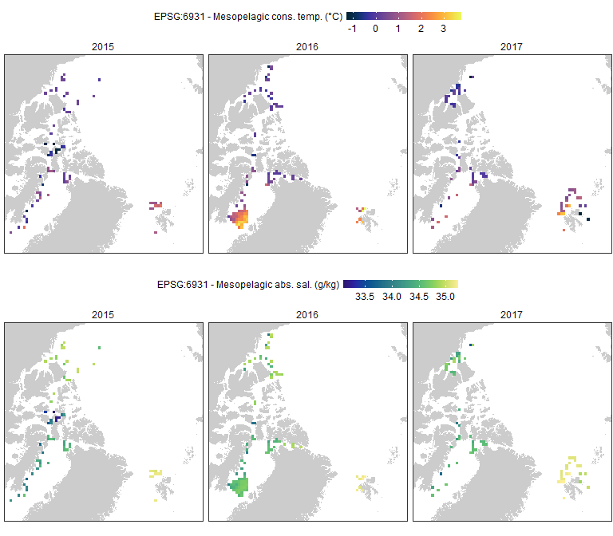

PanArctic DSL - CTD
================
[Pierre Priou](mailto:pierre.priou@mi.mun.ca)
2022/02/08 at 10:40

# Package loading

``` r
# Load packages
library(tidyverse)  # Tidy code
library(cowplot)    # Plots on a grid
library(raster)     # Data gridding
library(rgdal)      # Read shapefiles
library(cmocean)    # Oceanographic color palettes
# Custom figure theme
theme_set(theme_bw())
theme_update(axis.text = element_text(size = 9),
             axis.title = element_text(size = 9),
             strip.text.x = element_text(size = 9, face = "plain", hjust = 0.5),
             strip.background = element_rect(colour = "transparent", fill = "transparent"),
             legend.title = element_text(size = 9, vjust = 1),
             legend.margin = margin(0, 0, 0, 0),
             legend.box.margin = margin(0, 0, -8, 0),
             panel.grid = element_blank(), 
             plot.margin = unit(c(0.02, 0.02, 0.02, 0.02), "in"),
             plot.title = element_text(size = 9, face = "bold"))
options(dplyr.summarise.inform = F) # Suppress summarise() warning
```

# CTD data

CTD data were collected regularly during each of the survey. To match
CTD records with acoustic data, I rasterized CTD data on the same grid
as the acoustic data. I tried two different grids; the WGS84 projection
(EPSG:4326) with grid cells of 2°lon \* 1°lat, and the EASE-Grid 2.0
North (EPSG:6931) with grid cells of 100 km \* 100 km which is the
default grid for sea-ice data. For each cell I calculated the mean
conservative temperature and absolute salinity between 200 and 1000 m
depth.

``` r
load("data/CTD/CTD_2015_2019.RData") # CTD data
```

## EPSG:4326 - WGS84 projection

``` r
arctic_latlon <- raster(extent(-155, 35, 66, 85), # Base projection for acoustic and CTD data
                        crs = "EPSG:4326", 
                        res = c(2, 1)) # cells of 2 degree longitude per 1 degree latitude

CTD_grid_latlon <- data.frame() # Empty dataframe that will be filled with gridded CTD data

for (i in seq(2015, 2017, 1)) { # Data gridding
  CTD_tmp <- CTD_2015_2019 %>%
    filter(year == i & between(depth, 200, 1000) & CTD_depth_max > 200) %>%
    dplyr::select(date, cast, lat, lon, depth, CT, SA) %>%
    group_by(date, cast, lat, lon) %>%
    summarise(cons_temp = mean(CT), # Calculate average temp and sal at mesopelagic depths
              abs_sal = mean(SA)) %>%
    ungroup()
  # Rasterize data in latlon
  CTD_tmp_latlon <- SpatialPointsDataFrame(SpatialPoints(cbind(CTD_tmp$lon, CTD_tmp$lat), 
                                                         proj4string = CRS("EPSG:4326")),
                                            data.frame(lat_mean = CTD_tmp$lat,
                                                       lon_mean = CTD_tmp$lon,
                                                       cons_temp = CTD_tmp$cons_temp,
                                                       abs_sal = CTD_tmp$abs_sal)) %>%
    rasterize(., arctic_latlon, fun = mean, na.rm = T) %>% # Rasterize data in latlon
    dropLayer(1) %>% # Remove ID layer
    rasterToPoints() %>% # Convert raster to data frame
    as.data.frame() %>%
    rename(lon = x, lat = y) %>% # Rename variables
    mutate(year = i, 
           area = factor(case_when(lon > -155 & lon <= -95 & lat > 65 & lat <= 82 ~ "BF_CAA",
                                   lon > -95 & lon <= -50 & lat > 66 & lat <= 82 ~ "BB",
                                   lon >= -25 & lon <= 145 & lat > 77 & lat <= 90 ~ "SV"),
                         levels = c("BF_CAA", "BB", "SV"))) %>%
    filter(abs(lon - lon_mean) < 2 & abs(lat - lat_mean) < 1) %>% # Quality check
    dplyr::select(year, area, lat, lon, cons_temp, abs_sal)
  CTD_grid_latlon <- bind_rows(CTD_grid_latlon, CTD_tmp_latlon)
}
rm(CTD_tmp, CTD_tmp_latlon, i) # Remove temporary data
```

Plot mean conservative temperature and absolute salinity over
mesopelagic depths (200 - 1000 m depth) with the WGS84 projection.

``` r
coast_10m_latlon <- readOGR("data/bathy/ne_10m_land.shp", verbose = F) %>% # Coastline in latlon
  spTransform(CRSobj = crs(arctic_latlon)) %>% # Make sure that the shapefile is in the right projection
  crop(extent(-180, 180, 0, 90)) %>% # Crop shapefile
  fortify() %>% # Convert to a dataframe for ggplot
  rename(lon = long)

plot_grid(CTD_grid_latlon %>% # Map conservative temperature
            ggplot() +
            geom_polygon(data = coast_10m_latlon, aes(x = lon, y = lat, group = group), fill = "grey80") +
            geom_tile(aes(x = lon, y = lat, fill = cons_temp)) +
            scale_fill_cmocean("EPSG:4326 - Mesopelagic cons. temp. (°C)", name = "thermal") +
            facet_wrap(~ year, ncol = 1) +
            coord_cartesian(xlim = c(-155, 40), ylim = c(65, 85), expand = c(0, 0))  +
            theme(legend.position = "top", legend.key.height = unit(0.1, "in"), legend.key.width = unit(0.3, "in")),
          CTD_grid_latlon %>% # Map absolute salinity
            ggplot() +
            geom_polygon(data = coast_10m_latlon, aes(x = lon, y = lat, group = group), fill = "grey80") +
            geom_tile(aes(x = lon, y = lat, fill = abs_sal)) +
            scale_fill_cmocean("EPSG:4326 - Mesopelagic abs. sal. (g/kg)", name = "haline") +
            facet_wrap(~ year, ncol = 1) +
            coord_cartesian(xlim = c(-155, 40), ylim = c(65, 85), expand = c(0, 0))  +
            theme(legend.position = "top", legend.key.height = unit(0.1, "in"), legend.key.width = unit(0.3, "in")),
          ncol = 2, align = "hv", axis = "tblr")
```

<!-- -->

## EPSG:6931 - EASE-Grid 2.0 North (Lambert’s equal-area, azimuthal)

More info on this projection can be found on the [NSIDC
website](https://nsidc.org/data/ease/).

``` r
cell_res <- 100 # Cell resolution in km
arctic_laea <- raster(extent(-2700, 2700, -2700, 2700), crs = "EPSG:6931") # Seaice projection
projection(arctic_laea) <- gsub("units=m", "units=km", projection(arctic_laea)) # Convert proj unit from m to km
res(arctic_laea) <- c(cell_res, cell_res) # Define the 100 km cell resolution

CTD_grid_laea <- data.frame() # Empty dataframe that will be filled with gridded CTD data

for (i in seq(2015, 2017, 1)) { # Data gridding
  CTD_tmp <- CTD_2015_2019 %>%
    filter(year == i & between(depth, 200, 1000) & CTD_depth_max > 200) %>%
    dplyr::select(date, cast, lat, lon, depth, CT, SA) %>%
    group_by(date, cast, lat, lon) %>%
    summarise(cons_temp = mean(CT), # Calculate average temp and sal at mesopelagic depths
              abs_sal = mean(SA)) %>%
    ungroup()
  # Rasterize data in latlon
  CTD_tmp_laea <- SpatialPointsDataFrame(SpatialPoints(cbind(CTD_tmp$lon, CTD_tmp$lat), 
                                                       proj4string = CRS("EPSG:4326")),
                                            data.frame(lat = CTD_tmp$lat,
                                                       lon = CTD_tmp$lon,
                                                       cons_temp = CTD_tmp$cons_temp,
                                                       abs_sal = CTD_tmp$abs_sal)) %>%
    spTransform(., CRSobj = crs(arctic_laea)) %>% # Change projection to EPSG:6931
    rasterize(., arctic_laea, fun = mean, na.rm = T) %>% # Rasterize data in latlon
    dropLayer(1) %>% # Remove ID layer
    rasterToPoints() %>% # Convert raster to data frame
    as.data.frame() %>%
    rename(xc = x, yc = y) %>% # Rename variables
    mutate(year = i, 
           area = factor(case_when(lon > -155 & lon <= -95 & lat > 65 & lat <= 82 ~ "BF_CAA",
                                   lon > -95 & lon <= -50 & lat > 66 & lat <= 82 ~ "BB",
                                   lon >= -25 & lon <= 145 & lat > 77 & lat <= 90 ~ "SV"),
                         levels = c("BF_CAA", "BB", "SV"))) %>%
    dplyr::select(year, area, lat, lon, xc, yc, cons_temp, abs_sal)
  CTD_grid_laea <- bind_rows(CTD_grid_laea, CTD_tmp_laea)
}
rm(CTD_tmp, CTD_tmp_laea, i, cell_res) # Remove temporary data
```

Plot mean conservative temperature and absolute salinity over
mesopelagic depths (200 - 1000 m depth) with the EASE-Grid 2.0 North.

``` r
coast_10m_laea <- readOGR("data/bathy/ne_10m_land.shp", verbose = F) %>% # Coastline in laea
  spTransform(CRSobj = crs(arctic_latlon)) %>% # Make sure that the shapefile is in the right projection
  crop(extent(-180, 180, 0, 90)) %>% # Crop shapefile
  spTransform(CRSobj = crs(arctic_laea)) %>% # Project shapefile in laea
  fortify() %>% # Convert to a dataframe for ggplot
  rename(xc = long, yc = lat)

plot_grid(CTD_grid_laea %>% # Map conservative temperature
            ggplot() +
            geom_polygon(data = coast_10m_laea, aes(x = xc, y = yc, group = group), fill = "grey80") +
            geom_tile(aes(x = xc, y = yc, fill = cons_temp)) +
            scale_fill_cmocean("EPSG:6931 - Mesopelagic cons. temp. (°C)", name = "thermal") +
            facet_wrap(~ year, ncol = 3) +
            coord_fixed(xlim = c(-2700, 1300), ylim = c(-1900, 2000), expand = c(0, 0)) +
            theme(legend.position = "top", legend.key.height = unit(0.1, "in"), legend.key.width = unit(0.3, "in")),
          CTD_grid_laea %>% # Map absolute salinity
            ggplot() +
            geom_polygon(data = coast_10m_laea, aes(x = xc, y = yc, group = group), fill = "grey80") +
            geom_tile(aes(x = xc, y = yc, fill = abs_sal)) +
            scale_fill_cmocean("EPSG:6931 - Mesopelagic abs. sal. (g/kg)", name = "haline") +
            facet_wrap(~ year, ncol = 3) +
            coord_fixed(xlim = c(-2700, 1300), ylim = c(-1900, 2000), expand = c(0, 0)) +
            theme(legend.position = "top", legend.key.height = unit(0.1, "in"), legend.key.width = unit(0.3, "in")),
          ncol = 1, align = "hv", axis = "tblr")
```

<!-- -->

# Save data

``` r
save(CTD_grid_laea, CTD_grid_latlon, file = "data/CTD/CTD_grids.RData") # Save data
```
