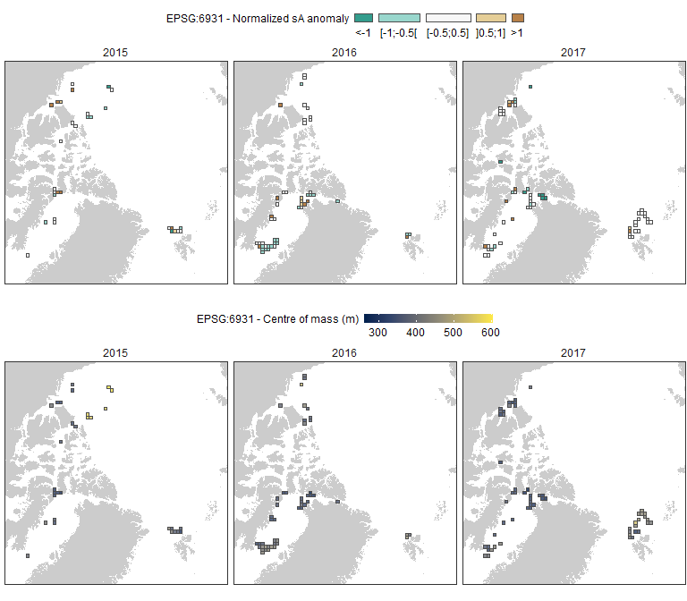

PanArctic DSL - Acoustic gridding
================
[Pierre Priou](mailto:pierre.priou@mi.mun.ca)
2022/02/09 at 10:51

# Package loading

``` r
# Load packages
library(tidyverse)    # Tidy code
library(cowplot)      # Plots on a grid
library(raster)       # Data gridding
library(rgdal)        # Read shapefiles
library(cmocean)      # Oceanographic color palettes
library(RColorBrewer) # Diverging color palette
# Custom figure theme
theme_set(theme_bw())
theme_update(axis.text = element_text(size = 9),
             axis.title = element_text(size = 9),
             strip.text.x = element_text(size = 9, face = "plain", hjust = 0.5),
             strip.background = element_rect(colour = "transparent", fill = "transparent"),
             legend.title = element_text(size = 9, vjust = 1),
             legend.margin = margin(0, 0, 0, 0),
             legend.box.margin = margin(0, 0, -8, 0),
             panel.grid = element_blank(), 
             plot.margin = unit(c(0.02, 0.02, 0.02, 0.02), "in"),
             plot.title = element_text(size = 9, face = "bold"))
options(dplyr.summarise.inform = F) # Suppress summarise() warning
```

# Integrated s<sub>A</sub> and centre of mass

Acoustic data were collected continuously at 38 kHz. We selected data
when the ship were stationary (&lt; 1 knot). To match acoustic records
to CTD and remote sensing data, and to homogenize data
spatio-temporally, I rasterized acoustic data per year. I used two
different grids; the WGS84 projection (EPSG:4326) with grid cells of
2°lon x 1°lat, and the EASE-Grid 2.0 North (EPSG:6931)—which is the
default grid for sea-ice data—with grid cells of 150 km x 150 km. For
each cell I calculated the mean integrated nautical area scattering
coefficient (s<sub>A</sub>; m<sup>2</sup> nmi<sup>-2</sup>) and centre
of mass over mesopelagic depths (200-1000 m). Then, I calculated the
normalized backscatter anomaly for each grid cell per area—Beaufort Sea
and Canadian Arctic Archipelago, Baffin Bay, and Svalbard—per year.

``` r
load("data/acoustics/MVBS_2015_2017.RData") # Acoustic data
```

## EPSG:4326 - WGS84 projection

``` r
arctic_latlon <- raster(extent(-155, 35, 66, 85), # Base projection for acoustic and CTD data
                        crs = "EPSG:4326", 
                        res = c(2, 1)) # cells of 2 degree longitude per 1 degree latitude

SA_grid_latlon <- data.frame() # Empty dataframe that will be filled with gridded CTD data

for (i in seq(2015, 2017, 1)) { # Data gridding
  SA_tmp <- SA_metrics %>%
    filter(year == i & day_night == "day") %>%
    dplyr::select(year, lat, lon, NASC_int, CM)
  # Rasterize data in latlon
  SA_tmp_latlon <- SpatialPointsDataFrame(SpatialPoints(cbind(SA_tmp$lon, SA_tmp$lat), 
                                                        proj4string = CRS("EPSG:4326")),
                                          data.frame(lat_mean = SA_tmp$lat,
                                                     lon_mean = SA_tmp$lon,
                                                     NASC_int = SA_tmp$NASC_int,
                                                     CM = SA_tmp$CM)) %>%
    rasterize(., arctic_latlon, fun = mean, na.rm = T) %>% # Rasterize data in latlon
    dropLayer(1) %>% # Remove ID layer
    rasterToPoints() %>% # Convert raster to data frame
    as.data.frame() %>%
    rename(lon = x, lat = y) %>% # Rename variables
    mutate(year = i, 
           area = factor(case_when(lon > -155 & lon <= -95 & lat > 65 & lat <= 82 ~ "BF_CAA",
                                   lon > -95 & lon <= -50 & lat > 66 & lat <= 82 ~ "BB",
                                   lon >= -25 & lon <= 145 & lat > 77 & lat <= 90 ~ "SV"),
                         levels = c("BF_CAA", "BB", "SV"))) %>%
    filter(abs(lon - lon_mean) < 2 & abs(lat - lat_mean) < 1) %>% # Quality check
    dplyr::select(year, area, lat, lon, NASC_int, CM)
 SA_grid_latlon <- bind_rows(SA_grid_latlon, SA_tmp_latlon)
}
rm(SA_tmp, SA_tmp_latlon, i) # Remove temporary data

SA_grid_latlon <- SA_grid_latlon %>% # Calculate normalized backscatter anomalies
  group_by(year, area) %>%
  mutate(mean_NASC_area_year = mean(NASC_int),
         sd_NASC_area_year = sd(NASC_int)) %>%
  ungroup() %>%
  mutate(NASC_anomaly = (NASC_int - mean_NASC_area_year) / sd_NASC_area_year,  # Calculate normalized backscatter anomaly
         NASC_anomaly_d = factor(case_when(NASC_anomaly < -1 ~ "<-1", # Discretize colour scale
                                           NASC_anomaly >= -1 & NASC_anomaly < -0.5 ~ "[-1;-0.5[",
                                           NASC_anomaly >= -0.5 & NASC_anomaly <= 0.5 ~ "[-0.5;0.5]",
                                           NASC_anomaly > 0.5 & NASC_anomaly <= 1 ~ "]0.5;1]",
                                           NASC_anomaly > 1 ~ ">1"),
                                           levels = c("<-1", "[-1;-0.5[", "[-0.5;0.5]", "]0.5;1]", ">1"))) %>%
  ungroup()
```

Plot mesopelagic normalized s<sub>A</sub> anomalies and centre of mass
with the WGS84 projection.

``` r
coast_10m_latlon <- readOGR("data/bathy/ne_10m_land.shp", verbose = F) %>% # Coastline in latlon
  spTransform(CRSobj = crs(arctic_latlon)) %>% # Make sure that the shapefile is in the right projection
  crop(extent(-180, 180, 0, 90)) %>% # Crop shapefile
  fortify() %>% # Convert to a dataframe for ggplot
  rename(lon = long)

col_pal <- c("#80cdc1",  "#f5f5f5", "#dfc27d", "#a6611a") # Manual colour palette

plot_grid(SA_grid_latlon %>% # Map integrated normalized backscatter anomaly
            mutate(NASC_anomaly_d = factor(case_when(NASC_anomaly < -1 ~ "<-1", # Discretize colour scale
                                                     NASC_anomaly >= -1 & NASC_anomaly < -0.5 ~ "[-1;-0.5[",
                                                     NASC_anomaly >= -0.5 & NASC_anomaly <= 0.5 ~ "[-0.5;0.5]",
                                                     NASC_anomaly > 0.5 & NASC_anomaly <= 1 ~ "]0.5;1]",
                                                     NASC_anomaly > 1 ~ ">1"),
                                           levels = c("<-1", "[-1;-0.5[", "[-0.5;0.5]", "]0.5;1]", ">1"))) %>%
            
            ggplot() +
            geom_polygon(data = coast_10m_latlon, aes(x = lon, y = lat, group = group), fill = "grey80") +
            geom_tile(aes(x = lon, y = lat, fill = NASC_anomaly_d), color = "grey30", alpha = 0.8, size = 0.15) +
            scale_fill_manual("EPSG:4326 - Normalized sA anomaly", values = col_pal) +
            facet_wrap(~ year, ncol = 1) +
            coord_cartesian(xlim = c(-155, 40), ylim = c(65, 85), expand = F)  +
            guides(fill = guide_legend(keywidth = 0.05,
                                       keyheight = 0.1,
                                       default.unit = "in", 
                                       label.position = "bottom"),
                   color = "none") +
            theme(legend.position = "top"),
          SA_grid_latlon %>% # Map centre of mass
            ggplot() +
            geom_polygon(data = coast_10m_latlon, aes(x = lon, y = lat, group = group), fill = "grey80") +
            geom_tile(aes(x = lon, y = lat, fill = CM)) +
            scale_fill_viridis_c("EPSG:4326 - Centre of mass (m)", option = "cividis") +
            facet_wrap(~ year, ncol = 1) +
            coord_cartesian(xlim = c(-155, 40), ylim = c(65, 85), expand = F)  +
            theme(legend.position = "top", legend.key.height = unit(0.1, "in"), legend.key.width = unit(0.3, "in")),
          ncol = 2, align = "hv", axis = "tblr")
```

<!-- -->

## EPSG:6931 - EASE-Grid 2.0 North (Lambert’s equal-area, azimuthal)

More info on this projection can be found on the [NSIDC
website](https://nsidc.org/data/ease/).

``` r
cell_res <- 150 # Cell resolution in km
arctic_laea <- raster(extent(-2700, 2700, -2700, 2700), crs = "EPSG:6931") # Seaice projection
projection(arctic_laea) <- gsub("units=m", "units=km", projection(arctic_laea)) # Convert proj unit from m to km
res(arctic_laea) <- c(cell_res, cell_res) # Define the 100 km cell resolution

SA_grid_laea <- data.frame() # Empty dataframe that will be filled with gridded CTD data

for (i in seq(2015, 2017, 1)) { # Data gridding
  SA_tmp <- SA_metrics %>%
    filter(year == i & day_night == "day") %>%
    dplyr::select(year, lat, lon, NASC_int, CM)
  # Rasterize data in latlon
  SA_tmp_laea <- SpatialPointsDataFrame(SpatialPoints(cbind(SA_tmp$lon, SA_tmp$lat), 
                                                        proj4string = CRS("EPSG:4326")),
                                          data.frame(lat = SA_tmp$lat,
                                                     lon = SA_tmp$lon,
                                                     NASC_int = SA_tmp$NASC_int,
                                                     CM = SA_tmp$CM)) %>%
    spTransform(., CRSobj = crs(arctic_laea)) %>% # Change projection to EPSG:6931
    rasterize(., arctic_laea, fun = mean, na.rm = T) %>% # Rasterize data in latlon
    dropLayer(1) %>% # Remove ID layer
    rasterToPoints() %>% # Convert raster to data frame
    as.data.frame() %>%
    rename(xc = x, yc = y) %>% # Rename variables
    mutate(year = i, 
           area = factor(case_when(lon > -155 & lon <= -95 & lat > 65 & lat <= 82 ~ "BF_CAA",
                                   lon > -95 & lon <= -50 & lat > 66 & lat <= 82 ~ "BB",
                                   lon >= -25 & lon <= 145 & lat > 77 & lat <= 90 ~ "SV"),
                         levels = c("BF_CAA", "BB", "SV"))) %>%
    dplyr::select(year, area, lat, lon, xc, yc, NASC_int, CM) 
  SA_grid_laea <- bind_rows(SA_grid_laea, SA_tmp_laea)
}
rm(SA_tmp, SA_tmp_laea, i, cell_res) # Remove temporary data

SA_grid_laea <- SA_grid_laea %>% # Calculate normalized backscatter anomalies
  group_by(year, area) %>%
  mutate(mean_NASC_area_year = mean(NASC_int),
         sd_NASC_area_year = sd(NASC_int)) %>%
  ungroup() %>%
  mutate(NASC_anomaly = (NASC_int - mean_NASC_area_year) / sd_NASC_area_year,  # Calculate normalized backscatter anomaly
         NASC_anomaly_d = factor(case_when(NASC_anomaly < -1 ~ "<-1", # Discretize colour scale
                                           NASC_anomaly >= -1 & NASC_anomaly < -0.5 ~ "[-1;-0.5[",
                                           NASC_anomaly >= -0.5 & NASC_anomaly <= 0.5 ~ "[-0.5;0.5]",
                                           NASC_anomaly > 0.5 & NASC_anomaly <= 1 ~ "]0.5;1]",
                                           NASC_anomaly > 1 ~ ">1"),
                                           levels = c("<-1", "[-1;-0.5[", "[-0.5;0.5]", "]0.5;1]", ">1"))) %>%
  ungroup()
```

Plot mesopelagic normalized s<sub>A</sub> anomalies and centre of mass
with the EASE-Grid 2.0 North.

``` r
coast_10m_laea <- readOGR("data/bathy/ne_10m_land.shp", verbose = F) %>% # Coastline in laea
  spTransform(CRSobj = crs(arctic_latlon)) %>% # Make sure that the shapefile is in the right projection
  crop(extent(-180, 180, 0, 90)) %>% # Crop shapefile
  spTransform(CRSobj = crs(arctic_laea)) %>% # Project shapefile in laea
  fortify() %>% # Convert to a dataframe for ggplot
  rename(xc = long, yc = lat)

col_pal <- rev(brewer.pal(n = 5, name = "BrBG"))

plot_grid(SA_grid_laea %>% # Map integrated normalized backscatter anomaly
            ggplot() +
            geom_polygon(data = coast_10m_laea, aes(x = xc, y = yc, group = group), fill = "grey80") +
            geom_tile(aes(x = xc, y = yc, fill = NASC_anomaly_d), color = "grey30", alpha = 0.8, size = 0.15) +
            scale_fill_manual("EPSG:6931 - Normalized sA anomaly", values = col_pal) +
            facet_wrap(~ year, ncol = 3) +
            coord_fixed(xlim = c(-2600, 1100), ylim = c(-1800, 1900), expand = F) + 
            guides(fill = guide_legend(keywidth = 0.05,
                                       keyheight = 0.1,
                                       default.unit = "in",
                                       label.position = "bottom"),
                   color = "none") +
            theme(legend.position = "top", axis.text = element_blank(), axis.ticks = element_blank(), axis.title = element_blank()),
          SA_grid_laea %>% # Map centre of mass
            ggplot() +
            geom_polygon(data = coast_10m_laea, aes(x = xc, y = yc, group = group), fill = "grey80") +
            geom_tile(aes(x = xc, y = yc, fill = CM)) +
            scale_fill_viridis_c("EPSG:6931 - Centre of mass (m)", option = "cividis") +
            facet_wrap(~ year, ncol = 3) +
            coord_fixed(xlim = c(-2600, 1100), ylim = c(-1800, 1900), expand = F) + 
            theme(legend.position = "top", legend.key.height = unit(0.1, "in"), legend.key.width = unit(0.3, "in"),
                  axis.text = element_blank(), axis.ticks = element_blank(), axis.title = element_blank()),
          ncol = 1, align = "hv", axis = "tblr")
```

<!-- -->

# Save data

``` r
save(SA_grid_laea, SA_grid_latlon, file = "data/acoustics/SA_grids.RData") # Save data
```
