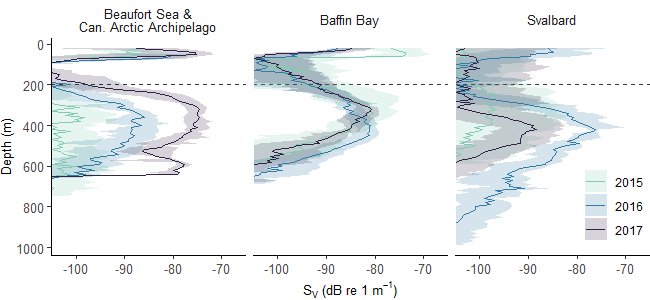

PanArctic DSL - Analyses
================
[Pierre Priou](mailto:pierre.priou@mi.mun.ca)
2022/01/25 at 20:14

# Package and data loading

``` r
# Load packages
library(tidyverse)              # Tidy code
library(lubridate)              # Deal with dates
library(kableExtra)             # Pretty tables
library(cowplot)                # Plots on a grid
library(rgdal)                  # Read shapefiles
library(rworldxtra)             # Higher resolution coastline data
library(marmap)                 # Bathymetry data of the Arctic Ocean
library(ggforce)                # Draw polygons
library(cmocean)                # Pretty color palettes
source("R/getNOAA.ice.bathy.R") # Load bathy data from NOAA
# Custom figure theme
theme_set(theme_bw())
theme_update(axis.text = element_text(size = 9),
             axis.title = element_text(size = 9),
             strip.text.x = element_text(size = 9, face = "plain", hjust = 0.5),
             strip.background = element_rect(colour = "transparent", fill = "transparent"),
             legend.title = element_text(size = 9),
             legend.margin = margin(0, 0, 0, 0),
             legend.box.margin = margin(0, 0, -8, 0),
             panel.grid = element_blank(), 
             plot.margin = unit(c(0, 0, 0, 0), "in"))
options(dplyr.summarise.inform = F) # Suppress summarise() warning
```

``` r
# Geographical data
coastlines_110m <- readOGR("data/bathy/ne_110m_land.shp", verbose = F) %>% 
  fortify() %>%
  rename(lon = long, region = id)
coastlines_50m <- readOGR("data/bathy/ne_50m_land.shp", verbose = F) %>% 
  fortify() %>%
  rename(lon = long, region = id)
coastlines_10m <- readOGR("data/bathy/ne_10m_land.shp", verbose = F) %>% 
  fortify() %>%
  rename(lon = long, region = id)
# Bathy data
bathy_df <- getNOAA.ice.bathy(lon1 = -180, lon2 = 180, lat1 = 50, lat2 = 90,
                              resolution = 6, keep = T, path = "data/bathy/") %>%
  fortify.bathy() %>%
  rename(lon = x, lat = y, depth = z) %>%
  mutate(depth_d=factor(case_when(between(depth, -50, Inf) ~ "0-50",
                                  between(depth, -100, -50) ~ "50-100",
                                  between(depth, -200, -100) ~ "100-200",
                                  between(depth, -500, -200) ~ "200-500",
                                  between(depth, -1000, -500) ~ "500-1000",
                                  between(depth, -2000, -1000) ~ "1000-2000",
                                  between(depth, -4000, -2000) ~ "2000-4000",
                                  between(depth, -Inf, -4000) ~ "4000-8000"),
                        levels=c(">0","0-50","50-100","100-200","200-500","500-1000","1000-2000","2000-4000","4000-8000")))
# Bathy data
bathyHD_df <- getNOAA.ice.bathy(lon1 = -180, lon2 = 180, lat1 = 50, lat2 = 90,
                              resolution = 2, keep = T, path = "data/bathy/") %>%
  fortify.bathy() %>%
  rename(lon = x, lat = y, depth = z) %>%
  mutate(depth_d=factor(case_when(between(depth, -50, Inf) ~ "0-50",
                                  between(depth, -100, -50) ~ "50-100",
                                  between(depth, -200, -100) ~ "100-200",
                                  between(depth, -500, -200) ~ "200-500",
                                  between(depth, -1000, -500) ~ "500-1000",
                                  between(depth, -2000, -1000) ~ "1000-2000",
                                  between(depth, -4000, -2000) ~ "2000-4000",
                                  between(depth, -Inf, -4000) ~ "4000-8000"),
                        levels=c(">0","0-50","50-100","100-200","200-500","500-1000","1000-2000","2000-4000","4000-8000")))
# Areas of interest
area_BF_CAA <- data.frame(x = c(-153, -141.5, -93, -94, -153), y = c(75, 69, 69, 78, 78))
area_BB <- data.frame(x = c(-85, -65, -51.5, -51.5, -85), y = c(72, 66.3, 66.3, 82, 82))
area_SV <- data.frame(x = c(40, 21, 0, 0, 40), y = c(80, 78, 77, 85, 85))
area_BF_CAA_mercator <- data.frame(x = c(-153.5, -153.5, -90, -90), y = c(67, 78, 78, 67))
area_BB_mercator <- data.frame(x = c(-86, -65, -50, -50, -86), y = c(72, 66, 66, 82.5, 82.5))
area_SV_mercator <- data.frame(x = c(37, 37, 2, 2), y = c(75, 85, 85, 75))
area_BF_CAA_2 <- data.frame(x = c(-158, -158, -93, -93, -158), y = c(79, 68.5, 68.5, 79, 79))
area_BB_2 <- data.frame(x = c(-86, -65, -51.5, -51.5, -86), y = c(72, 65.5, 65.5, 83, 83))
area_SV_2 <- data.frame(x = c(46, 46, 0, 0, 46), y = c(85, 76, 76, 85, 85))
# Acoustic data
load("data/acoustics/MVBS_2015_2017.RData")
# CTD data
load("data/CTD/CTD_2015_2019.RData")
# Trawl data
load("data/nets/trawl_mwt_2015_2017.RData")
# Stats data
# load("data/acoustics/kruskal_dunn_spatial_interannual.RData")
# Primary production data
load("data/remote_sensing/remote_sensing_chl.RData")
```

# Plots

## Figure 1. Bathy map with sampling locations

Careful this map takes forever to compute (> 18 h) when bathy has to be
drawn.

``` r
trawl_loc <- trawl_station %>%
  group_by(date) %>%
  summarise(lat = mean(lat),
            lon = mean(lon))
MVBS %>%
  mutate(lat = round(lat, 1),
         lon = round(lon, 1)) %>%
  group_by(lat,lon) %>%
  summarise(lat = mean(lat), 
            lon = mean(lon)) %>%
  ungroup() %>%
  ggplot(aes(x = lon, y = lat)) +
  # Plot bathy
  # geom_tile(data = bathyHD_df, aes(x = lon, y = lat, fill = depth_d)) +
  # scale_fill_cmocean("Depth (m)", name = "deep", discrete = T, na.value = NA, alpha = 0.6) +
  # Plot coastlines
  geom_polygon(data = coastlines_10m, aes(x = lon, y = lat, group = group), fill = "grey70") +
  # Arctic circle
  geom_segment(aes(x = -180, xend = 0, y = 66.5, yend = 66.5), col = "grey40", lty = 2, size = 0.3) +
  geom_segment(aes(x = 0, xend = 180, y = 66.5, yend = 66.5), col = "grey40", lty = 2, size = 0.3) +
  # Areas of interest
  geom_shape(data=area_BF_CAA_2, aes(x=x,y=y), fill=NA, col="black", lwd=0.2, lty=1) +
  geom_shape(data=area_BB_2, aes(x=x,y=y), fill=NA, col="black", lwd=0.2, lty=1) +
  geom_shape(data=area_SV_2, aes(x=x,y=y), fill=NA, col="black", lwd=0.2, lty=1) +
  # Acoustic data
  geom_point(size = 0.7, shape = 4, color = "black") +
  # Trawl locations
  geom_point(data = trawl_loc, aes(x = lon, y = lat), shape = 23, size = 1.4, color = "black", fill = "orange") +
  # Change projection
  coord_map("azequalarea", ylim = c(66, 90), xlim = c(-160, 70), orientation = c(90,0,-60)) +
  guides(fill = guide_legend(keywidth = 0.2, keyheight = 0.2, default.unit = "in"), color = "none") +
  theme(legend.position = "right", panel.border = element_rect(fill = NA), axis.text = element_blank(),
        axis.ticks = element_blank(), axis.title = element_blank())
```


## Figure 2. Vertical S<sub>V</sub> profiles

Code that works and used for producing the plot in the manuscript from
2021_12_17



# Supplementary data

## Table S3. Acoustic settings

<table class=" lightable-classic" style="font-family: Arial; width: auto !important; margin-left: auto; margin-right: auto;">
<thead>
<tr>
<th style="text-align:left;">
Year
</th>
<th style="text-align:left;">
Area
</th>
<th style="text-align:left;">
Vessel
</th>
<th style="text-align:center;">
Echosounder
</th>
<th style="text-align:center;">
Transducers depth (m)
</th>
<th style="text-align:center;">
Pulse length (msec)
</th>
<th style="text-align:center;">
Power (W)
</th>
<th style="text-align:center;">
Acoustic data duration (h)
</th>
</tr>
</thead>
<tbody>
<tr grouplength="3">
<td colspan="8" style="border-bottom: 0;">
<strong>2015</strong>
</td>
</tr>
<tr>
<td style="text-align:left;padding-left: 2em;" indentlevel="1">
</td>
<td style="text-align:left;">
Beaufort Sea
</td>
<td style="text-align:left;">
CCGV Amundsen
</td>
<td style="text-align:center;">
EK60
</td>
<td style="text-align:center;">
7
</td>
<td style="text-align:center;">
1.024
</td>
<td style="text-align:center;">
2000
</td>
<td style="text-align:center;">
76
</td>
</tr>
<tr>
<td style="text-align:left;padding-left: 2em;" indentlevel="1">
</td>
<td style="text-align:left;">
Baffin Bay
</td>
<td style="text-align:left;">
CCGV Amundsen
</td>
<td style="text-align:center;">
EK60
</td>
<td style="text-align:center;">
7
</td>
<td style="text-align:center;">
1.024
</td>
<td style="text-align:center;">
2000
</td>
<td style="text-align:center;">
57
</td>
</tr>
<tr>
<td style="text-align:left;padding-left: 2em;" indentlevel="1">
</td>
<td style="text-align:left;">
Svalbard
</td>
<td style="text-align:left;">
RV Polarstern
</td>
<td style="text-align:center;">
EK60
</td>
<td style="text-align:center;">
11
</td>
<td style="text-align:center;">
1.024
</td>
<td style="text-align:center;">
1000
</td>
<td style="text-align:center;">
230
</td>
</tr>
<tr grouplength="3">
<td colspan="8" style="border-bottom: 0;">
<strong>2016</strong>
</td>
</tr>
<tr>
<td style="text-align:left;padding-left: 2em;" indentlevel="1">
</td>
<td style="text-align:left;">
Beaufort Sea
</td>
<td style="text-align:left;">
CCGV Amundsen
</td>
<td style="text-align:center;">
EK60
</td>
<td style="text-align:center;">
7
</td>
<td style="text-align:center;">
1.024
</td>
<td style="text-align:center;">
2000
</td>
<td style="text-align:center;">
48
</td>
</tr>
<tr>
<td style="text-align:left;padding-left: 2em;" indentlevel="1">
</td>
<td style="text-align:left;">
Baffin Bay
</td>
<td style="text-align:left;">
CCGV Amundsen
</td>
<td style="text-align:center;">
EK60
</td>
<td style="text-align:center;">
7
</td>
<td style="text-align:center;">
1.024
</td>
<td style="text-align:center;">
2000
</td>
<td style="text-align:center;">
141
</td>
</tr>
<tr>
<td style="text-align:left;padding-left: 2em;" indentlevel="1">
</td>
<td style="text-align:left;">
Svalbard
</td>
<td style="text-align:left;">
RV Helmer Hanssen
</td>
<td style="text-align:center;">
EK60
</td>
<td style="text-align:center;">
8
</td>
<td style="text-align:center;">
1.024
</td>
<td style="text-align:center;">
2000
</td>
<td style="text-align:center;">
12
</td>
</tr>
<tr grouplength="3">
<td colspan="8" style="border-bottom: 0;">
<strong>2017</strong>
</td>
</tr>
<tr>
<td style="text-align:left;padding-left: 2em;" indentlevel="1">
</td>
<td style="text-align:left;">
Beaufort Sea
</td>
<td style="text-align:left;">
FV Frosti
</td>
<td style="text-align:center;">
EK80
</td>
<td style="text-align:center;">
6
</td>
<td style="text-align:center;">
1.024
</td>
<td style="text-align:center;">
2000
</td>
<td style="text-align:center;">
118
</td>
</tr>
<tr>
<td style="text-align:left;padding-left: 2em;" indentlevel="1">
</td>
<td style="text-align:left;">
Baffin Bay
</td>
<td style="text-align:left;">
CCGV Amundsen
</td>
<td style="text-align:center;">
EK60
</td>
<td style="text-align:center;">
7
</td>
<td style="text-align:center;">
1.024
</td>
<td style="text-align:center;">
2000
</td>
<td style="text-align:center;">
106
</td>
</tr>
<tr>
<td style="text-align:left;padding-left: 2em;" indentlevel="1">
</td>
<td style="text-align:left;">
Svalbard
</td>
<td style="text-align:left;">
RV Polarstern
</td>
<td style="text-align:center;">
EK60
</td>
<td style="text-align:center;">
11
</td>
<td style="text-align:center;">
1.024
</td>
<td style="text-align:center;">
1000
</td>
<td style="text-align:center;">
415
</td>
</tr>
</tbody>
</table>
