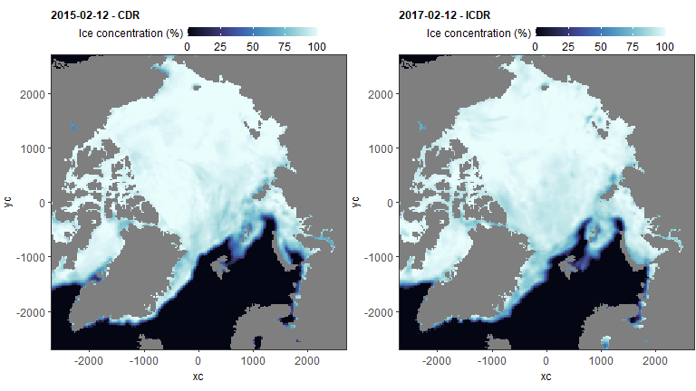

PanArctic DSL - Remote sensing
================
[Pierre Priou](mailto:pierre.priou@mi.mun.ca)
2022/02/02 at 13:46

# Package loading

``` r
library(tidyverse)  # Tidy code
library(lubridate)  # Deal with dates
library(tidync)     # Read NetCDF
library(raster)     # Rasterize data
library(ecmwfr)     # Download Copernicus data
```

# Sea ice data

Code that downloads sea ice data from the [Copernicus
website](https://cds.climate.copernicus.eu/cdsapp#!/dataset/satellite-sea-ice-concentration?tab=overview).
We use the daily sea ice concentration derived from satellite
observations from ECMWF. Data is downloaded in two batches because ECMWF
changed their Climate Data Record (CDR) on 2016-01-01. I changed the sea
ice data projection from Lambert Azimuthal Equal Area (EPSG:6931) to
WGS84 (EPSG:4326) and match the resolution to that of backscatter
anomalies (2 deg longitude \* 1 deg latitude).

## CDR data 2014-01-01 - 2015-12-31

``` r
# Define projections: latlon (acoustic and CTD data), and laea (sea ice data)
arctic_latlon <- raster(extent(-180,180,0,90), crs = "+init=epsg:4326", res = c(2, 1))
arctic_laea <- raster(extent(-5400,5400,-5400,5400), crs = "+init=epsg:6931", res = c(25, 25))
# Date range of interest
dates <- seq(ymd("2014-01-01"), ymd("2015-12-31"), 1)
# Download data
for (d in dates) {
  # Format years, month, and day to be correctly read in the request
  year = as.character(year(as.Date(d, origin = "1970-01-01")))
  month = if_else(as.numeric(month(as.Date(d, origin =" 1970-01-01"))) < 10,
                  paste0("0", as.character(month(as.Date(d, origin = "1970-01-01")))),
                  as.character(month(as.Date(d, origin = "1970-01-01"))))
  day = if_else(as.numeric(day(as.Date(d, origin = "1970-01-01"))) < 10,
                paste0("0", as.character(day(as.Date(d, origin = "1970-01-01")))),
                as.character(day(as.Date(d, origin = "1970-01-01"))))
  request <- list(version = "v2", # Create request
                  variable = "all",
                  format = "zip",
                  origin = "eumetsat_osi_saf",
                  region = "northern_hemisphere",
                  cdr_type = "cdr",
                  year = year,
                  month = month,
                  day = day,
                  dataset_short_name = "satellite-sea-ice-concentration",
                  target = "download.zip")
  print(paste0("Downloading and tidying ", request$dataset_short_name, " from ", year, "-", month, "-", day))
  tmp_raw <- wf_request(user = "113650", # Download requested file
                        request = request, 
                        transfer = T, 
                        verbose = F,
                        path = "data/remote_sensing/sea_ice/tmp") %>%
    unzip(exdir = "data/remote_sensing/sea_ice/tmp") %>%  # Unzip file
    tidync() # Read sea ice data
  # tmp_raw <- tidync("data/remote_sensing/ice_conc_nh_ease2-250_icdr-v2p0_201703091200.nc")
  tmp_coord <- tmp_raw %>% # Extract latlon and laea coordinates
    activate("D2,D3") %>%
    hyper_tibble()
  tmp_seaice <- tmp_raw %>%
    activate("D2,D3,D0") %>%
    hyper_tibble() %>%
    left_join(., tmp_coord, by = c("xc", "yc")) %>% # Join latlon coordinates to sea ice data
    mutate(date = ymd(format(as_datetime(time, origin = "1978-01-01", tz = "UTC"), format = "%Y%m%d"))) %>%
    filter(status_flag != c(1, 2, 16)) # Remove data from land (1), lakes (2), and possible dalse ice (16)
  tmp <- SpatialPointsDataFrame(SpatialPoints(cbind(tmp_seaice$lon, tmp_seaice$lat), # transform in spatial point data frame
                                              proj4string = CRS("+init=epsg:4326")),
                                data.frame(date = as.numeric(tmp_seaice$date), 
                                           ice_conc = tmp_seaice$ice_conc, 
                                           total_se = tmp_seaice$total_standard_error,
                                           smearing_se = tmp_seaice$smearing_standard_error,
                                           algorithm_se = tmp_seaice$algorithm_standard_error)) %>%
    rasterize(., arctic_latlon, fun = mean, na.rm = T) %>% # Rasterize data in latlon
    dropLayer(1) %>% # Remove ID layer
    crop(., y = extent(-155, 35, 66, 85)) %>% # Crop raster to areas of interest
    rasterToPoints() %>% # Convert raster to data frame
    as.data.frame() %>%
    rename(lon = x, lat = y) %>% # Rename variables
    mutate(date = as_date(date)) # Reformat date 
  write_csv(tmp, file = paste0("data/remote_sensing/sea_ice/", year, month, day, "_ice_conc.csv")) # Save data as a csv file
  file.remove(list.files("data/remote_sensing/sea_ice/tmp", full.names = T)) # Delete temporary netcdf and zip files
}
rm(request, tmp_raw, tmp_coord, tmp_seaice, tmp) # Remove unused variables
```

## ICDR data 2016-01-01 - 2017-12-31

``` r
# Define projections: latlon (acoustic and CTD data), and laea (sea ice data)
arctic_latlon <- raster(extent(-180,180,0,90), crs = "+init=epsg:4326", res = c(2, 1))
arctic_laea <- raster(extent(-5400,5400,-5400,5400), crs = "+init=epsg:6931", res = c(25, 25))
# Date range of interest
dates <- seq(ymd("2016-01-01"), ymd("2017-12-31"), 1)
# Download data
for (d in dates) {
  # Format years, month, and day to be correctly read in the request
  year = as.character(year(as.Date(d, origin = "1970-01-01")))
  month = if_else(as.numeric(month(as.Date(d, origin =" 1970-01-01"))) < 10,
                  paste0("0", as.character(month(as.Date(d, origin = "1970-01-01")))),
                  as.character(month(as.Date(d, origin = "1970-01-01"))))
  day = if_else(as.numeric(day(as.Date(d, origin = "1970-01-01"))) < 10,
                paste0("0", as.character(day(as.Date(d, origin = "1970-01-01")))),
                as.character(day(as.Date(d, origin = "1970-01-01"))))
  request <- list(version = "v2", # Create request
                  variable = "all",
                  format = "zip",
                  origin = "eumetsat_osi_saf",
                  region = "northern_hemisphere",
                  cdr_type = "icdr",
                  year = year,
                  month = month,
                  day = day,
                  dataset_short_name = "satellite-sea-ice-concentration",
                  target = "download.zip")
  print(paste0("Downloading and tidying ", request$dataset_short_name, " from ", year, "-", month, "-", day))
  tmp_raw <- wf_request(user = "113650", # Download requested file
                        request = request, 
                        transfer = T, 
                        verbose = F,
                        path = "data/remote_sensing/sea_ice/tmp") %>%
    unzip(exdir = "data/remote_sensing/sea_ice/tmp") %>%  # Unzip file
    tidync() # Read sea ice data
  # tmp_raw <- tidync("data/remote_sensing/ice_conc_nh_ease2-250_icdr-v2p0_201703091200.nc")
  tmp_coord <- tmp_raw %>% # Extract latlon and laea coordinates
    activate("D2,D3") %>%
    hyper_tibble()
  tmp_seaice <- tmp_raw %>%
    activate("D2,D3,D0") %>%
    hyper_tibble() %>%
    left_join(., tmp_coord, by = c("xc", "yc")) %>% # Join latlon coordinates to sea ice data
    mutate(date = ymd(format(as_datetime(time, origin = "1978-01-01", tz = "UTC"), format = "%Y%m%d"))) %>%
    filter(status_flag != c(1, 2, 16)) # Remove data from land (1), lakes (2), and possible dalse ice (16)
  tmp <- SpatialPointsDataFrame(SpatialPoints(cbind(tmp_seaice$lon, tmp_seaice$lat), # transform in spatial point data frame
                                              proj4string = CRS("+init=epsg:4326")),
                                data.frame(date = as.numeric(tmp_seaice$date), 
                                           ice_conc = tmp_seaice$ice_conc, 
                                           total_se = tmp_seaice$total_standard_error,
                                           smearing_se = tmp_seaice$smearing_standard_error,
                                           algorithm_se = tmp_seaice$algorithm_standard_error)) %>%
    rasterize(., arctic_latlon, fun = mean, na.rm = T) %>% # Rasterize data in latlon
    dropLayer(1) %>% # Remove ID layer
    crop(., y = extent(-155, 35, 66, 85)) %>% # Crop raster to areas of interest
    rasterToPoints() %>% # Convert raster to data frame
    as.data.frame() %>%
    rename(lon = x, lat = y) %>% # Rename variables
    mutate(date = as_date(date)) # Reformat date 
  write_csv(tmp, file = paste0("data/remote_sensing/sea_ice/", year, month, day, "_ice_conc.csv")) # Save data as a csv file
  file.remove(list.files("data/remote_sensing/sea_ice/tmp", full.names = T)) # Delete temporary netcdf and zip files
}
rm(request, tmp_raw, tmp_coord, tmp_seaice, tmp) # Remove unused variables
```

Plot data to see if reprojection worked.

``` r
read_csv("data/remote_sensing/sea_ice/20150212_ice_conc.csv") %>%
  ggplot(aes(x = lon, y = lat, fill = ice_conc)) + 
  geom_tile() + 
  scale_fill_viridis_c("Ice concentration (%)") +
  ggtitle("2015-02-12 - CDR") + 
  coord_cartesian(expand = c(0, 0))
```



``` r
read_csv("data/remote_sensing/sea_ice/20170212_ice_conc.csv") %>%
  ggplot(aes(x = lon, y = lat, fill = ice_conc)) + 
  geom_tile() + 
  scale_fill_viridis_c("Ice concentration (%)") +
  ggtitle("2017-02-12 - ICDR") + 
  coord_cartesian(expand = c(0, 0))
```


## Tidy sea ice data

I calculate the day of ice break-up, sea ice and open-water duration,
and mean sea ice concentration for each cell. I calculate open-water
duration from one sea ice minimum extent to the next. I retrieved the
dates of the sea ice minimum extent from
[NSIDC](http://nsidc.org/arcticseaicenews/2021/09/arctic-sea-ice-at-highest-minimum-since-2014/).
We define a cell being ice-covered when the mean sea ice concentration
is above 15 % [(as per NSIDC Sea Ice
Index)](https://nsidc.org/cryosphere/glossary/term/ice-extent).

``` r
date_min_seaice <- c(as.POSIXct("2014-09-17", tz = "UTC"), # Define dates of minimum sea ice extent
                     as.POSIXct("2015-09-09", tz = "UTC"),
                     as.POSIXct("2016-09-10", tz = "UTC"),
                     as.POSIXct("2017-09-13", tz = "UTC"))
seaice_2deg <- list.files("data/remote_sensing/sea_ice", pattern = "*_ice_conc.csv", full.names = T) %>% # List files in folder
  map_dfr(.f = ~ read_csv(., col_types = list("n", "n", "D", "n", "n", "n", "n"))) %>% # Read sea ice files
  mutate(date = ymd(date),
         season = case_when(date >= date_min_seaice[1] & date <= date_min_seaice[2] ~ 2015,
                            date >= date_min_seaice[2] & date <= date_min_seaice[3] ~ 2016,
                            date >= date_min_seaice[3] & date <= date_min_seaice[4] ~ 2017),
         year = year(date),
         area = factor(case_when(lon > -155 & lon <= -95 & lat > 65 & lat <= 82 ~ "BF_CAA",
                                 lon > -95 & lon <= -50 & lat > 66 & lat <= 82 ~ "BB",
                                 lon >= -25 & lon <= 145 & lat > 77 & lat <= 90 ~ "SV"),
                       levels = c("BF_CAA", "BB", "SV", "Other")))
seaice_2deg_season <- seaice_2deg %>% # Calculate metrics for each season
  filter(is.na(season) == F) %>% # Remove data outside of seasons (early 2014 and late 2017)
  mutate(ice_covered_day = if_else(ice_conc > 15, 1, 0)) %>%
  group_by(season, lat, lon) %>%
  mutate(ice_breakup = case_when(ice_conc < 15 ~ max(date))) %>% # Define open water as ice_conc < 15 %
  summarise(total_day = n(),
            seaice_duration = sum(ice_covered_day),
            openwater_duration = total_day - seaice_duration,
            mean_ice_conc = round(mean(ice_conc, na.rm = T), 2))
seaice_2deg_year <- seaice_2deg %>% # Calculate metrics for each season
  filter(year >= 2015) %>% # Remove data from 2014
  mutate(ice_covered_day = if_else(ice_conc > 15, 1, 0)) %>%
  group_by(year, lat, lon) %>%
  mutate(ice_breakup = case_when(ice_conc < 15 ~ max(date))) %>% # Define open water as ice_conc < 15 %
  summarise(total_day = n(),
            seaice_duration = sum(ice_covered_day),
            openwater_duration = total_day - seaice_duration,
            mean_ice_conc = round(mean(ice_conc, na.rm = T), 2))
save(seaice_2deg, seaice_2deg_season, seaice_2deg_year, file = "data/remote_sensing/remote_sensing_seaice_2deg.RData") # Save data
```

Plot data to see if calculations worked.

``` r
seaice_2deg_year %>%
  ggplot(aes(x = lon, y = lat, fill = openwater_duration)) +
  geom_tile() + 
  scale_fill_viridis_c("Open water\nduration (days)", option = "inferno", direction = -1) +
  facet_wrap(~ year, ncol = 1) + 
  coord_cartesian(expand = c(0, 0))
```


``` r
seaice_2deg_year %>%
  ggplot(aes(x = lon, y = lat, fill = mean_ice_conc)) +
  geom_tile() + 
  scale_fill_viridis_c("Mean ice\nconcentration (%)", option = "viridis") +
  facet_wrap(~ year, ncol = 1)+ 
  coord_cartesian(expand = c(0, 0))
```


