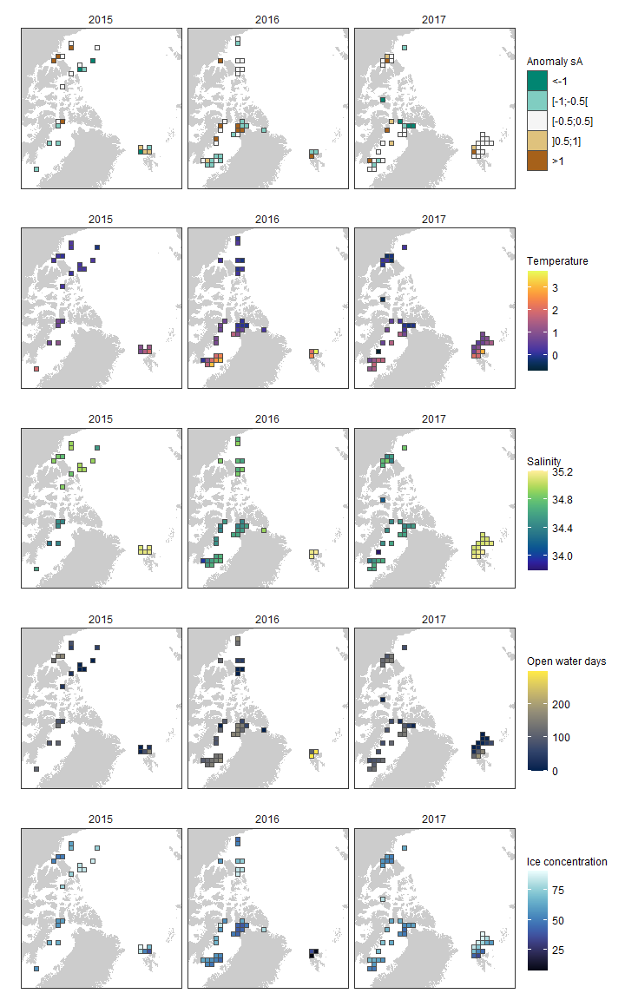
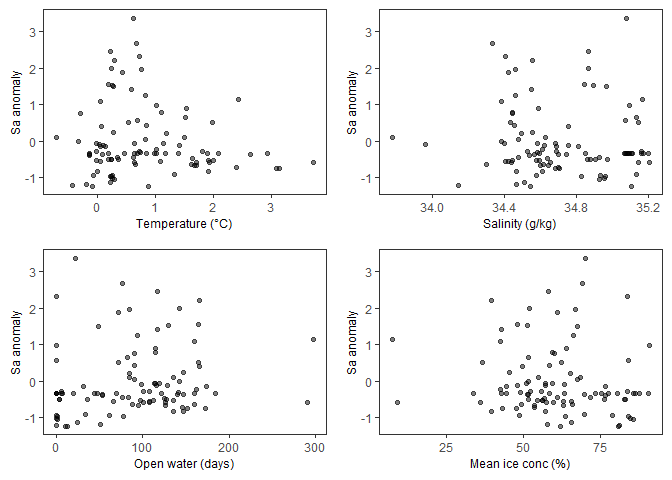
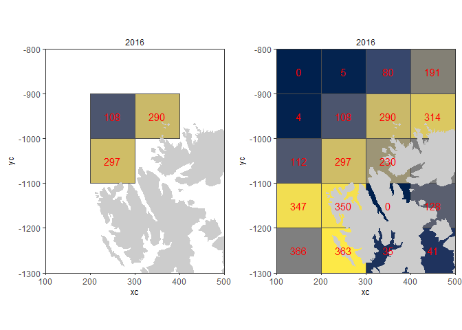
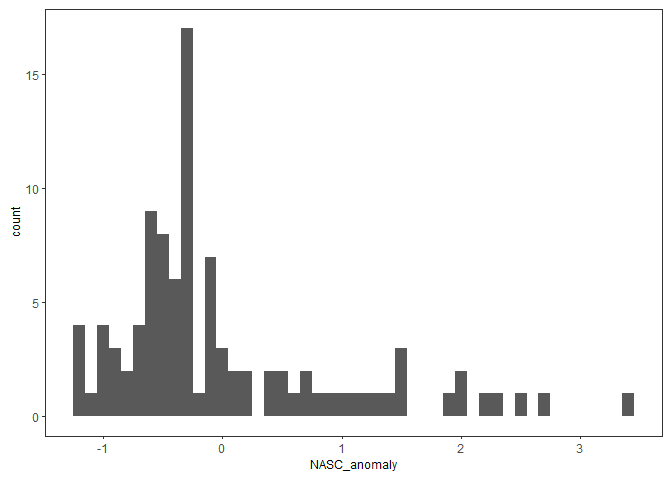

PanArctic DSL - Statistics
================
[Pierre Priou](mailto:pierre.priou@mi.mun.ca)
2022/02/08 at 18:00

# Package loading

``` r
# Load packages
library(tidyverse)    # Tidy code
library(cowplot)      # Plots on a grid
library(raster)       # Data gridding
library(rgdal)        # Read shapefiles
library(ggpubr)       # Deal with stats
library(ggfortify)    # Plotting glm
library(RColorBrewer) # Diverging colour palettes
library(cmocean)      # Oceanographic colour palettes
# Custom figure theme
theme_set(theme_bw())
theme_update(axis.text = element_text(size = 9),
             axis.title = element_text(size = 9),
             strip.text.x = element_text(size = 9, face = "plain", hjust = 0.5),
             strip.background = element_rect(colour = "transparent", fill = "transparent"),
             legend.title = element_text(size = 9),
             legend.margin = margin(0, 0, 0, 0),
             legend.box.margin = margin(0, 0, -8, 0),
             panel.grid = element_blank(), 
             plot.margin = unit(c(0.1, 0.1, 0.1, 0.1), "in"))
options(dplyr.summarise.inform = F) # Suppress summarise() warning
```

I want to test whether temperature and salinity at mesopelagic depth,
sea-ice concentration, open-water duration (a proxy for productivity)
have an effect on the backscatter anomalies observed per year. I
therefore combined gridded acoustic data—integrated mesopelagic
NASC—with gridded CTD, and remote sensing data projected on either the
WGS84 or the EASE-Grid 2.0 North.

``` r
# Map projections
cell_res <- 100 # Cell resolution in km
arctic_laea <- raster(extent(-2700, 2700, -2700, 2700), crs = "EPSG:6931") # Seaice projection
projection(arctic_laea) <- gsub("units=m", "units=km", projection(arctic_laea)) # Convert proj unit from m to km
res(arctic_laea) <- c(cell_res, cell_res) # Define the 100 km cell resolution

arctic_latlon <- raster(extent(-155, 35, 66, 85), # Base projection for acoustic and CTD data
                        crs = "EPSG:4326", 
                        res = c(2, 1)) # cells of 2 degree longitude per 1 degree latitude

# Coastline shapefiles
coast_10m_latlon <- readOGR("data/bathy/ne_10m_land.shp", verbose = F) %>% # Coastline in latlon
  spTransform(CRSobj = crs(arctic_latlon)) %>% # Make sure that the shapefile is in the right projection
  crop(extent(-180, 180, 0, 90)) %>% # Crop shapefile
  fortify() %>% # Convert to a dataframe for ggplot
  rename(lon = long)
coast_10m_laea <- readOGR("data/bathy/ne_10m_land.shp", verbose = F) %>% # Coastline in laea
  spTransform(CRSobj = crs(arctic_latlon)) %>% # Make sure that the shapefile is in the right projection
  crop(extent(-180, 180, 0, 90)) %>% # Crop shapefile
  spTransform(CRSobj = crs(arctic_laea)) %>% # Project shapefile in laea
  fortify() %>% # Convert to a dataframe for ggplot
  rename(xc = long, yc = lat)

# Gridded acoustic, CTD, and sea ice data
load("data/acoustics/SA_grids.RData") # Acoustic data
load("data/CTD/CTD_grids.RData") # CTD data
load("data/remote_sensing/seaice_grids.RData") # Remote sensing sea ice data
```

# EPSG:6931 - EASE-Grid 2.0 North

## Data preparation

First I combine data using the EASE-Grid 2.0 North (EPSG:6931).

``` r
SA_laea <- SA_grid_laea %>%  # Tidy anomaly dataset for joining
  dplyr::select(-lat, -lon)
CTD_laea <- CTD_grid_laea %>% # Tidy CTD dataset for joining
  dplyr::select(-lat, -lon)
seaice_laea <- seaice_grid_laea %>% # Tidy sea ice dataset for joining
  dplyr::select(-lat, -lon)

stat_laea <- left_join(SA_laea, seaice_laea, by = c("year", "area", "xc", "yc")) %>% # Join acoustic and seaice
  rowwise() %>%
  # Replace missing values of seaice by the mean of cells within a 1 cell radius
  mutate(xc_na = if_else(is.na(mean_ice_conc) == T, xc, NaN),
         yc_na = if_else(is.na(mean_ice_conc) == T, yc, NaN),
         year_na = if_else(is.na(mean_ice_conc) == T, year, NaN), 
         mean_ice_conc = if_else(is.na(mean_ice_conc) == T, 
                                 mean(pull(subset(seaice_grid_laea,
                                                  xc >= xc_na - 100 & xc <= xc_na + 100 & 
                                                    yc >= yc_na - 100 &  yc <= yc_na + 100 & 
                                                    year == year_na,
                                                  select = mean_ice_conc),
                                           mean_ice_conc),
                                      na.rm = T),
                                 mean_ice_conc),
         openwater_duration = if_else(is.na(openwater_duration) == T, 
                                      mean(pull(subset(seaice_grid_laea,
                                                       xc >= xc_na - 100 & xc <= xc_na + 100 & 
                                                         yc >= yc_na - 100 &  yc <= yc_na + 100 & 
                                                         year == year_na,
                                                       select = openwater_duration),
                                                openwater_duration),
                                           na.rm = T),
                                      openwater_duration),
         seaice_duration = if_else(is.na(seaice_duration) == T, 
                                   mean(pull(subset(seaice_grid_laea,
                                                    xc >= xc_na - 100 & xc <= xc_na + 100 & 
                                                      yc >= yc_na - 100 &  yc <= yc_na + 100 & 
                                                      year == year_na,
                                                    select = seaice_duration),
                                             seaice_duration),
                                        na.rm = T),
                                   seaice_duration)) %>%
  left_join(., CTD_laea, by = c("year", "area", "xc", "yc")) %>% # Join CTD data
  dplyr::select(-xc_na, -yc_na, -year_na) %>%
  # Replace missing values of temperature and salinity by the mean of cells within a 1 cell radius
  mutate(xc_na = if_else(is.na(cons_temp) == T, xc, NaN),
         yc_na = if_else(is.na(cons_temp) == T, yc, NaN),
         year_na = if_else(is.na(cons_temp) == T, year, NaN), 
         cons_temp = if_else(is.na(cons_temp) == T, 
                             mean(pull(subset(CTD_grid_laea,
                                              xc >= xc_na - 100 & xc <= xc_na + 100 & 
                                                yc >= yc_na - 100 &  yc <= yc_na + 100 & 
                                                year == year_na,
                                              select = cons_temp),
                                       cons_temp),
                                  na.rm = T),
                             cons_temp),
         abs_sal = if_else(is.na(abs_sal) == T, 
                           mean(pull(subset(CTD_grid_laea,
                                            xc >= xc_na - 100 & xc <= xc_na + 100 & 
                                              yc >= yc_na - 100 &  yc <= yc_na + 100 & 
                                              year == year_na,
                                            select = abs_sal),
                                     abs_sal),
                                na.rm = T),
                           abs_sal)) %>%
  dplyr::select(-xc_na, -yc_na, -year_na) %>%
  # There's still a missing value in 2017 in the CAA; I replace that value by the mean of cells within a 2 cell radius
  mutate(xc_na = if_else(is.na(cons_temp) == T, xc, NaN),
         yc_na = if_else(is.na(cons_temp) == T, yc, NaN),
         year_na = if_else(is.na(cons_temp) == T, year, NaN), 
         cons_temp = if_else(is.na(cons_temp) == T, 
                             mean(pull(subset(CTD_grid_laea,
                                              xc >= xc_na - 200 & xc <= xc_na + 200 & 
                                                yc >= yc_na - 200 &  yc <= yc_na + 200 & 
                                                year == year_na,
                                              select = cons_temp),
                                       cons_temp),
                                  na.rm = T),
                             cons_temp),
         abs_sal = if_else(is.na(abs_sal) == T, 
                           mean(pull(subset(CTD_grid_laea,
                                            xc >= xc_na - 200 & xc <= xc_na + 200 & 
                                              yc >= yc_na - 200 &  yc <= yc_na + 200 & 
                                              year == year_na,
                                            select = abs_sal),
                                     abs_sal),
                                na.rm = T),
                           abs_sal)) %>%
  dplyr::select(-xc_na, -yc_na, -year_na) 
```

Maps of all variables.

``` r
plot_grid(stat_laea %>% # Normalized backscatter anomaly
            ggplot(aes(x = xc,  y = yc)) +
            geom_polygon(data = coast_10m_laea, aes(x = xc, y = yc, group = group), fill = "grey80") +
            geom_tile(aes(fill = NASC_anomaly_d), color = "grey30") +
            scale_fill_manual("Anomaly sA", values = rev(brewer.pal(n = 5, name = "BrBG")), na.value = "red") +
            facet_wrap(~ year, ncol = 3) +
            coord_fixed(xlim = c(-2600, 1100), ylim = c(-1800, 1900), expand = F) + 
            theme(axis.text = element_blank(), axis.ticks = element_blank(), axis.title = element_blank()),
          stat_laea %>% # Conservative temperature
            ggplot(aes(x = xc,  y = yc)) +
            geom_polygon(data = coast_10m_laea, aes(x = xc, y = yc, group = group), fill = "grey80") +
            geom_tile(aes(fill = cons_temp), col = "grey30") +
            scale_fill_cmocean("Temperature", name = "thermal", na.value = "red") +
            facet_wrap(~ year, ncol = 3) +
            coord_fixed(xlim = c(-2600, 1100), ylim = c(-1800, 1900), expand = F) + 
            theme(axis.text = element_blank(), axis.ticks = element_blank(), axis.title = element_blank()),
          stat_laea %>% # Absolute salinity
            ggplot(aes(x = xc,  y = yc)) +
            geom_polygon(data = coast_10m_laea, aes(x = xc, y = yc, group = group), fill = "grey80") +
            geom_tile(aes(fill = abs_sal), col = "grey30") +
            scale_fill_cmocean("Salinity", name = "haline", na.value = "red") +
            facet_wrap(~ year, ncol = 3) +
            coord_fixed(xlim = c(-2600, 1100), ylim = c(-1800, 1900), expand = F) + 
            theme(axis.text = element_blank(), axis.ticks = element_blank(), axis.title = element_blank()),
          stat_laea %>% # Open water duration
            ggplot(aes(x = xc,  y = yc)) +
            geom_polygon(data = coast_10m_laea, aes(x = xc, y = yc, group = group), fill = "grey80") +
            geom_tile(aes(fill = openwater_duration), col = "grey30") +
            scale_fill_viridis_c("Open water days", option = "cividis", na.value = "red") +
            facet_wrap(~ year, ncol = 3) +
            coord_fixed(xlim = c(-2600, 1100), ylim = c(-1800, 1900), expand = F) + 
            theme(axis.text = element_blank(), axis.ticks = element_blank(), axis.title = element_blank()),
          stat_laea %>% # Ice concentration
            ggplot(aes(x = xc,  y = yc)) +
            geom_polygon(data = coast_10m_laea, aes(x = xc, y = yc, group = group), fill = "grey80") +
            geom_tile(aes(fill = mean_ice_conc), col = "grey30") +
            scale_fill_cmocean("Ice concentration", name = "ice", na.value = "red") +
            facet_wrap(~ year, ncol = 3) +
            coord_fixed(xlim = c(-2600, 1100), ylim = c(-1800, 1900), expand = F) + 
            theme(axis.text = element_blank(), axis.ticks = element_blank(), axis.title = element_blank()),
          ncol = 1, align = "hv", axis = "tblr")
```



## Data exploration

``` r
plot_grid(stat_laea %>%
            ggplot(aes(x = cons_temp, y = NASC_anomaly, col = area)) +
            geom_point(alpha = 0.5) +
            stat_smooth(method = "lm", se = F) +
            scale_x_continuous("Temperature (°C)") +
            scale_y_continuous("Sa anomaly"),
          stat_laea %>%
            ggplot(aes(x = abs_sal, y = NASC_anomaly, col = area)) +
            geom_point(alpha = 0.5) +
            stat_smooth(method = "lm", se = F) +
            scale_x_continuous("Salinity (g/kg)") +
            scale_y_continuous("Sa anomaly"),
          stat_laea %>%
            ggplot(aes(x = openwater_duration, y = NASC_anomaly, col = area)) +
            geom_point(alpha = 0.5) +
            stat_smooth(method = "lm", se = F) +
            scale_x_continuous("Open water (days)") +
            scale_y_continuous("Sa anomaly"),
          stat_laea %>%
            ggplot(aes(x = mean_ice_conc, y = NASC_anomaly, col = area)) +
            geom_point(alpha = 0.5) +
            stat_smooth(method = "lm", se = F) +
            scale_x_continuous("Mean ice conc (%)") +
            scale_y_continuous("Sa anomaly"),
          ncol = 2, align = "hv", axis = "tblr")
```



The two cells with open water days &gt; 200 and mean ice concentration
&lt; 25 % are from Svalbard in 2016. These are not outliers, the ice
edge in Svalbard in 2016 was quite far north all year round.

``` r
plot_grid(stat_laea %>% 
            filter(year == 2016) %>%
            ggplot(aes(x = xc,  y = yc)) +
            geom_tile(aes(fill = openwater_duration), col = "grey30") +
            geom_polygon(data = coast_10m_laea, aes(x = xc, y = yc, group = group), fill = "grey80") +
            geom_text(aes(label = round(openwater_duration)), col = "red") +
            scale_fill_viridis_c("Open water days", option = "cividis", limits = c(0,365)) +
            facet_wrap(~ year, ncol = 3) +
            coord_fixed(xlim = c(100, 500), ylim = c(-1300, -800), expand = F) +
            theme(legend.position = "none"),
          seaice_grid_laea %>% 
            filter(year == 2016) %>%
            ggplot(aes(x = xc,  y = yc)) +
            geom_tile(aes(fill = openwater_duration), col = "grey30") +
            geom_polygon(data = coast_10m_laea, aes(x = xc, y = yc, group = group), fill = "grey80") +
            geom_text(aes(label = round(openwater_duration)), col = "red") +
            scale_fill_viridis_c("Open water days", option = "cividis", limits = c(0,365)) +
            facet_wrap(~ year, ncol = 3) +
            coord_fixed(xlim = c(100, 500), ylim = c(-1300, -800), expand = F) +
            theme(legend.position = "none"),
          ncol = 2)
```

<!-- -->

Data does not look very normal. The mean and variance of normalized
backscatter anomalies are 0, 0.918, respectively.

``` r
stat_laea %>%
  ggplot() + 
  geom_histogram(aes(x = NASC_anomaly), binwidth = 0.1)
```

<!-- -->
Gaussian linear regression.

``` r
# Gaussian linear model
lm_gaussian <- lm(NASC_anomaly ~ cons_temp + abs_sal + mean_ice_conc + openwater_duration, 
                  data = stat_laea)
summary(lm_gaussian)
```

    ## 
    ## Call:
    ## lm(formula = NASC_anomaly ~ cons_temp + abs_sal + mean_ice_conc + 
    ##     openwater_duration, data = stat_laea)
    ## 
    ## Residuals:
    ##     Min      1Q  Median      3Q     Max 
    ## -1.1162 -0.5688 -0.2367  0.2913  3.6079 
    ## 
    ## Coefficients:
    ##                      Estimate Std. Error t value Pr(>|t|)  
    ## (Intercept)        -13.225806  13.815624  -0.957   0.3409  
    ## cons_temp           -0.306711   0.142562  -2.151   0.0340 *
    ## abs_sal              0.335520   0.386256   0.869   0.3873  
    ## mean_ice_conc        0.017360   0.016516   1.051   0.2959  
    ## openwater_duration   0.008558   0.004462   1.918   0.0582 .
    ## ---
    ## Signif. codes:  0 '***' 0.001 '**' 0.01 '*' 0.05 '.' 0.1 ' ' 1
    ## 
    ## Residual standard error: 0.9404 on 93 degrees of freedom
    ## Multiple R-squared:  0.07585,    Adjusted R-squared:  0.0361 
    ## F-statistic: 1.908 on 4 and 93 DF,  p-value: 0.1156

``` r
autoplot(lm_gaussian)
```


