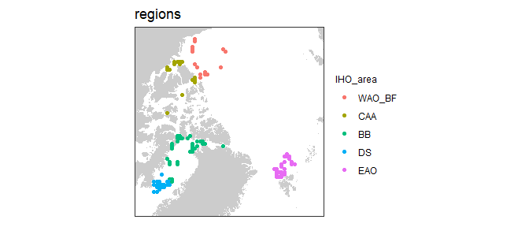
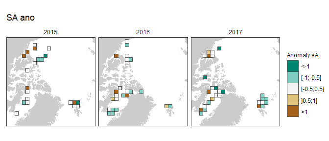
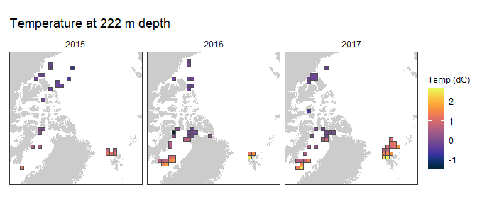
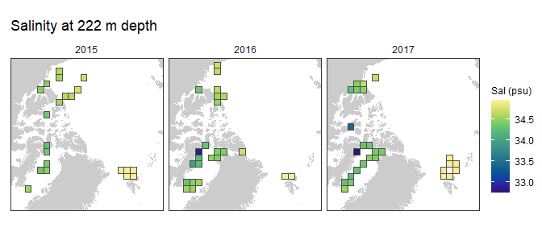
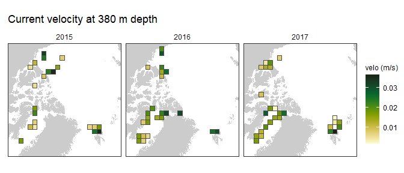
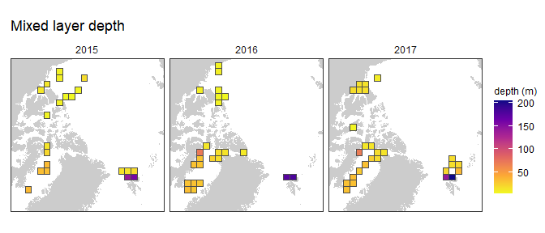
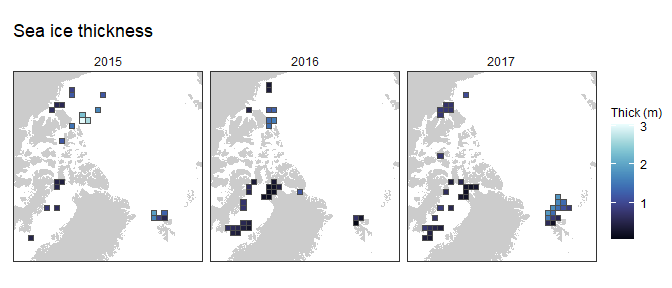
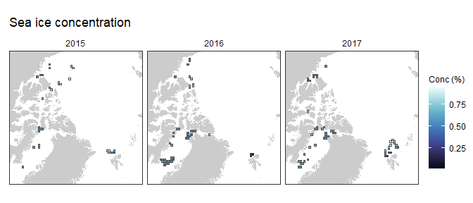
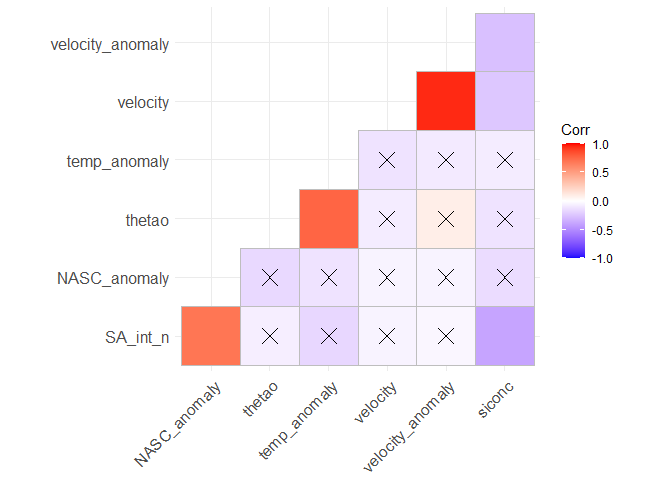

PanArctic DSL - Statistics
================
[Pierre Priou](mailto:pierre.priou@mi.mun.ca)
2022/04/22 at 14:22

# Package loading

``` r
# Load packages
library(tidyverse)    # Tidy code
library(cowplot)      # Plots on a grid
library(raster)       # Data gridding
library(rgdal)        # Read shapefiles
library(ggpubr)       # Deal with stats
library(ggfortify)    # Plotting glm
library(RColorBrewer) # Diverging colour palettes
library(cmocean)      # Oceanographic colour palettes
library(moments)      # Overlay distributions
library(ggcorrplot)   # Correlation plots
```

    ## Warning: package 'ggcorrplot' was built under R version 4.1.3

``` r
# Custom figure theme
theme_set(theme_bw())
theme_update(axis.text = element_text(size = 9),
             axis.title = element_text(size = 9),
             strip.text.x = element_text(size = 9, face = "plain", hjust = 0.5),
             strip.background = element_rect(colour = "transparent", fill = "transparent"),
             legend.title = element_text(size = 9),
             legend.margin = margin(0, 0, 0, 0),
             legend.box.margin = margin(0, 0, -8, 0),
             panel.grid = element_blank(), 
             plot.margin = unit(c(0.1, 0.1, 0.1, 0.1), "in"))
options(dplyr.summarise.inform = F) # Suppress summarise() warning
```

I want to test whether temperature and salinity at mesopelagic depth,
sea-ice concentration, open-water duration (a proxy for productivity)
have an effect on the backscatter anomalies observed per year. I
therefore combined gridded acoustic data—integrated mesopelagic
NASC—with gridded CTD, and remote sensing data projected on either the
WGS84 or the EASE-Grid 2.0 North.

``` r
# Map projections
cell_res <- 150 # Cell resolution in km
arctic_laea <- raster(extent(-2700, 2700, -2700, 2700), crs = "EPSG:6931") # Seaice projection
projection(arctic_laea) <- gsub("units=m", "units=km", projection(arctic_laea)) # Convert proj unit from m to km
res(arctic_laea) <- c(cell_res, cell_res) # Define the 100 km cell resolution

arctic_latlon <- raster(extent(-155, 35, 66, 85), # Base projection for acoustic and CTD data
                        crs = "EPSG:4326", 
                        res = c(2, 1)) # cells of 2 degree longitude per 1 degree latitude

# Coastline shapefiles
coast_10m_latlon <- readOGR("data/bathy/ne_10m_land.shp", verbose = F) %>% # Coastline in latlon
  spTransform(CRSobj = crs(arctic_latlon)) %>% # Make sure that the shapefile is in the right projection
  crop(extent(-180, 180, 0, 90)) %>% # Crop shapefile
  fortify() %>% # Convert to a dataframe for ggplot
  rename(lon = long)
coast_10m_laea <- readOGR("data/bathy/ne_10m_land.shp", verbose = F) %>% # Coastline in laea
  spTransform(CRSobj = crs(arctic_latlon)) %>% # Make sure that the shapefile is in the right projection
  crop(extent(-180, 180, 0, 90)) %>% # Crop shapefile
  spTransform(CRSobj = crs(arctic_laea)) %>% # Project shapefile in laea
  fortify() %>% # Convert to a dataframe for ggplot
  rename(xc = long, yc = lat)

# Gridded acoustic, CTD, and sea ice data
load("data/acoustics/SA_grids.RData") # Acoustic data
# load("data/CTD/CTD_grids.RData") # CTD data
load("data/remote_sensing/physics_grids.RData") # Modelled physics data 
load("data/remote_sensing/seaice_grids.RData") # Remote sensing sea ice data

rm(list = ls(pattern = "latlon")) # Remove EPSG:4326 files
```

# EPSG:6931 - EASE-Grid 2.0 North

## Data preparation

First I combine data using the EASE-Grid 2.0 North (EPSG:6931).

``` r
SA_laea <- SA_grid_laea %>%  # Tidy anomaly dataset for joining
  dplyr::select(-lat, -lon)
phy_laea <- phy_grid_laea %>% # Tidy remote sensing dataset for joining
  dplyr::select(-lat, -lon)

stat_laea <- left_join(SA_laea, phy_laea, by = c("year", "area", "xc", "yc", "cell_res")) %>% # Join acoustic and seaice
  filter(depth == 380) %>% # Select data at 222 m depth
  mutate(SA_int = 10 * log10(NASC_int))
```

Maps of all variables.

``` r
stat_laea %>% # Backscatter
  ggplot(aes(x = xc,  y = yc)) +
  geom_polygon(data = coast_10m_laea, aes(x = xc, y = yc, group = group), fill = "grey80") +
  geom_tile(aes(fill = SA_int), color = "grey30") +
  scale_fill_viridis_c("SA int (dB)", option = "turbo", na.value = "red") +
  facet_wrap(~ year, ncol = 3) +
  ggtitle("Integrated SA") +
  coord_fixed(xlim = c(-2600, 1100), ylim = c(-1800, 1900), expand = F) + 
  theme(axis.text = element_blank(), axis.ticks = element_blank(), axis.title = element_blank())
```

<!-- -->

``` r
stat_laea %>% # Backscatter anomaly
  ggplot(aes(x = xc,  y = yc)) +
  geom_polygon(data = coast_10m_laea, aes(x = xc, y = yc, group = group), fill = "grey80") +
  geom_tile(aes(fill = NASC_anomaly_d), color = "grey30") +
  scale_fill_manual("Anomaly sA", values = rev(brewer.pal(n = 5, name = "BrBG")), na.value = "red") +
  facet_wrap(~ year, ncol = 3) +
  ggtitle("SA ano") +
  coord_fixed(xlim = c(-2600, 1100), ylim = c(-1800, 1900), expand = F) + 
  theme(axis.text = element_blank(), axis.ticks = element_blank(), axis.title = element_blank())
```

<!-- -->

``` r
stat_laea %>% # Temperature
  ggplot(aes(x = xc,  y = yc)) +
  geom_polygon(data = coast_10m_laea, aes(x = xc, y = yc, group = group), fill = "grey80") +
  geom_tile(aes(fill = thetao), color = "grey30") +
  scale_fill_cmocean("Temp (dC)", name = "thermal", na.value = "red") +
  facet_wrap(~ year, ncol = 3) +
  ggtitle("Temperature at 222 m depth") +
  coord_fixed(xlim = c(-2600, 1100), ylim = c(-1800, 1900), expand = F) + 
  theme(axis.text = element_blank(), axis.ticks = element_blank(), axis.title = element_blank())
```

<!-- -->

``` r
stat_laea %>% # Salinity
  ggplot(aes(x = xc,  y = yc)) +
  geom_polygon(data = coast_10m_laea, aes(x = xc, y = yc, group = group), fill = "grey80") +
  geom_tile(aes(fill = so), color = "grey30") +
  scale_fill_cmocean("Sal (psu)", name = "haline", na.value = "red") +
  facet_wrap(~ year, ncol = 3) +
  ggtitle("Salinity at 222 m depth") +
  coord_fixed(xlim = c(-2600, 1100), ylim = c(-1800, 1900), expand = F) + 
  theme(axis.text = element_blank(), axis.ticks = element_blank(), axis.title = element_blank())
```

<!-- -->

``` r
stat_laea %>% # Ice concentration
  ggplot(aes(x = xc,  y = yc)) +
  geom_polygon(data = coast_10m_laea, aes(x = xc, y = yc, group = group), fill = "grey80") +
  geom_tile(aes(fill = velocity), color = "grey30") +
  scale_fill_cmocean("velo (m/s)", name = "speed", na.value = "red") +
  facet_wrap(~ year, ncol = 3) +
  ggtitle("Current velocity at 380 m depth") +
  coord_fixed(xlim = c(-2600, 1100), ylim = c(-1800, 1900), expand = F) + 
  theme(axis.text = element_blank(), axis.ticks = element_blank(), axis.title = element_blank())
```

<!-- -->

``` r
stat_laea %>% # Mixed layer depth
  ggplot(aes(x = xc,  y = yc)) +
  geom_polygon(data = coast_10m_laea, aes(x = xc, y = yc, group = group), fill = "grey80") +
  geom_tile(aes(fill = mlotst), color = "grey30") +
  scale_fill_viridis_c("depth (m)", option = "plasma", direction = -1, na.value = "red") +
  facet_wrap(~ year, ncol = 3) +
  ggtitle("Mixed layer depth") +
  coord_fixed(xlim = c(-2600, 1100), ylim = c(-1800, 1900), expand = F) + 
  theme(axis.text = element_blank(), axis.ticks = element_blank(), axis.title = element_blank())
```

<!-- -->

``` r
stat_laea %>% # Ice thickness
  ggplot(aes(x = xc,  y = yc)) +
  geom_polygon(data = coast_10m_laea, aes(x = xc, y = yc, group = group), fill = "grey80") +
  geom_tile(aes(fill = sithick), color = "grey30") +
  scale_fill_cmocean("Thick (m)", name = "ice", na.value = "red") +
  facet_wrap(~ year, ncol = 3) +
  ggtitle("Sea ice thickness") +
  coord_fixed(xlim = c(-2600, 1100), ylim = c(-1800, 1900), expand = F) + 
  theme(axis.text = element_blank(), axis.ticks = element_blank(), axis.title = element_blank())
```

<!-- -->

``` r
stat_laea %>% # Ice concentration
  ggplot(aes(x = xc,  y = yc)) +
  geom_polygon(data = coast_10m_laea, aes(x = xc, y = yc, group = group), fill = "grey80") +
  geom_tile(aes(fill = siconc), color = "grey30") +
  scale_fill_cmocean("Conc (%)", name = "ice", na.value = "red") +
  facet_wrap(~ year, ncol = 3) +
  ggtitle("Sea ice concentration") +
  coord_fixed(xlim = c(-2600, 1100), ylim = c(-1800, 1900), expand = F) + 
  theme(axis.text = element_blank(), axis.ticks = element_blank(), axis.title = element_blank())
```

<!-- -->

## Data exploration

First I check the general correlation for the entire data set and then I
check whether there are correlations within each cell.

``` r
corr <- stat_laea %>% # Compute Spearman correlation matrix
  dplyr::select(NASC_int, SA_int, NASC_anomaly, thetao, so, velocity, mlotst, siconc, sithick) %>%
  cor(., method = "spearman") %>%
  round(., 2)
corr_pvalues <- stat_laea %>% # Compute Spearman correlation matrix p-values
  dplyr::select(NASC_int, SA_int, NASC_anomaly, thetao, so, velocity, mlotst, siconc, sithick) %>%
  cor_pmat(., method = "spearman") 
```

``` r
ggcorrplot(corr, type = "lower", p.mat = corr_pvalues)
```

<!-- -->
