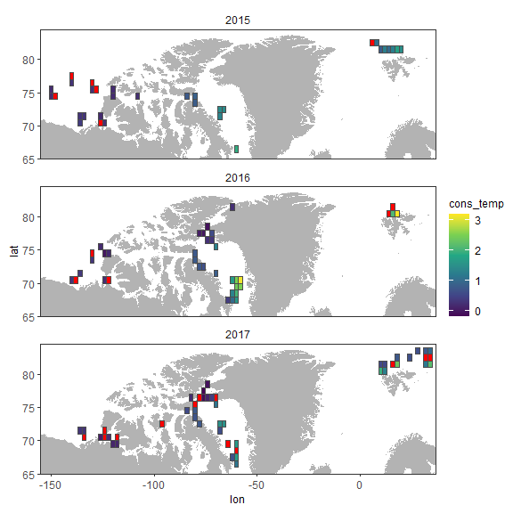

PanArctic DSL - Statistics
================
[Pierre Priou](mailto:pierre.priou@mi.mun.ca)
2022/02/02 at 19:42

# Package loading

``` r
# Load packages
library(tidyverse)  # Tidy code
library(cowplot)    # Plots on a grid
library(rgdal)      # Read shapefiles
library(ggpubr)     # Deal with stats
library(ggfortify)  # Plotting glm
# Custom figure theme
theme_set(theme_bw())
theme_update(axis.text = element_text(size = 9),
             axis.title = element_text(size = 9),
             strip.text.x = element_text(size = 9, face = "plain", hjust = 0.5),
             strip.background = element_rect(colour = "transparent", fill = "transparent"),
             legend.title = element_text(size = 9),
             legend.margin = margin(0, 0, 0, 0),
             legend.box.margin = margin(0, 0, -8, 0),
             panel.grid = element_blank(), 
             plot.margin = unit(c(0.1, 0.1, 0.1, 0.1), "in"))
options(dplyr.summarise.inform = F) # Suppress summarise() warning
```

# Preparing data

I want to test whether temperature and salinity at mesopelagic depth,
sea-ice concentration, open-water duration (a proxy for productivity)
have an effect on the backscatter anomalies observed per year. I
therefore combined gridded acoustic data—integrated mesopelagic
NASC—with gridded CTD, and remote sensing data.

``` r
coastlines_10m <- readOGR("data/bathy/ne_10m_land.shp", verbose = F) %>%  # Coastlines
  fortify() %>%
  rename(lon = long, region = id)
load("data/acoustics/MVBS_2015_2017.RData") # Acoustic data
load("data/CTD/CTD_grid_2deg_2015_2017.RData") # CTD data
load("data/remote_sensing/remote_sensing_seaice_2deg.RData") # Remote sensing sea ice data
```

``` r
SA_join <- SA_anomaly_2deg %>%  # Tidy anomaly dataset for joining
  dplyr::select(year, area, lat, lon, anomaly_NASC_int)
CTD_join <- CTD_2deg %>% # Tidy CTD dataset for joining
  dplyr::select(year, area, lat, lon, cons_temp, abs_sal)
seaice_join <- seaice_2deg_year %>% # Tidy sea ice dataset for joining
  dplyr::select(year, lat, lon, mean_ice_conc, openwater_duration, seaice_duration)

SA_CTD_seaice <- left_join(SA_join, seaice_join, by = c("year", "lon", "lat")) %>% # Join data
  left_join(., CTD_join, by = c("year", "area", "lon", "lat")) %>%
  mutate(anomaly_NASC_int = round(anomaly_NASC_int, 3))

summary(SA_CTD_seaice)
```

    ##       year          area         lat             lon         
    ##  Min.   :2015   BF_CAA:38   Min.   :66.50   Min.   :-150.00  
    ##  1st Qu.:2015   BB    :53   1st Qu.:70.50   1st Qu.:-122.00  
    ##  Median :2016   SV    :27   Median :74.50   Median : -74.00  
    ##  Mean   :2016   Other : 0   Mean   :74.88   Mean   : -68.58  
    ##  3rd Qu.:2017               3rd Qu.:78.25   3rd Qu.: -60.00  
    ##  Max.   :2017               Max.   :83.50   Max.   :  34.00  
    ##                                                              
    ##  anomaly_NASC_int    mean_ice_conc   openwater_duration seaice_duration
    ##  Min.   :-0.976000   Min.   : 5.18   Min.   :  0.00     Min.   : 37.0  
    ##  1st Qu.:-0.508750   1st Qu.:53.00   1st Qu.: 27.50     1st Qu.:232.2  
    ##  Median :-0.347000   Median :59.90   Median : 96.50     Median :268.5  
    ##  Mean   : 0.000034   Mean   :61.59   Mean   : 86.97     Mean   :278.3  
    ##  3rd Qu.: 0.015000   3rd Qu.:72.11   3rd Qu.:133.00     3rd Qu.:337.5  
    ##  Max.   : 4.493000   Max.   :92.52   Max.   :329.00     Max.   :366.0  
    ##                                                                        
    ##    cons_temp          abs_sal     
    ##  Min.   :-0.1900   Min.   :34.17  
    ##  1st Qu.: 0.2487   1st Qu.:34.55  
    ##  Median : 0.6815   Median :34.73  
    ##  Mean   : 0.8521   Mean   :34.76  
    ##  3rd Qu.: 1.2975   3rd Qu.:34.95  
    ##  Max.   : 3.2020   Max.   :35.19  
    ##  NA's   :24        NA's   :24

**PROBLEM: Some cells do not have temperature and salinity data (red
tiles). This needs to be fixed before modeling.**

``` r
SA_CTD_seaice %>%
  ggplot(aes(x = lon,  y = lat)) +
  geom_polygon(data = coastlines_10m, aes(x = lon, y = lat, group = group), fill = "grey70") +
  geom_tile(aes(fill = cons_temp), color = "grey30") + 
  scale_fill_viridis_c(na.value = "red") +
  facet_wrap(~ year, ncol = 1) +
  coord_cartesian(ylim = c(65, 84.5), xlim = c(-155, 37), expand = c(0, 0)) 
```



``` r
plot_grid(SA_CTD_seaice %>%
            ggplot() +
            geom_point(aes(x = cons_temp, y = anomaly_NASC_int, col = area)) +
            scale_x_continuous("Temperature (°C)") +
            scale_y_continuous("Sa anomaly") +
            theme(plot.margin = margin(0.1, 0.1, 0.1, 0.1, unit = "in")),
          SA_CTD_seaice %>%
            ggplot() +
            geom_point(aes(x = abs_sal, y = anomaly_NASC_int, col = area)) +
            scale_x_continuous("Salinity (g/kg)") +
            scale_y_continuous("Sa anomaly") +
            theme(plot.margin = margin(0.1, 0.1, 0.1, 0.1, unit = "in")),
          SA_CTD_seaice %>%
            ggplot() +
            geom_point(aes(x = mean_ice_conc, y = anomaly_NASC_int, col = area)) +
            scale_x_continuous("Mean ice conc (%)") +
            scale_y_continuous("Sa anomaly") +
            theme(plot.margin = margin(0.1, 0.1, 0.1, 0.1, unit = "in")),
          SA_CTD_seaice %>%
            ggplot() +
            geom_point(aes(x = openwater_duration, y = anomaly_NASC_int, col = area)) +
            scale_x_continuous("Open water (days)") +
            scale_y_continuous("Sa anomaly") +
            theme(plot.margin = margin(0.1, 0.1, 0.1, 0.1, unit = "in")),
          ncol = 2, align = "hv", axis = "tblr")
```


``` r
SA_CTD_seaice %>%
  ggplot() + 
  geom_histogram(aes(x = anomaly_NASC_int), binwidth = 0.1)
```


Data does not look very normal. The mean and variance of normalized
backscatter anomalies are 0, 0.932, respectively.

``` r
# Gaussian linear model
lm_gaussian <- glm(anomaly_NASC_int ~ cons_temp + abs_sal + mean_ice_conc + openwater_duration, 
                   data = SA_CTD_seaice,
                   family = gaussian(link = "identity"))
summary(lm_gaussian)
```

    ## 
    ## Call:
    ## glm(formula = anomaly_NASC_int ~ cons_temp + abs_sal + mean_ice_conc + 
    ##     openwater_duration, family = gaussian(link = "identity"), 
    ##     data = SA_CTD_seaice)
    ## 
    ## Deviance Residuals: 
    ##     Min       1Q   Median       3Q      Max  
    ## -1.0578  -0.4241  -0.2321   0.0777   3.3558  
    ## 
    ## Coefficients:
    ##                     Estimate Std. Error t value Pr(>|t|)  
    ## (Intercept)        -0.769498  13.589656  -0.057   0.9550  
    ## cons_temp          -0.299452   0.134573  -2.225   0.0286 *
    ## abs_sal             0.030925   0.382137   0.081   0.9357  
    ## mean_ice_conc      -0.003945   0.013786  -0.286   0.7754  
    ## openwater_duration  0.001541   0.003421   0.450   0.6536  
    ## ---
    ## Signif. codes:  0 '***' 0.001 '**' 0.01 '*' 0.05 '.' 0.1 ' ' 1
    ## 
    ## (Dispersion parameter for gaussian family taken to be 0.7085637)
    ## 
    ##     Null deviance: 67.317  on 93  degrees of freedom
    ## Residual deviance: 63.062  on 89  degrees of freedom
    ##   (24 observations deleted due to missingness)
    ## AIC: 241.24
    ## 
    ## Number of Fisher Scoring iterations: 2

``` r
autoplot(lm_gaussian) 
```


