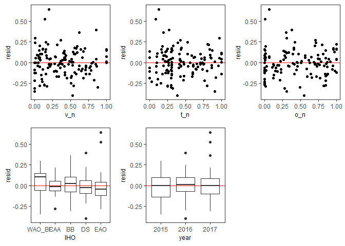
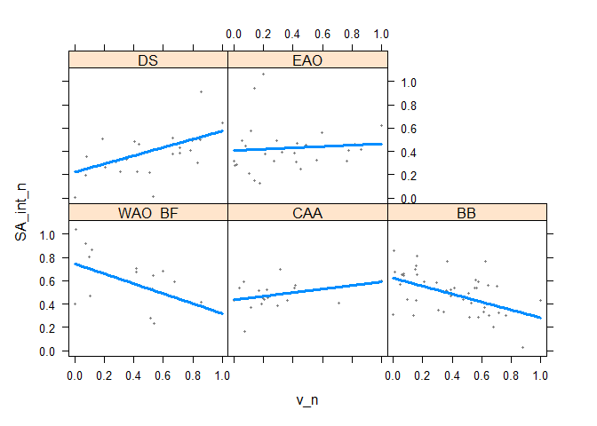
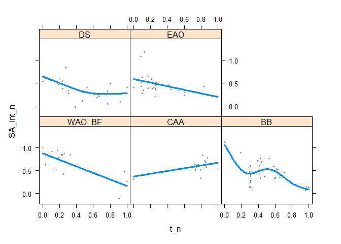
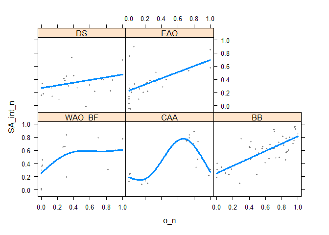
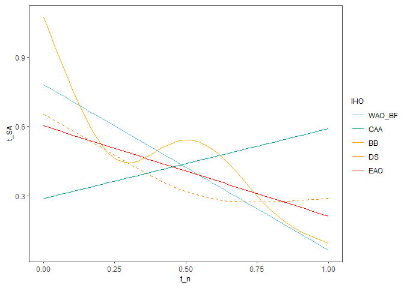
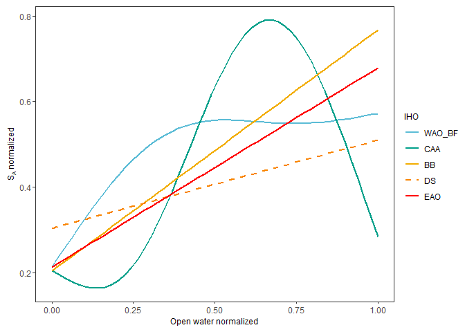

PanArctic DSL - Statistics
================
[Pierre Priou](mailto:pierre.priou@mi.mun.ca)
2022/05/01 at 22:32

# Package loading

``` r
# Load packages
library(tidyverse)    # Tidy code
library(cowplot)      # Plots on a grid
library(raster)       # Data gridding
library(sf)           # Spatial data
library(rgdal)        # Read shapefiles
library(ggpubr)       # Deal with stats
library(ggfortify)    # Plotting glm
library(RColorBrewer) # Diverging colour palettes
library(cmocean)      # Oceanographic colour palettes
library(moments)      # Overlay distributions
library(ggcorrplot)   # Correlation plots
```

    ## Warning: package 'ggcorrplot' was built under R version 4.1.3

``` r
library(kableExtra)   # Pretty tables
library(mgcv)         # Fit GAM
library(gratia)       # Visualise GAM
library(visreg)       # Visualise GAM
```

    ## Warning: package 'visreg' was built under R version 4.1.3

``` r
library(tidymv)       # Predict GAM
```

    ## Warning: package 'tidymv' was built under R version 4.1.3

``` r
library(MuMIn)        # AIC weights
```

    ## Warning: package 'MuMIn' was built under R version 4.1.3

``` r
library(DT)           # Interactive table
```

    ## Warning: package 'DT' was built under R version 4.1.3

``` r
# Custom figure theme
theme_set(theme_bw())
theme_update(axis.text = element_text(size = 9),
             axis.title = element_text(size = 9),
             strip.text.x = element_text(size = 9, face = "plain", hjust = 0.5),
             strip.background = element_rect(colour = "transparent", fill = "transparent"),
             legend.title = element_text(size = 9),
             legend.margin = margin(0, 0, 0, 0),
             legend.box.margin = margin(0, 0, -8, 0),
             panel.grid = element_blank(), 
             plot.margin = unit(c(0.1, 0.1, 0.1, 0.1), "in"))
options(dplyr.summarise.inform = F) # Suppress summarise() warning
```

I want to test whether temperature and salinity at mesopelagic depth,
sea-ice concentration, open-water duration (a proxy for productivity)
have an effect on the backscatter anomalies observed per year. I
therefore combined gridded acoustic data—integrated mesopelagic
NASC—with gridded CTD, and remote sensing data projected on either the
WGS84 or the EASE-Grid 2.0 North.

``` r
# Map projections
cell_res <- 50 # Cell resolution in km
arctic_laea <- raster(extent(-2700, 2700, -2700, 2700), crs = "EPSG:6931") # Seaice projection
projection(arctic_laea) <- gsub("units=m", "units=km", projection(arctic_laea)) # Convert proj unit from m to km
res(arctic_laea) <- c(cell_res, cell_res) # Define the 100 km cell resolution

arctic_latlon <- raster(extent(-155, 35, 66, 85), # Base projection for acoustic and CTD data
                        crs = "EPSG:4326", 
                        res = c(2, 1)) # cells of 2 degree longitude per 1 degree latitude

# Coastline shapefiles
coast_10m_laea <- readOGR("data/bathy/ne_10m_land.shp", verbose = F) %>% # Coastline in laea
  spTransform(CRSobj = crs(arctic_latlon)) %>% # Make sure that the shapefile is in the right projection
  crop(extent(-180, 180, 0, 90)) %>% # Crop shapefile
  spTransform(CRSobj = crs(arctic_laea)) %>% # Project shapefile in laea
  fortify() %>% # Convert to a dataframe for ggplot
  rename(xc = long, yc = lat)

# IHO regions
IHO_EAO <- readOGR("data/arctic_regions/iho_eastern_arctic_ocean.shp", verbose = F) %>% # Eastern Arctic Ocean
  spTransform(CRSobj = crs(arctic_latlon)) %>% # Make sure that the shapefile is in the right projection
  spTransform(CRSobj = crs(arctic_laea)) %>% # Project shapefile in laea
  fortify() %>% # Convert to dataframe for ggplot
  rename(xc = long, yc = lat)
IHO_WAO <- readOGR("data/arctic_regions/iho_western_arctic_ocean.shp", verbose = F) %>% # Western Arctic Ocean
  spTransform(CRSobj = crs(arctic_latlon)) %>% # Make sure that the shapefile is in the right projection
  spTransform(CRSobj = crs(arctic_laea)) %>% # Project shapefile in laea
  fortify() %>% # Convert to dataframe for ggplot
  rename(xc = long, yc = lat)
IHO_BF <- readOGR("data/arctic_regions/iho_beaufort_sea.shp", verbose = F) %>% # Eastern Arctic Ocean
  spTransform(CRSobj = crs(arctic_latlon)) %>% # Make sure that the shapefile is in the right projection
  spTransform(CRSobj = crs(arctic_laea)) %>% # Project shapefile in laea
  fortify() %>% # Convert to dataframe for ggplot
  rename(xc = long, yc = lat)
IHO_NWP <- readOGR("data/arctic_regions/iho_northwestern_passages.shp", verbose = F) %>% # Eastern Arctic Ocean
  spTransform(CRSobj = crs(arctic_latlon)) %>% # Make sure that the shapefile is in the right projection
  spTransform(CRSobj = crs(arctic_laea)) %>% # Project shapefile in laea
  fortify() %>% # Convert to dataframe for ggplot
  rename(xc = long, yc = lat)
IHO_BB <- readOGR("data/arctic_regions/iho_baffin_bay.shp", verbose = F) %>% # Eastern Arctic Ocean
  spTransform(CRSobj = crs(arctic_latlon)) %>% # Make sure that the shapefile is in the right projection
  spTransform(CRSobj = crs(arctic_laea)) %>% # Project shapefile in laea
  fortify() %>% # Convert to dataframe for ggplot
  rename(xc = long, yc = lat)
IHO_DF <- readOGR("data/arctic_regions/iho_davis_strait.shp", verbose = F) %>% # Eastern Arctic Ocean
  spTransform(CRSobj = crs(arctic_latlon)) %>% # Make sure that the shapefile is in the right projection
  spTransform(CRSobj = crs(arctic_laea)) %>% # Project shapefile in laea
  fortify() %>% # Convert to dataframe for ggplot
  rename(xc = long, yc = lat)
IHO_regions <- bind_rows(IHO_EAO, IHO_WAO, IHO_BF, IHO_NWP, IHO_BB, IHO_DF) # Combine IHO definitions

# Gridded acoustic, CTD, and sea ice data
load("data/acoustics/SA_grids.RData") # Acoustic data
load("data/remote_sensing/physics_grids.RData") # Modelled physics data 
load("data/remote_sensing/seaice_grids.RData") # Remote sensing sea ice data
```

# Data preparation

I combine data using the EASE-Grid 2.0 North (EPSG:6931) and normalize
the covariates. Calculation of the anomalies are also computed based on
the IHO areas.

``` r
SA_laea <- SA_grid_laea %>%  # Tidy anomaly dataset for joining
  dplyr::select(-lat, -lon)
phy_laea <- phy_grid_laea %>% # Tidy remote sensing dataset for joining
  dplyr::select(-lat, -lon)
seaice_laea <- seaice_grid_laea %>%
  dplyr::select(-lat, -lon)

stat_laea <- left_join(SA_laea, phy_laea, by = c("year", "area", "xc", "yc", "cell_res")) %>% # Join acoustic and physics
  left_join(., seaice_laea, by = c("year", "area", "xc", "yc", "cell_res")) %>%
  # For cells that have NaN, get the mean of the surrounding cells
   rowwise() %>%
   mutate(xc_na = if_else(is.na(mean_ice_conc) == T, xc, NaN),
          yc_na = if_else(is.na(mean_ice_conc) == T, yc, NaN),
          year_na = if_else(is.na(mean_ice_conc) == T, year, NaN), 
          mean_ice_conc = if_else(is.na(mean_ice_conc) == T, mean(pull(subset(seaice_grid_laea,
                                                                             xc >= xc_na - 50 &
                                                                               xc <= xc_na + 50 & 
                                                                               yc >= yc_na - 50 & 
                                                                               yc <= yc_na + 50 & 
                                                                               year == year_na,
                                                                             select = mean_ice_conc),
                                                                      mean_ice_conc),
                                                                 na.rm = T),
                                 mean_ice_conc),
         openwater_duration = if_else(is.na(openwater_duration) == T, mean(pull(subset(seaice_grid_laea,
                                                                                       xc >= xc_na - 50 &
                                                                                         xc <= xc_na + 50 & 
                                                                                         yc >= yc_na - 50 & 
                                                                                         yc <= yc_na + 50 & 
                                                                                         year == year_na,
                                                                                       select = openwater_duration),
                                                                                openwater_duration),
                                                                           na.rm = T),
                                      openwater_duration),
         ice_break = if_else(is.na(ice_break) == T, mean(pull(subset(seaice_grid_laea,
                                                                     xc >= xc_na - 50 &
                                                                       xc <= xc_na + 50 & 
                                                                       yc >= yc_na - 50 & 
                                                                       yc <= yc_na + 50 & 
                                                                       year == year_na,
                                                                     select = ice_break),
                                                              ice_break),
                                                         na.rm = T),
                             ice_break),
         ice_week = if_else(is.na(ice_week) == T, mean(pull(subset(seaice_grid_laea,
                                                                   xc >= xc_na - 50 &
                                                                     xc <= xc_na + 50 & 
                                                                     yc >= yc_na - 50 & 
                                                                     yc <= yc_na + 50 & 
                                                                     year == year_na,
                                                                   select = ice_week),
                                                            ice_week),
                                                       na.rm = T),
                            ice_week)) %>%
  filter(depth == 380) %>% # Select data at 380 m depth
  mutate(SA_int = 10 * log10(NASC_int),
         IHO_area = factor(case_when(IHO_area == "East Arctic Ocean" ~ "EAO",
                                     IHO_area == "West Arctic Ocean" ~ "WAO_BF",
                                     IHO_area == "Beaufort Sea" ~ "WAO_BF",
                                     IHO_area == "The Northwestern Passages" ~ "CAA",
                                     IHO_area == "Baffin Bay" ~ "BB",
                                     IHO_area == "Davis Strait" ~ "DS"),
                            levels = c("WAO_BF", "CAA", "BB", "DS", "EAO"))) %>%
  ungroup() %>%
  dplyr::select(-mean_NASC_area_year, -sd_NASC_area_year, -NASC_anomaly_d, -cell_res, -vxo, -vyo,
                -mean_temp_area_depth, -mean_velo_area_depth, -xc_na, -yc_na, -year_na, -siconc, -sithick,
                -temp_anomaly, -velocity_anomaly)
```

# Data exploration

Maps of all variables.

``` r
stat_laea %>% 
  ggplot(aes(x = xc,  y = yc)) +
  geom_polygon(data = coast_10m_laea, aes(x = xc, y = yc, group = group), fill = "grey80") +
  geom_point(aes(col = IHO_area)) +
  ggtitle("regions") +
  coord_fixed(xlim = c(-2600, 1100), ylim = c(-1800, 1900), expand = F) + 
  theme(axis.text = element_blank(), axis.ticks = element_blank(), axis.title = element_blank())
```

<!-- -->

``` r
stat_laea %>% # Ice concentration
  ggplot(aes(x = xc,  y = yc)) +
  geom_polygon(data = coast_10m_laea, aes(x = xc, y = yc, group = group), fill = "grey80") +
  geom_tile(aes(fill = mean_ice_conc)) +
  scale_fill_cmocean("Ice (%)", name = "ice", na.value = "red") +
  facet_wrap(~ year, ncol = 3) +
  ggtitle("Sea ice concentration") +
  coord_fixed(xlim = c(-2600, 1100), ylim = c(-1800, 1900), expand = F) + 
  theme(axis.text = element_blank(), axis.ticks = element_blank(), axis.title = element_blank())
```

<!-- -->

``` r
stat_laea %>% # Openwater duration
  ggplot(aes(x = xc,  y = yc)) +
  geom_polygon(data = coast_10m_laea, aes(x = xc, y = yc, group = group), fill = "grey80") +
  geom_tile(aes(fill = openwater_duration)) +
  scale_fill_viridis_c("Day", option = "plasma", na.value = "red") +
  facet_wrap(~ year, ncol = 3) +
  ggtitle("Openwater duration") +
  coord_fixed(xlim = c(-2600, 1100), ylim = c(-1800, 1900), expand = F) + 
  theme(axis.text = element_blank(), axis.ticks = element_blank(), axis.title = element_blank())
```

<!-- -->

``` r
stat_laea %>% # Openwater duration
  ggplot(aes(x = xc,  y = yc)) +
  geom_polygon(data = coast_10m_laea, aes(x = xc, y = yc, group = group), fill = "grey80") +
  geom_tile(aes(fill = ice_break)) +
  scale_fill_viridis_c("Day", option = "viridis", na.value = "red") +
  facet_wrap(~ year, ncol = 3) +
  ggtitle("Day ice breakup") +
  coord_fixed(xlim = c(-2600, 1100), ylim = c(-1800, 1900), expand = F) + 
  theme(axis.text = element_blank(), axis.ticks = element_blank(), axis.title = element_blank())
```

<!-- -->

``` r
stat_laea %>% # Openwater duration
  ggplot(aes(x = xc,  y = yc)) +
  geom_polygon(data = coast_10m_laea, aes(x = xc, y = yc, group = group), fill = "grey80") +
  geom_tile(aes(fill = ice_week)) +
  scale_fill_viridis_c("Week", option = "viridis", na.value = "red") +
  facet_wrap(~ year, ncol = 3) +
  ggtitle("Week ice breakup") +
  coord_fixed(xlim = c(-2600, 1100), ylim = c(-1800, 1900), expand = F) + 
  theme(axis.text = element_blank(), axis.ticks = element_blank(), axis.title = element_blank())
```

<!-- -->

``` r
stat_laea %>% # Temperature
  ggplot(aes(x = xc,  y = yc)) +
  geom_polygon(data = coast_10m_laea, aes(x = xc, y = yc, group = group), fill = "grey80") +
  geom_tile(aes(fill = thetao)) +
  scale_fill_cmocean("Temp (dC)", name = "thermal", na.value = "red") +
  facet_wrap(~ year, ncol = 3) +
  ggtitle("Temperature at 380 m depth") +
  coord_fixed(xlim = c(-2600, 1100), ylim = c(-1800, 1900), expand = F) + 
  theme(axis.text = element_blank(), axis.ticks = element_blank(), axis.title = element_blank())
```

<!-- -->

``` r
stat_laea %>% # Salinity
  ggplot(aes(x = xc,  y = yc)) +
  geom_polygon(data = coast_10m_laea, aes(x = xc, y = yc, group = group), fill = "grey80") +
  geom_tile(aes(fill = so)) +
  scale_fill_cmocean("Sal (psu)", name = "haline", na.value = "red") +
  facet_wrap(~ year, ncol = 3) +
  ggtitle("Salinity at 380 m depth") +
  coord_fixed(xlim = c(-2600, 1100), ylim = c(-1800, 1900), expand = F) + 
  theme(axis.text = element_blank(), axis.ticks = element_blank(), axis.title = element_blank())
```

<!-- -->

``` r
stat_laea %>% # Ice concentration
  ggplot(aes(x = xc,  y = yc)) +
  geom_polygon(data = coast_10m_laea, aes(x = xc, y = yc, group = group), fill = "grey80") +
  geom_tile(aes(fill = velocity)) +
  scale_fill_cmocean("velo (m/s)", name = "speed", na.value = "red") +
  facet_wrap(~ year, ncol = 3) +
  ggtitle("Current velocity at 380 m depth") +
  coord_fixed(xlim = c(-2600, 1100), ylim = c(-1800, 1900), expand = F) + 
  theme(axis.text = element_blank(), axis.ticks = element_blank(), axis.title = element_blank())
```

<!-- -->

``` r
stat_laea %>% # Mixed layer depth
  ggplot(aes(x = xc,  y = yc)) +
  geom_polygon(data = coast_10m_laea, aes(x = xc, y = yc, group = group), fill = "grey80") +
  geom_tile(aes(fill = mlotst)) +
  scale_fill_viridis_c("depth (m)", option = "plasma", direction = -1, na.value = "red") +
  facet_wrap(~ year, ncol = 3) +
  ggtitle("Mixed layer depth") +
  coord_fixed(xlim = c(-2600, 1100), ylim = c(-1800, 1900), expand = F) + 
  theme(axis.text = element_blank(), axis.ticks = element_blank(), axis.title = element_blank())
```

<!-- -->

# HGAM

## Data preparation

Because I am interested in the environmental drivers of mesopelagic
backscatter within each area, I run a linear model for each area. First,
I prepare the dataset and standardize each environmental variable per
area.

``` r
SA_df <- stat_laea %>%
  dplyr::select(year, xc, yc, area, IHO_area_large, IHO_area, SA_int, velocity, thetao, openwater_duration, ice_week) %>%
  group_by(IHO_area) %>%
  mutate(year = factor(year),
         SA_int_n = (SA_int - min(SA_int)) / (max(SA_int) - min(SA_int)),
         v_n = (velocity - min(velocity)) / (max(velocity) - min(velocity)),
         t_n = (thetao - min(thetao)) / (max(thetao) - min(thetao)),
         o_n = (openwater_duration - min(openwater_duration)) / (max(openwater_duration) - min(openwater_duration)),
         s_n = (ice_week - min(ice_week)) / (max(ice_week) - min(ice_week))) %>%
  ungroup() %>%
  rename(IHO = IHO_area, 
         v = velocity,
         t = thetao,
         o = openwater_duration,
         s = ice_week)
```

Plot data.

``` r
plot_grid(SA_df %>%
            ggplot(aes(x = v_n, y = SA_int_n, col = IHO_area_large)) +
            geom_point() +
            geom_smooth(method = "lm", se = F, col = "grey20") +
            facet_grid(~ IHO) +
            theme(legend.position = "none"),
          SA_df %>%
            ggplot(aes(x = t_n, y = SA_int_n, col = IHO_area_large)) +
            geom_point() +
            geom_smooth(method = "lm", se = F, col = "grey20") +
            facet_grid(~ IHO) +
            theme(legend.position = "none"),
          SA_df %>%
            ggplot(aes(x = o_n, y = SA_int_n, col = IHO_area_large)) +
            geom_point() +
            geom_smooth(method = "lm", se = F, col = "grey20") +
            facet_grid(~ IHO) +
            theme(legend.position = "none"),
          SA_df %>%
            ggplot(aes(x = s_n, y = SA_int_n, col = IHO_area_large)) +
            geom_point() +
            geom_smooth(method = "lm", se = F, col = "grey20") +
            facet_grid(~ IHO) +
            theme(legend.position = "none"),
          ncol = 1)
```

<!-- -->

``` r
plot_grid(SA_df %>%
            ggplot(aes(x = v_n, fill = IHO_area_large)) +
            geom_histogram() +
            facet_grid(~ IHO) +
            theme(legend.position = "none"),
          SA_df %>%
            ggplot(aes(x = t_n, fill = IHO_area_large)) +
            geom_histogram() +
            facet_grid(~ IHO) +
            theme(legend.position = "none"),
          SA_df %>%
            ggplot(aes(x = o_n, fill = IHO_area_large)) +
            geom_histogram() +
            facet_grid(~ IHO) +
            theme(legend.position = "none"),
          SA_df %>%
            ggplot(aes(x = s_n, fill = IHO_area_large)) +
            geom_histogram() +
            facet_grid(~ IHO) +
            theme(legend.position = "none"),
          ncol = 1)
```

<!-- -->

Check correlations.

``` r
corr_EAO <- SA_df %>% # Compute Spearman correlation matrix
  filter(IHO == "EAO") %>%
  dplyr::select(-year, -xc, -yc, -IHO_area_large, -IHO, -area, -SA_int_n, -v_n, -t_n, -o_n, -s_n) %>%
  cor(., method = "spearman") %>%
  round(., 2)
ggcorrplot(corr_EAO, type = "lower", lab = T, title = "corr EAO")
```

<!-- -->

``` r
corr_BB <- SA_df %>% # Compute Spearman correlation matrix
  filter(IHO == "BB") %>%
  dplyr::select(-year, -xc, -yc, -IHO_area_large, -IHO, -area, -SA_int_n, -v_n, -t_n, -o_n, -s_n) %>%
  cor(., method = "spearman") %>%
  round(., 2)
ggcorrplot(corr_BB, type = "lower", lab = T, title = "corr BB")
```

<!-- -->

``` r
corr_DS <- SA_df %>% # Compute Spearman correlation matrix
  filter(IHO == "DS") %>%
  dplyr::select(-year, -xc, -yc, -IHO_area_large, -IHO, -area, -SA_int_n, -v_n, -t_n, -o_n, -s_n) %>%
  cor(., method = "spearman") %>%
  round(., 2)
ggcorrplot(corr_DS, type = "lower", lab = T, title = "corr BB")
```

<!-- -->

``` r
corr_WAO <- SA_df %>% # Compute Spearman correlation matrix
  filter(IHO == "WAO_BF") %>%
  dplyr::select(-year, -xc, -yc, -IHO_area_large, -IHO, -area, -SA_int_n, -v_n, -t_n, -o_n, -s_n) %>%
  cor(., method = "spearman") %>%
  round(., 2)
ggcorrplot(corr_WAO, type = "lower", lab = T, title = "corr WAO")
```

<!-- -->

``` r
corr_CAA <- SA_df %>% # Compute Spearman correlation matrix
  filter(IHO == "CAA") %>%
  dplyr::select(-year, -xc, -yc, -IHO_area_large, -IHO, -area, -SA_int_n, -v_n, -t_n, -o_n, -s_n) %>%
  cor(., method = "spearman") %>%
  round(., 2)
ggcorrplot(corr_CAA, type = "lower", lab = T, title = "corr CAA")
```

<!-- -->

## Model fitting

I decided to fit hierarchical generalized additive model due to their
flexibility in modelling non linear relationships. I fit several models
with different structures (random intercept, random “slope”) and
different covariates.

``` r
# Fit models
GAM1 <- gam(SA_int_n ~ s(v_n, k = 5, bs = "tp") + s(t_n, k = 5, bs = "tp") + s(o_n, k = 5, bs = "tp"),
            data = SA_df, family = "gaussian", method = "REML")
GAM2 <- gam(SA_int_n ~ s(v_n, k = 5, bs = "tp") + s(t_n, k = 5, bs = "tp"), 
            data = SA_df, family = "gaussian", method = "REML")
GAM3 <- gam(SA_int_n ~ s(v_n, k = 5, bs = "tp") + s(o_n, k = 5, bs = "tp"),
            data = SA_df, family = "gaussian", method = "REML")
GAM4 <- gam(SA_int_n ~ s(t_n, k = 5, bs = "tp") + s(o_n, k = 5, bs = "tp"),
            data = SA_df, family = "gaussian", method = "REML")
GAM5 <- gam(SA_int_n ~ s(v_n, k = 5, bs = "tp"), data = SA_df, family = "gaussian", method = "REML")
GAM6 <- gam(SA_int_n ~ s(t_n, k = 5, bs = "tp"), data = SA_df, family = "gaussian", method = "REML")
GAM7 <- gam(SA_int_n ~ s(o_n, k = 5, bs = "tp"), data = SA_df, family = "gaussian", method = "REML")
# Model S
GAM8 <- gam(SA_int_n ~ s(v_n, IHO, bs = "fs", k = 5, m = 2) + s(t_n, IHO, bs = "fs", k = 5, m = 2) + s(o_n, IHO, bs = "fs", k = 5, m = 2), 
            data = SA_df, family = "gaussian", method = "REML")
```

    ## Warning in gam.side(sm, X, tol = .Machine$double.eps^0.5): model has repeated 1-
    ## d smooths of same variable.

``` r
GAM9 <- gam(SA_int_n ~ s(v_n, IHO, bs = "fs", k = 5, m = 2) + s(t_n, IHO, bs = "fs", k = 5, m = 2),
            data = SA_df, family = "gaussian", method = "REML")
```

    ## Warning in gam.side(sm, X, tol = .Machine$double.eps^0.5): model has repeated 1-
    ## d smooths of same variable.

``` r
GAM10 <- gam(SA_int_n ~ s(v_n, IHO, bs = "fs", k = 5, m = 2) + s(o_n, IHO, bs = "fs", k = 5, m = 2),
             data = SA_df, family = "gaussian", method = "REML")
```

    ## Warning in gam.side(sm, X, tol = .Machine$double.eps^0.5): model has repeated 1-
    ## d smooths of same variable.

``` r
GAM11 <- gam(SA_int_n ~ s(t_n, IHO, bs = "fs", k = 5, m = 2) + s(o_n, IHO, bs = "fs", k = 5, m = 2),
             data = SA_df, family = "gaussian", method = "REML")
```

    ## Warning in gam.side(sm, X, tol = .Machine$double.eps^0.5): model has repeated 1-
    ## d smooths of same variable.

``` r
GAM12 <- gam(SA_int_n ~ s(v_n, IHO, bs = "fs", k = 5, m = 2),
             data = SA_df, family = "gaussian", method = "REML")
GAM13 <- gam(SA_int_n ~ s(t_n, IHO, bs = "fs", k = 5, m = 2), 
             data = SA_df, family = "gaussian", method = "REML")
GAM14 <- gam(SA_int_n ~ s(o_n, IHO, bs = "fs", k = 5, m = 2),
             data = SA_df, family = "gaussian", method = "REML")
# Model I
GAM15 <- gam(SA_int_n ~ s(IHO, bs = "re") + s(v_n, by = IHO, k = 5, bs = "tp") +
               s(t_n, by = IHO, k = 5, bs = "tp") + s(o_n, by = IHO, k = 5, bs = "tp"),
            data = SA_df, family = "gaussian", method = "REML")
GAM16 <- gam(SA_int_n ~ s(IHO, bs = "re") + s(v_n, by = IHO, k = 5, bs = "tp") + s(t_n, by = IHO, k = 5, bs = "tp"),
            data = SA_df, family = "gaussian", method = "REML")
GAM17 <- gam(SA_int_n ~ s(IHO, bs = "re") + s(v_n, by = IHO, k = 5, bs = "tp") + s(o_n, by = IHO, k = 5, bs = "tp"),
             data = SA_df, family = "gaussian", method = "REML")
GAM18 <- gam(SA_int_n ~ s(IHO, bs = "re") + s(t_n, by = IHO, k = 5, bs = "tp") + s(o_n, by = IHO, k = 5, bs = "tp"),
             data = SA_df, family = "gaussian", method = "REML")
GAM19 <- gam(SA_int_n ~ s(IHO, bs = "re") + s(v_n, by = IHO, k = 5, bs = "tp"),
             data = SA_df, family = "gaussian", method = "REML")
GAM20 <- gam(SA_int_n ~ s(IHO, bs = "re") + s(t_n, by = IHO, k = 5, bs = "tp"),
             data = SA_df, family = "gaussian", method = "REML")
GAM21 <- gam(SA_int_n ~ s(IHO, bs = "re", k = 5) + s(o_n, by = IHO, k = 5, bs = "tp"),
             data = SA_df, family = "gaussian", method = "REML")
# Model GS
# GAM15 <- gam(SA_int_n ~ s(v_n, k = 5, m = 2) + s(t_n, k = 5, m = 2) + s(o_n, k = 5, m = 2) + 
#                s(v_n, IHO, bs = "fs", k = 5, m = 2) + s(t_n, IHO, bs = "fs", k = 5, m = 2) + s(o_n, IHO, bs = "fs", k = 5, m = 2), 
#             data = SA_df, family = "gaussian", method = "REML")
# GAM16 <- gam(SA_int_n ~ s(v_n, k = 5, m = 2) + s(t_n, k = 5, m = 2) +
#                s(v_n, IHO, bs = "fs", k = 5, m = 2) + s(t_n, IHO, bs = "fs", k = 5, m = 2),
#             data = SA_df, family = "gaussian", method = "REML")
# GAM17 <- gam(SA_int_n ~ s(v_n, k = 5, m = 2) + s(o_n, k = 5, m = 2) + 
#                s(v_n, IHO, bs = "fs", k = 5, m = 2) + s(o_n, IHO, bs = "fs", k = 5, m = 2),
#              data = SA_df, family = "gaussian", method = "REML")
# GAM18 <- gam(SA_int_n ~ s(t_n, k = 5, m = 2) + s(o_n, k = 5, m = 2) + 
#                s(t_n, IHO, bs = "fs", k = 5, m = 2) + s(o_n, IHO, bs = "fs", k = 5, m = 2),
#              data = SA_df, family = "gaussian", method = "REML")
# GAM19 <- gam(SA_int_n ~ s(v_n, IHO, bs = "fs", k = 5, m = 2),
#              data = SA_df, family = "gaussian", method = "REML")
# GAM20 <- gam(SA_int_n ~ s(t_n, IHO, bs = "fs", k = 5, m = 2), 
#              data = SA_df, family = "gaussian", method = "REML")
# GAM21 <- gam(SA_int_n ~ s(o_n, IHO, bs = "fs", k = 5, m = 2),
#              data = SA_df, family = "gaussian", method = "REML")

GAM_AIC <- AIC(GAM1, GAM2, GAM3, GAM4, GAM5, GAM6, GAM7, GAM8, GAM9, GAM10, GAM11, GAM12,
               GAM13, GAM14, GAM15, GAM16, GAM17, GAM18, GAM19, GAM20, GAM21) %>% 
  rownames_to_column() %>%
  rename(model = rowname,
         df = )
# Metrics data frame
summ_GAM <- data.frame(model = c("GAM1", "GAM2", "GAM3", "GAM4", "GAM5", "GAM6", "GAM7", "GAM8",
                                 "GAM9", "GAM10", "GAM11", "GAM12", "GAM13", "GAM14", "GAM15",
                                 "GAM16", "GAM17", "GAM18", "GAM19", "GAM20", "GAM21"),
                       reml = round(c(GAM1$gcv.ubre, GAM2$gcv.ubre, GAM3$gcv.ubre, GAM4$gcv.ubre, GAM5$gcv.ubre,
                                      GAM6$gcv.ubre, GAM7$gcv.ubre, GAM8$gcv.ubre, GAM9$gcv.ubre, GAM10$gcv.ubre,
                                      GAM11$gcv.ubre, GAM12$gcv.ubre, GAM13$gcv.ubre, GAM14$gcv.ubre, GAM15$gcv.ubre,
                                      GAM16$gcv.ubre, GAM17$gcv.ubre, GAM18$gcv.ubre, GAM19$gcv.ubre, GAM20$gcv.ubre, 
                                      GAM21$gcv.ubre), 2), 
                       dev_expl = round(c((1 - (GAM1$deviance / GAM1$null.deviance)) * 100,
                                          (1 - (GAM2$deviance / GAM2$null.deviance)) * 100,
                                          (1 - (GAM3$deviance / GAM3$null.deviance)) * 100,
                                          (1 - (GAM4$deviance / GAM4$null.deviance)) * 100,
                                          (1 - (GAM5$deviance / GAM5$null.deviance)) * 100,
                                          (1 - (GAM6$deviance / GAM6$null.deviance)) * 100,
                                          (1 - (GAM7$deviance / GAM7$null.deviance)) * 100,
                                          (1 - (GAM8$deviance / GAM8$null.deviance)) * 100,
                                          (1 - (GAM9$deviance / GAM9$null.deviance)) * 100,
                                          (1 - (GAM10$deviance / GAM10$null.deviance)) * 100,
                                          (1 - (GAM11$deviance / GAM11$null.deviance)) * 100,
                                          (1 - (GAM12$deviance / GAM12$null.deviance)) * 100,
                                          (1 - (GAM13$deviance / GAM13$null.deviance)) * 100,
                                          (1 - (GAM14$deviance / GAM14$null.deviance)) * 100,
                                          (1 - (GAM15$deviance / GAM15$null.deviance)) * 100,
                                          (1 - (GAM16$deviance / GAM16$null.deviance)) * 100,
                                          (1 - (GAM17$deviance / GAM17$null.deviance)) * 100,
                                          (1 - (GAM18$deviance / GAM18$null.deviance)) * 100,
                                          (1 - (GAM19$deviance / GAM19$null.deviance)) * 100,
                                          (1 - (GAM20$deviance / GAM20$null.deviance)) * 100,
                                          (1 - (GAM21$deviance / GAM21$null.deviance)) * 100), 2),
                       r2 = round(c(summary(GAM1)$r.sq, summary(GAM2)$r.sq, summary(GAM3)$r.sq, summary(GAM4)$r.sq, 
                                    summary(GAM5)$r.sq, summary(GAM6)$r.sq, summary(GAM7)$r.sq, summary(GAM8)$r.sq, 
                                    summary(GAM9)$r.sq, summary(GAM10)$r.sq, summary(GAM11)$r.sq, summary(GAM12)$r.sq, 
                                    summary(GAM13)$r.sq, summary(GAM14)$r.sq, summary(GAM15)$r.sq, summary(GAM16)$r.sq,
                                    summary(GAM17)$r.sq, summary(GAM18)$r.sq, summary(GAM19)$r.sq, summary(GAM20)$r.sq,
                                    summary(GAM21)$r.sq), 2)) %>%
  full_join(., GAM_AIC, by = "model") %>%
  mutate(df = round(df, 3),
         AIC = round(AIC, 3),
         dAIC = AIC - min(AIC),
         w_AIC = round(Weights(AIC), 10)) %>%
  dplyr::select(model, df, dev_expl, r2, reml, AIC, dAIC, w_AIC) %>%
  arrange(dAIC) %>% 
  datatable(class = "cell-border stribe", rownames = F)
summ_GAM
```

<!-- -->

`GAM15` seems to perform pretty well for all metrics (AIC and REML
scores, and deviance explained), so I select this model.

``` r
summary(GAM15)
```

    ## 
    ## Family: gaussian 
    ## Link function: identity 
    ## 
    ## Formula:
    ## SA_int_n ~ s(IHO, bs = "re") + s(v_n, by = IHO, k = 5, bs = "tp") + 
    ##     s(t_n, by = IHO, k = 5, bs = "tp") + s(o_n, by = IHO, k = 5, 
    ##     bs = "tp")
    ## 
    ## Parametric coefficients:
    ##             Estimate Std. Error t value Pr(>|t|)    
    ## (Intercept)  0.43352    0.03047   14.23   <2e-16 ***
    ## ---
    ## Signif. codes:  0 '***' 0.001 '**' 0.01 '*' 0.05 '.' 0.1 ' ' 1
    ## 
    ## Approximate significance of smooth terms:
    ##                    edf Ref.df      F  p-value    
    ## s(IHO)           1.504  4.000  0.722 0.108500    
    ## s(v_n):IHOWAO_BF 1.000  1.000  4.594 0.034328 *  
    ## s(v_n):IHOCAA    1.000  1.000  0.762 0.384637    
    ## s(v_n):IHOBB     1.000  1.000  8.658 0.003986 ** 
    ## s(v_n):IHODS     1.000  1.000  4.199 0.042865 *  
    ## s(v_n):IHOEAO    1.000  1.000  0.098 0.754692    
    ## s(t_n):IHOWAO_BF 1.000  1.000 15.207 0.000168 ***
    ## s(t_n):IHOCAA    1.000  1.000  2.855 0.093989 .  
    ## s(t_n):IHOBB     3.557  3.871  6.826 0.000446 ***
    ## s(t_n):IHODS     1.889  2.370  2.212 0.103570    
    ## s(t_n):IHOEAO    1.000  1.000  3.309 0.071655 .  
    ## s(o_n):IHOWAO_BF 2.107  2.525  5.205 0.007454 ** 
    ## s(o_n):IHOCAA    3.027  3.369  8.335  1.6e-05 ***
    ## s(o_n):IHOBB     1.000  1.000 34.692  < 2e-16 ***
    ## s(o_n):IHODS     1.000  1.000  1.003 0.318741    
    ## s(o_n):IHOEAO    1.000  1.000  4.558 0.035036 *  
    ## ---
    ## Signif. codes:  0 '***' 0.001 '**' 0.01 '*' 0.05 '.' 0.1 ' ' 1
    ## 
    ## R-sq.(adj) =  0.543   Deviance explained = 62.3%
    ## -REML = -0.64242  Scale est. = 0.032455  n = 132

``` r
appraise(GAM15)
```

<!-- -->

``` r
resid_GAM <- bind_cols(SA_df, residuals.gam(GAM15)) %>%
  rename(resid = "...17")
plot_grid(resid_GAM %>%
            ggplot(aes(x = v_n, y = resid)) + 
            geom_hline(yintercept = 0, col = "red") +
            geom_point(), 
          resid_GAM %>%
            ggplot(aes(x = t_n, y = resid)) + 
            geom_hline(yintercept = 0, col = "red") +
            geom_point(), 
          resid_GAM %>%
            ggplot(aes(x = o_n, y = resid)) + 
            geom_hline(yintercept = 0, col = "red") +
            geom_point(), 
          resid_GAM %>%
            ggplot(aes(x = IHO, y = resid)) + 
            geom_hline(yintercept = 0, col = "red") +
            geom_boxplot(fill = NA), 
          resid_GAM %>%
            ggplot(aes(x = year, y = resid)) + 
            geom_hline(yintercept = 0, col = "red") +
            geom_boxplot(fill = NA))
```

<!-- -->

The residuals look great.

``` r
par(mfrow = c(1, 2), mar = c(4, 4, 4, 0.5))
acf(resid(GAM15), lag.max = 36, main = "ACF")
pacf(resid(GAM15), lag.max = 36, main = "pACF")
```

<!-- -->

``` r
visreg(GAM15, "v_n", "IHO", overlay = F, scale = "response", band = F, partial = T)
```

<!-- -->

``` r
visreg(GAM15, "t_n", "IHO", overlay = F, scale = "response", band = F, partial = T)
```

<!-- -->

``` r
visreg(GAM15, "o_n", "IHO", overlay = F, scale = "response", band = F, partial = T)
```

<!-- -->

Now I predict the model for plotting

``` r
pred_vn <- get_gam_predictions(GAM15, series = v_n, .comparison = IHO, series_length = 50) %>%
  rename(idx = ".idx",
         v_SA = SA_int_n,
         v_SE = SE,
         v_CI_upper = CI_upper,
         v_CI_lower = CI_lower) %>%
  mutate(v_signif = case_when(IHO == "WAO_BF" ~  0.05, # Significance level
                              IHO == "CAA" ~ 1,
                              IHO == "BB" ~ 0.01,
                              IHO == "DS" ~ 0.05,
                              IHO == "EAO" ~ 1),
         v_group = factor(if_else(v_signif > 0.1, F, T)))
pred_tn <- get_gam_predictions(GAM15, series = t_n, .comparison = IHO, series_length = 50) %>%
  rename(t_IHO = IHO,
         t_idx = ".idx",
         t_SA = SA_int_n,
         t_SE = SE,
         t_CI_upper = CI_upper,
         t_CI_lower = CI_lower) %>%
  mutate(t_signif = case_when(t_IHO == "WAO_BF" ~ 0.001, # significance level
                              t_IHO == "CAA" ~ 0.1,
                              t_IHO == "BB" ~ 0.001,
                              t_IHO == "DS" ~ 1,
                              t_IHO == "EAO" ~ 0.1),
         t_group = factor(if_else(t_signif > 0.1, F, T)))
pred_on <- get_gam_predictions(GAM15, series = o_n, .comparison = IHO, series_length = 50) %>%
  rename(o_IHO = IHO,
         o_idx = ".idx",
         o_SA = SA_int_n,
         o_SE = SE,
         o_CI_upper = CI_upper,
         o_CI_lower = CI_lower) %>%
  mutate(o_signif = case_when(o_IHO == "WAO_BF" ~ 0.01, # significance level
                              o_IHO == "CAA" ~ 0.001,
                              o_IHO == "BB" ~ 0.001,
                              o_IHO == "DS" ~ 1,
                              o_IHO == "EAO" ~ 0.05),
         o_group = factor(if_else(o_signif > 0.1, F, T)))

pred_GAM15 <- bind_cols(pred_vn, pred_tn, pred_on) %>%
  dplyr::select(-t_IHO, -t_idx, -o_IHO, -o_idx)
```

``` r
col_pal <- c("#5BBCD6", "#00A08A", "#F2AD00", "#F98400", "#FF0000")# wesanderson::wes_palette("Darjeeling1", type = "discrete") 

pred_GAM15 %>%
  mutate(group = factor(if_else(v_signif > 0.1, F, T))) %>%
  ggplot() +
  geom_line(aes(x = v_n, y = v_SA, col = IHO, linetype = group), size = 0.7) +
  geom_ribbon(aes(x = v_n, ymin = v_CI_lower, ymax = v_CI_upper, fill = IHO), alpha = 0.1) +
  scale_colour_manual(values = col_pal) + 
  scale_fill_manual(values = col_pal) +
  scale_linetype_manual(values = c(2, 1)) +
  guides(linetype = F)
```

    ## Warning: `guides(<scale> = FALSE)` is deprecated. Please use `guides(<scale> =
    ## "none")` instead.

<!-- -->

``` r
pred_GAM15 %>%
  mutate(group = factor(if_else(t_signif > 0.1, F, T))) %>%
  ggplot() +
  geom_line(aes(x = t_n, y = t_SA, col = IHO, linetype = group), size = 0.7) +
  # geom_ribbon(aes(x = v_n, ymin = v_CI_lower, ymax = v_CI_upper, fill = IHO), alpha = 0.1) +
  scale_colour_manual(values = col_pal) + 
  scale_fill_manual(values = col_pal) +
  scale_linetype_manual(values = c(2, 1)) +
  guides(linetype = F)
```

    ## Warning: `guides(<scale> = FALSE)` is deprecated. Please use `guides(<scale> =
    ## "none")` instead.

<!-- -->

``` r
pred_GAM15 %>%
  mutate(group = factor(if_else(o_signif > 0.1, F, T))) %>%
  ggplot() +
  geom_line(aes(x = o_n, y = o_SA, col = IHO, linetype = group), size = 0.7) +
  # geom_ribbon(aes(x = v_n, ymin = v_CI_lower, ymax = v_CI_upper, fill = IHO), alpha = 0.1) +
  scale_colour_manual(values = col_pal) + 
  scale_fill_manual(values = col_pal) +
  scale_linetype_manual(values = c(2, 1)) +
  guides(linetype = F)
```

    ## Warning: `guides(<scale> = FALSE)` is deprecated. Please use `guides(<scale> =
    ## "none")` instead.

<!-- -->
