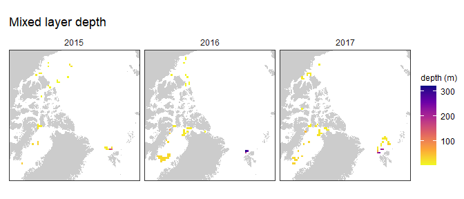

PanArctic DSL - Statistics
================
[Pierre Priou](mailto:pierre.priou@mi.mun.ca)
2022/04/27 at 15:49

# Package loading

``` r
# Load packages
library(tidyverse)    # Tidy code
library(cowplot)      # Plots on a grid
library(raster)       # Data gridding
library(sf)           # Spatial data
library(rgdal)        # Read shapefiles
library(ggpubr)       # Deal with stats
library(ggfortify)    # Plotting glm
library(RColorBrewer) # Diverging colour palettes
library(cmocean)      # Oceanographic colour palettes
library(moments)      # Overlay distributions
library(ggcorrplot)   # Correlation plots
```

    ## Warning: package 'ggcorrplot' was built under R version 4.1.3

``` r
library(kableExtra)   # Pretty tables
# Custom figure theme
theme_set(theme_bw())
theme_update(axis.text = element_text(size = 9),
             axis.title = element_text(size = 9),
             strip.text.x = element_text(size = 9, face = "plain", hjust = 0.5),
             strip.background = element_rect(colour = "transparent", fill = "transparent"),
             legend.title = element_text(size = 9),
             legend.margin = margin(0, 0, 0, 0),
             legend.box.margin = margin(0, 0, -8, 0),
             panel.grid = element_blank(), 
             plot.margin = unit(c(0.1, 0.1, 0.1, 0.1), "in"))
options(dplyr.summarise.inform = F) # Suppress summarise() warning
```

I want to test whether temperature and salinity at mesopelagic depth,
sea-ice concentration, open-water duration (a proxy for productivity)
have an effect on the backscatter anomalies observed per year. I
therefore combined gridded acoustic data—integrated mesopelagic
NASC—with gridded CTD, and remote sensing data projected on either the
WGS84 or the EASE-Grid 2.0 North.

``` r
# Map projections
cell_res <- 100 # Cell resolution in km
arctic_laea <- raster(extent(-2700, 2700, -2700, 2700), crs = "EPSG:6931") # Seaice projection
projection(arctic_laea) <- gsub("units=m", "units=km", projection(arctic_laea)) # Convert proj unit from m to km
res(arctic_laea) <- c(cell_res, cell_res) # Define the 100 km cell resolution

arctic_latlon <- raster(extent(-155, 35, 66, 85), # Base projection for acoustic and CTD data
                        crs = "EPSG:4326", 
                        res = c(2, 1)) # cells of 2 degree longitude per 1 degree latitude

# Coastline shapefiles
# coast_10m_latlon <- readOGR("data/bathy/ne_10m_land.shp", verbose = F) %>% # Coastline in latlon
#   spTransform(CRSobj = crs(arctic_latlon)) %>% # Make sure that the shapefile is in the right projection
#   crop(extent(-180, 180, 0, 90)) %>% # Crop shapefile
#   fortify() %>% # Convert to a dataframe for ggplot
#   rename(lon = long)
coast_10m_laea <- readOGR("data/bathy/ne_10m_land.shp", verbose = F) %>% # Coastline in laea
  spTransform(CRSobj = crs(arctic_latlon)) %>% # Make sure that the shapefile is in the right projection
  crop(extent(-180, 180, 0, 90)) %>% # Crop shapefile
  spTransform(CRSobj = crs(arctic_laea)) %>% # Project shapefile in laea
  fortify() %>% # Convert to a dataframe for ggplot
  rename(xc = long, yc = lat)

# IHO regions
# IHO_latlon <- readOGR("data/arctic_regions/World_Seas_IHO_v3.shp", verbose = F) %>% # Coastline in latlon
#   spTransform(CRSobj = crs(arctic_latlon)) %>% # Make sure that the shapefile is in the right projection
#   crop(extent(-180, 180, 0, 90)) %>% # Crop shapefile
#   fortify() %>% # Convert to dataframe for ggplot
#   rename(xc = long, yc = lat)
# IHO_laea <- readOGR("data/arctic_regions/World_Seas_IHO_v3.shp", verbose = F) %>% # Coastline in latlon
#   spTransform(CRSobj = crs(arctic_latlon)) %>% # Make sure that the shapefile is in the right projection
#   crop(extent(-180, 180, 0, 90)) %>% # Crop shapefile
#   spTransform(CRSobj = crs(arctic_laea)) %>% # Project shapefile in laea
#   fortify() %>% # Convert to dataframe for ggplot
#   rename(xc = long, yc = lat)

# Gridded acoustic, CTD, and sea ice data
load("data/acoustics/SA_grids.RData") # Acoustic data
# load("data/CTD/CTD_grids.RData") # CTD data
load("data/remote_sensing/physics_grids.RData") # Modelled physics data 
load("data/remote_sensing/seaice_grids.RData") # Remote sensing sea ice data
```

# Data preparation

I combine data using the EASE-Grid 2.0 North (EPSG:6931) and normalize
the covariates. Calculation of the anomalies are also computed based on
the IHO areas.

``` r
SA_laea <- SA_grid_laea %>%  # Tidy anomaly dataset for joining
  dplyr::select(-lat, -lon)
phy_laea <- phy_grid_laea %>% # Tidy remote sensing dataset for joining
  dplyr::select(-lat, -lon)
seaice_laea <- seaice_grid_laea %>%
  dplyr::select(-lat, -lon)

stat_laea <- left_join(SA_laea, phy_laea, by = c("year", "area", "xc", "yc", "cell_res")) %>% # Join acoustic and physics
  left_join(., seaice_laea, by = c("year", "area", "xc", "yc", "cell_res")) %>%
  # For cells that have NaN, get the mean of the surrounding cells
   rowwise() %>%
   mutate(xc_na = if_else(is.na(mean_ice_conc) == T, xc, NaN),
          yc_na = if_else(is.na(mean_ice_conc) == T, yc, NaN),
          year_na = if_else(is.na(mean_ice_conc) == T, year, NaN), 
          mean_ice_conc = if_else(is.na(mean_ice_conc) == T, mean(pull(subset(seaice_grid_laea,
                                                                             xc >= xc_na - 50 &
                                                                               xc <= xc_na + 50 & 
                                                                               yc >= yc_na - 50 & 
                                                                               yc <= yc_na + 50 & 
                                                                               year == year_na,
                                                                             select = mean_ice_conc),
                                                                      mean_ice_conc),
                                                                 na.rm = T),
                                 mean_ice_conc),
         openwater_duration = if_else(is.na(openwater_duration) == T, mean(pull(subset(seaice_grid_laea,
                                                                                       xc >= xc_na - 50 &
                                                                                         xc <= xc_na + 50 & 
                                                                                         yc >= yc_na - 50 & 
                                                                                         yc <= yc_na + 50 & 
                                                                                         year == year_na,
                                                                                       select = openwater_duration),
                                                                                openwater_duration),
                                                                           na.rm = T),
                                      openwater_duration),
         seaice_duration = if_else(is.na(seaice_duration) == T, mean(pull(subset(seaice_grid_laea,
                                                                                 xc >= xc_na - 50 &
                                                                                   xc <= xc_na + 50 & 
                                                                                   yc >= yc_na - 50 & 
                                                                                   yc <= yc_na + 50 & 
                                                                                   year == year_na,
                                                                                 select = seaice_duration),
                                                                          seaice_duration),
                                                                     na.rm = T),
                                   seaice_duration)) %>%
  filter(depth == 380) %>% # Select data at 380 m depth
  mutate(SA_int = 10 * log10(NASC_int)) %>%
  group_by(area) %>%
  mutate(SA_int_n = (SA_int - min(SA_int)) / (max(SA_int - min(SA_int)))) %>% # SA_int_n per area
  ungroup() %>%
  dplyr::select(-mean_NASC_area_year, -sd_NASC_area_year, -NASC_anomaly_d, -cell_res, -vxo, -vyo,
                -mean_temp_area_depth, -mean_velo_area_depth, -xc_na, -yc_na, -year_na)
```

# Data exploration

Maps of all variables.

``` r
stat_laea %>% # Backscatter
  ggplot(aes(x = xc,  y = yc)) +
  geom_polygon(data = coast_10m_laea, aes(x = xc, y = yc, group = group), fill = "grey80") +
  geom_tile(aes(fill = SA_int_n), color = "grey30") +
  scale_fill_viridis_c("SA int (dB)", option = "turbo", na.value = "red") +
  facet_wrap(~ year, ncol = 3) +
  ggtitle("Integrated SA") +
  coord_fixed(xlim = c(-2600, 1100), ylim = c(-1800, 1900), expand = F) + 
  theme(axis.text = element_blank(), axis.ticks = element_blank(), axis.title = element_blank())
```

<!-- -->

``` r
stat_laea %>% # Backscatter anomaly
  ggplot(aes(x = xc,  y = yc)) +
  geom_polygon(data = coast_10m_laea, aes(x = xc, y = yc, group = group), fill = "grey80") +
  geom_tile(aes(fill = openwater_duration), color = "grey30") +
  scale_fill_viridis_c("Anomaly sA", option = "plasma", na.value = "red") +
  facet_wrap(~ year, ncol = 3) +
  ggtitle("SA ano") +
  coord_fixed(xlim = c(-2600, 1100), ylim = c(-1800, 1900), expand = F) + 
  theme(axis.text = element_blank(), axis.ticks = element_blank(), axis.title = element_blank())
```

<!-- -->

``` r
stat_laea %>% # Temperature
  ggplot(aes(x = xc,  y = yc)) +
  geom_polygon(data = coast_10m_laea, aes(x = xc, y = yc, group = group), fill = "grey80") +
  geom_tile(aes(fill = thetao), color = "grey30") +
  scale_fill_cmocean("Temp (dC)", name = "thermal", na.value = "red") +
  facet_wrap(~ year, ncol = 3) +
  ggtitle("Temperature at 380 m depth") +
  coord_fixed(xlim = c(-2600, 1100), ylim = c(-1800, 1900), expand = F) + 
  theme(axis.text = element_blank(), axis.ticks = element_blank(), axis.title = element_blank())
```

<!-- -->

``` r
stat_laea %>% # Salinity
  ggplot(aes(x = xc,  y = yc)) +
  geom_polygon(data = coast_10m_laea, aes(x = xc, y = yc, group = group), fill = "grey80") +
  geom_tile(aes(fill = so), color = "grey30") +
  scale_fill_cmocean("Sal (psu)", name = "haline", na.value = "red") +
  facet_wrap(~ year, ncol = 3) +
  ggtitle("Salinity at 380 m depth") +
  coord_fixed(xlim = c(-2600, 1100), ylim = c(-1800, 1900), expand = F) + 
  theme(axis.text = element_blank(), axis.ticks = element_blank(), axis.title = element_blank())
```

<!-- -->

``` r
stat_laea %>% # Ice concentration
  ggplot(aes(x = xc,  y = yc)) +
  geom_polygon(data = coast_10m_laea, aes(x = xc, y = yc, group = group), fill = "grey80") +
  geom_tile(aes(fill = velocity), color = "grey30") +
  scale_fill_cmocean("velo (m/s)", name = "speed", na.value = "red") +
  facet_wrap(~ year, ncol = 3) +
  ggtitle("Current velocity at 380 m depth") +
  coord_fixed(xlim = c(-2600, 1100), ylim = c(-1800, 1900), expand = F) + 
  theme(axis.text = element_blank(), axis.ticks = element_blank(), axis.title = element_blank())
```

<!-- -->

``` r
stat_laea %>% # Mixed layer depth
  ggplot(aes(x = xc,  y = yc)) +
  geom_polygon(data = coast_10m_laea, aes(x = xc, y = yc, group = group), fill = "grey80") +
  geom_tile(aes(fill = mlotst), color = "grey30") +
  scale_fill_viridis_c("depth (m)", option = "plasma", direction = -1, na.value = "red") +
  facet_wrap(~ year, ncol = 3) +
  ggtitle("Mixed layer depth") +
  coord_fixed(xlim = c(-2600, 1100), ylim = c(-1800, 1900), expand = F) + 
  theme(axis.text = element_blank(), axis.ticks = element_blank(), axis.title = element_blank())
```

<!-- -->

``` r
stat_laea %>% # Ice thickness
  ggplot(aes(x = xc,  y = yc)) +
  geom_polygon(data = coast_10m_laea, aes(x = xc, y = yc, group = group), fill = "grey80") +
  geom_tile(aes(fill = sithick), color = "grey30") +
  scale_fill_cmocean("Thick (m)", name = "ice", na.value = "red") +
  facet_wrap(~ year, ncol = 3) +
  ggtitle("Sea ice thickness") +
  coord_fixed(xlim = c(-2600, 1100), ylim = c(-1800, 1900), expand = F) + 
  theme(axis.text = element_blank(), axis.ticks = element_blank(), axis.title = element_blank())
```

<!-- -->

``` r
stat_laea %>% # Ice concentration
  ggplot(aes(x = xc,  y = yc)) +
  geom_polygon(data = coast_10m_laea, aes(x = xc, y = yc, group = group), fill = "grey80") +
  geom_tile(aes(fill = siconc), color = "grey30") +
  scale_fill_cmocean("Conc (%)", name = "ice", na.value = "red") +
  facet_wrap(~ year, ncol = 3) +
  ggtitle("Sea ice concentration") +
  coord_fixed(xlim = c(-2600, 1100), ylim = c(-1800, 1900), expand = F) + 
  theme(axis.text = element_blank(), axis.ticks = element_blank(), axis.title = element_blank())
```

<!-- -->

# Linear mixed model

## Data preparation

I require the following packages to fit GLMM.

``` r
library(lme4)
library(MASS)
library(vcdExtra)
```

    ## Warning: package 'vcdExtra' was built under R version 4.1.3

    ## Warning: package 'vcd' was built under R version 4.1.3

    ## Warning: package 'gnm' was built under R version 4.1.3

``` r
library(bbmle)
```

    ## Warning: package 'bbmle' was built under R version 4.1.3

``` r
library(MuMIn)
```

    ## Warning: package 'MuMIn' was built under R version 4.1.3

``` r
library(ggplot2)
library(DescTools)
```

    ## Warning: package 'DescTools' was built under R version 4.1.3

``` r
library(remotes)
library(gridExtra)
library(lattice)
```

Select the variables of interest, SA\_int\_n (per area), velocity,
temperature anomaly, and openwater\_duration.

``` r
SA_df <- stat_laea %>%
  dplyr::select(year, xc, yc, area, SA_int, velocity, temp_anomaly, thetao, openwater_duration)
```

Summary of data. The dataset is not perfectly balanced.

``` r
table(SA_df[, c("area", "year")])
```

    ##         year
    ## area     2015 2016 2017
    ##   BF_CAA   14   10   10
    ##   BB        9   34   27
    ##   SV        7    3   18

Scatterplot of responses of covariates.

``` r
plot_grid(SA_df %>%
            ggplot(aes(x = velocity, y = SA_int, col = area)) + 
            geom_point(),
          SA_df %>%
            ggplot(aes(x = thetao, y = SA_int, col = area)) + 
            geom_point(),
          SA_df %>%
            ggplot(aes(x = openwater_duration, y = SA_int, col = area)) + 
            geom_point())
```

<!-- -->

Distribution of continuous variables.

``` r
plot_grid(SA_df %>%
            ggplot(aes(x = SA_int)) + 
            geom_histogram(),
          SA_df %>%
            ggplot(aes(x = velocity)) + 
            geom_histogram(),
          SA_df %>%
            ggplot(aes(x = thetao)) + 
            geom_histogram(),
          SA_df %>%
            ggplot(aes(x = openwater_duration)) + 
            geom_histogram())
```

<!-- -->

Check colinearity.

``` r
corr <- SA_df %>% # Compute Spearman correlation matrix
  dplyr::select(-year, -xc, -yc, -area) %>%
  cor(., method = "spearman") %>%
  round(., 2)
ggcorrplot(corr, type = "lower", lab = T)
```

<!-- -->

Scale data per area.

``` r
SA_df <- SA_df %>%
  # group_by(area) %>%
  mutate(SA_int_n = (SA_int - min(SA_int)) / (max(SA_int) - min(SA_int)),
         velo_n = (velocity - min(velocity)) / (max(velocity) - min(velocity)),
         temp_n = (thetao - min(thetao)) / (max(thetao) - min(thetao)),
         ow_n = (openwater_duration - min(openwater_duration)) / (max(openwater_duration) - min(openwater_duration))) %>%
  ungroup()
```

## Model fitting

Fit a linear model.

``` r
lm_test <- lm(SA_int_n ~ velo_n + temp_n + ow_n, data = SA_df) # Fit model
lm_test_resid <- rstandard(lm_test) # Calculate residuals
```

Plot residuals.

``` r
par(mfrow = c(1, 2))
plot(lm_test_resid ~ as.factor(SA_df$area), xlab = "Area", ylab = "Standardized residuals")
abline(0, 0, lty = 2)
plot(lm_test_resid ~ as.factor(SA_df$year), xlab = "Year", ylab = "Standardized residuals")
abline(0, 0, lty = 2)
```

<!-- -->

There is residual variance that could be explained by area but not so
much by the year. So I fit a linear mixed model.

``` r
lmer(SA_int_n ~ velo_n + temp_n + ow_n + (1 | area), data = SA_df, REML = TRUE)
```

    ## Linear mixed model fit by REML ['lmerMod']
    ## Formula: SA_int_n ~ velo_n + temp_n + ow_n + (1 | area)
    ##    Data: SA_df
    ## REML criterion at convergence: -124.3102
    ## Random effects:
    ##  Groups   Name        Std.Dev.
    ##  area     (Intercept) 0.06064 
    ##  Residual             0.14111 
    ## Number of obs: 132, groups:  area, 3
    ## Fixed Effects:
    ## (Intercept)       velo_n       temp_n         ow_n  
    ##      0.3549      -0.1199      -0.1368       0.4405

Incorporate different model sturctures (random intercepts and random
slopes).

``` r
# Note that REML = FALSE in order to compare with the basic linear model where estimation method = ML
# Basic linear model / Linear model with no random effects
M0 <- lm(SA_int_n ~ velo_n + temp_n + ow_n,
          data = SA_df)
# Full model with varying intercepts
M1 <- lmer(SA_int_n ~ velo_n + temp_n + ow_n + (1 | area) + (1 | year), 
           data = SA_df, REML = T)
# Full model with varying intercepts and slopes
M2 <- lmer(SA_int_n ~ velo_n + temp_n + ow_n +
             (1 + velo_n | area) + (1 + temp_n | area) + (1 + ow_n | area) +
             (1 + velo_n | year) + (1 + temp_n | year) + (1 + ow_n | year),
           data = SA_df, REML = FALSE)
```

    ## boundary (singular) fit: see help('isSingular')

``` r
# No year varying intercepts only
M3 <- lmer(SA_int_n ~ velo_n + temp_n + ow_n + (1 | area), 
           data = SA_df, REML = FALSE)
# No area varying intercepts only
M4 <- lmer(SA_int_n ~ velo_n + temp_n + ow_n + (1 | year), 
           data = SA_df, REML = FALSE)
# No year, varying intercepts and slopes
M5 <- lmer(SA_int_n ~ velo_n + temp_n + ow_n + 
             (1 + velo_n | area) + (1 + temp_n | area) + (1 + ow_n | area),
           data = SA_df, REML = FALSE)
```

    ## boundary (singular) fit: see help('isSingular')

``` r
# No area, varying intercepts and slopes
M6 <- lmer(SA_int_n ~ velo_n + temp_n + ow_n +
             (1 + velo_n | year) + (1 + temp_n | year) + (1 + ow_n | year),
           data = SA_df, REML = FALSE)
```

    ## boundary (singular) fit: see help('isSingular')

``` r
# Full model with varying intercepts and slopes only varying by area
M7 <- lmer(SA_int_n ~ velo_n + temp_n + ow_n + (1 | year) +
             (1 + velo_n | area) + (1 + temp_n | area) + (1 + ow_n | area),
           data = SA_df, REML = FALSE)
```

    ## boundary (singular) fit: see help('isSingular')

``` r
# Full model with varying intercepts and slopes only varying by year
M8 <- lmer(SA_int_n ~ velo_n + temp_n + ow_n + (1 | area) +
             (1 + velo_n | year) + (1 + temp_n | year) + (1 + ow_n | year),
           data = SA_df, REML = FALSE)
```

    ## boundary (singular) fit: see help('isSingular')

Compare models.

``` r
# To group all AICc values into a single table, we can use MuMIn::model.sel() to calculate AICc for each model
MuMIn::model.sel(M0, M1, M2, M3, M4, M5, M6, M7, M8)[, c("df", "logLik", "AICc", "delta")] 
```

    ##    df   logLik       AICc     delta
    ## M3  6 70.12756 -127.58312  0.000000
    ## M0  5 68.11737 -125.75856  1.824564
    ## M4  6 68.23901 -123.80602  3.777099
    ## M1  7 62.19094 -109.47865 18.104469
    ## M5 14 70.50732 -109.42489 18.158227
    ## M7 15 70.50732 -106.87671 20.706415
    ## M8 15 70.28538 -106.43284 21.150284
    ## M6 14 69.00959 -106.42943 21.153689
    ## M2 23 71.06867  -85.91512 41.668005

M3, the model which does not include a year effect is the best model. I
therefore refit M3 with REML for further analyses.

``` r
# No year varying intercepts only
M3_bis <- lmer(SA_int_n ~ velo_n + temp_n + ow_n + (1 | area), 
               data = SA_df, REML = TRUE)
```

## Model validation

Check homogeneity of variance.

``` r
MX <- M3_bis
# Plot predicted values vs residual values
par(mar = c(4, 4, 0.5, 0.5))
plot(resid(MX) ~ fitted(MX), xlab = "Predicted values", ylab = "Normalized residuals")
abline(h = 0, lty = 2)
```

<!-- -->

Assumption is met.

Check independence of model residuals with each covariate. First I plot
the residuals vs each covariate.

``` r
MX <- M3_bis
# In order to check the independence of the model residuals we need to plot residuals vs each covariate of the model
par(mfrow = c(1, 5), mar = c(4, 4, 0.5, 0.5))
plot(resid(MX) ~ SA_df$velo_n, xlab = "Velocity normalized", ylab = "Normalized residuals")
abline(h = 0, lty = 2)
plot(resid(MX) ~ SA_df$temp_n, xlab = "Temperature normalized", ylab = "Normalized residuals")
abline(h = 0, lty = 2)
plot(resid(MX) ~ SA_df$ow_n, xlab = "Openwater normalized", ylab = "Normalized residuals")
abline(h = 0, lty = 2)
boxplot(resid(MX) ~ area, data = SA_df, xlab = "Area", ylab = "Normalized residuals")
abline(h = 0, lty = 2)
boxplot(resid(MX) ~ year, data = SA_df, xlab = "Year", ylab = "Normalized residuals")
abline(h = 0, lty = 2)
```

<!-- -->

Check normality of residuals.

``` r
qqnorm(resid(M3_bis))
qqline(resid(M3_bis))
```

<!-- -->

Residuals are pretty normal except for two outliers.

## Model interpretation and visualisation

Check the summary of our model.

``` r
summary(M3_bis)
```

    ## Linear mixed model fit by REML ['lmerMod']
    ## Formula: SA_int_n ~ velo_n + temp_n + ow_n + (1 | area)
    ##    Data: SA_df
    ## 
    ## REML criterion at convergence: -124.3
    ## 
    ## Scaled residuals: 
    ##     Min      1Q  Median      3Q     Max 
    ## -2.2023 -0.5584 -0.0205  0.5282  4.7638 
    ## 
    ## Random effects:
    ##  Groups   Name        Variance Std.Dev.
    ##  area     (Intercept) 0.003677 0.06064 
    ##  Residual             0.019911 0.14111 
    ## Number of obs: 132, groups:  area, 3
    ## 
    ## Fixed effects:
    ##             Estimate Std. Error t value
    ## (Intercept)  0.35486    0.05185   6.844
    ## velo_n      -0.11992    0.06237  -1.923
    ## temp_n      -0.13684    0.07025  -1.948
    ## ow_n         0.44054    0.06924   6.363
    ## 
    ## Correlation of Fixed Effects:
    ##        (Intr) velo_n temp_n
    ## velo_n -0.375              
    ## temp_n -0.540  0.187       
    ## ow_n   -0.066 -0.282 -0.325

``` r
# Calculate confidence interval for parameter
CI_velo <- c(0.06237 * 1.96 - 0.11992, 0.06237 * 1.96 + 0.11992) # velocity, significantly different from 0
CI_velo
```

    ## [1] 0.0023252 0.2421652

``` r
CI_temp <- c(0.07025 * 1.96 - 0.13684, 0.07025 * 1.96 + 0.13684) # temperature, significantly different from 0
CI_temp
```

    ## [1] 0.00085 0.27453

``` r
CI_ow <- c(0.06924 * 1.96 - 0.44054, 0.06924 * 1.96 + 0.44054) # openwater, NOT significantly different from 0
CI_ow
```

    ## [1] -0.3048296  0.5762504

Plot results

``` r
area_coef <- coef(M3_bis)$area

SA_df %>%
  ggplot() +
  geom_point(aes(x = velo_n, y = SA_int_n, col = factor(area)), size = 4) + 
  geom_abline(intercept = area_coef[1, 1], slope = area_coef[1, 2], col = "coral2", size = 1) +
  geom_abline(intercept = area_coef[2, 1], slope = area_coef[2, 2], col = "green4", size = 1) +
  geom_abline(intercept = area_coef[3, 1], slope = area_coef[3, 2], col = "blue1", size = 1)
```

<!-- -->

``` r
SA_df %>%
  ggplot() +
  geom_point(aes(x = temp_n, y = SA_int_n, col = factor(area)), size = 4) + 
  geom_abline(intercept = area_coef[1, 1], slope = area_coef[1, 3], col = "coral2", size = 1) +
  geom_abline(intercept = area_coef[2, 1], slope = area_coef[2, 3], col = "green4", size = 1) +
  geom_abline(intercept = area_coef[3, 1], slope = area_coef[3, 3], col = "blue1", size = 1)
```

<!-- -->

``` r
SA_df %>%
  ggplot() +
  geom_point(aes(x = ow_n, y = SA_int_n, col = factor(area)), size = 4) + 
  geom_abline(intercept = area_coef[1, 1], slope = area_coef[1, 4], col = "coral2", size = 1) +
  geom_abline(intercept = area_coef[2, 1], slope = area_coef[2, 4], col = "green4", size = 1) +
  geom_abline(intercept = area_coef[3, 1], slope = area_coef[3, 4], col = "blue1", size = 1)
```

<!-- -->

I am not too convinced so I fit a hierarchical gam.
