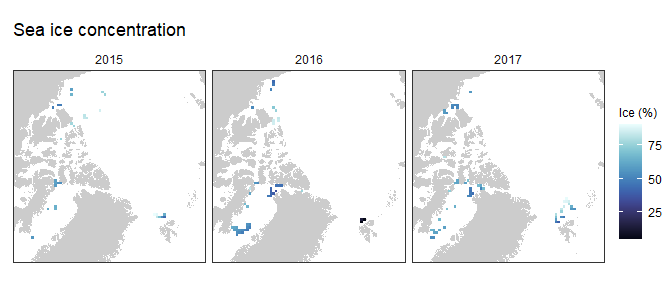
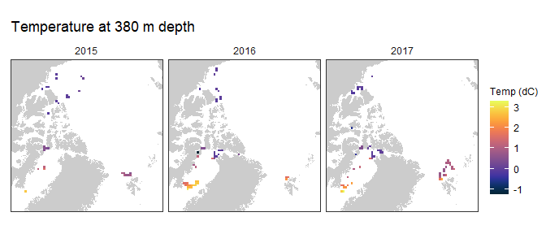
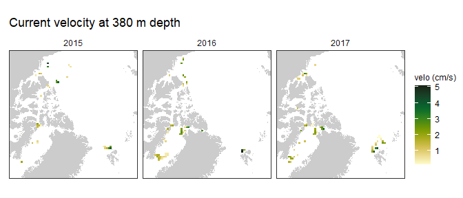
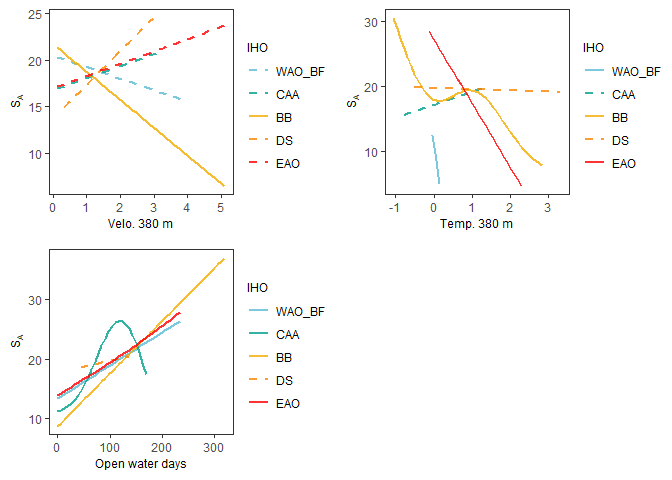

PanArctic DSL - Statistics
================
[Pierre Priou](mailto:pierre.priou@mi.mun.ca)
2022/05/02 at 12:23

# Package loading

``` r
# Load packages
library(tidyverse)    # Tidy code
library(cowplot)      # Plots on a grid
library(raster)       # Data gridding
library(sf)           # Spatial data
library(rgdal)        # Read shapefiles
library(ggpubr)       # Deal with stats
library(ggfortify)    # Plotting glm
library(RColorBrewer) # Diverging colour palettes
library(cmocean)      # Oceanographic colour palettes
library(moments)      # Overlay distributions
library(ggcorrplot)   # Correlation plots
library(kableExtra)   # Pretty tables
library(mgcv)         # Fit GAM
library(gratia)       # Visualise GAM
library(visreg)       # Visualise GAM
library(tidymv)       # Predict GAM
library(MuMIn)        # AIC weights
library(DT)           # Interactive table
# Custom figure theme
theme_set(theme_bw())
theme_update(axis.text = element_text(size = 9),
             axis.title = element_text(size = 9),
             strip.text.x = element_text(size = 9, face = "plain", hjust = 0.5),
             strip.background = element_rect(colour = "transparent", fill = "transparent"),
             legend.title = element_text(size = 9),
             legend.margin = margin(0, 0, 0, 0),
             legend.box.margin = margin(0, 0, -8, 0),
             panel.grid = element_blank(), 
             plot.margin = unit(c(0.1, 0.1, 0.1, 0.1), "in"))
options(dplyr.summarise.inform = F) # Suppress summarise() warning
```

I want to test whether temperature and salinity at mesopelagic depth,
sea-ice concentration, open-water duration (a proxy for productivity)
have an effect on the backscatter anomalies observed per year. I
therefore combined gridded acoustic data—integrated mesopelagic
NASC—with gridded CTD, and remote sensing data projected on either the
WGS84 or the EASE-Grid 2.0 North.

``` r
# Map projections
cell_res <- 50 # Cell resolution in km
arctic_laea <- raster(extent(-2700, 2700, -2700, 2700), crs = "EPSG:6931") # Seaice projection
projection(arctic_laea) <- gsub("units=m", "units=km", projection(arctic_laea)) # Convert proj unit from m to km
res(arctic_laea) <- c(cell_res, cell_res) # Define the 100 km cell resolution

arctic_latlon <- raster(extent(-155, 35, 66, 85), # Base projection for acoustic and CTD data
                        crs = "EPSG:4326", 
                        res = c(2, 1)) # cells of 2 degree longitude per 1 degree latitude

# Coastline shapefiles
coast_10m_laea <- readOGR("data/bathy/ne_10m_land.shp", verbose = F) %>% # Coastline in laea
  spTransform(CRSobj = crs(arctic_latlon)) %>% # Make sure that the shapefile is in the right projection
  crop(extent(-180, 180, 0, 90)) %>% # Crop shapefile
  spTransform(CRSobj = crs(arctic_laea)) %>% # Project shapefile in laea
  fortify() %>% # Convert to a dataframe for ggplot
  rename(xc = long, yc = lat)

# Gridded acoustic, CTD, and sea ice data
load("data/acoustics/SA_grids.RData") # Acoustic data
load("data/remote_sensing/physics_grids.RData") # Modelled physics data 
load("data/remote_sensing/seaice_grids.RData") # Remote sensing sea ice data
```

# Data preparation

I combine data using the EASE-Grid 2.0 North (EPSG:6931) and normalize
the covariates per IHO area. I combined the Beaufort Sea and West Arctic
Ocean data to have more points for the regression due to their
geographical proximity.

``` r
SA_laea <- SA_grid_laea %>%  # Tidy anomaly dataset for joining
  dplyr::select(-lat, -lon)
phy_laea <- phy_grid_laea %>% # Tidy remote sensing dataset for joining
  dplyr::select(-lat, -lon)
seaice_laea <- seaice_grid_laea %>%
  dplyr::select(-lat, -lon)

stat_laea <- left_join(SA_laea, phy_laea, by = c("year", "area", "xc", "yc", "cell_res")) %>% # Join acoustic and physics
  left_join(., seaice_laea, by = c("year", "area", "xc", "yc", "cell_res")) %>%
  # For cells that have NaN, get the mean of the surrounding cells
   rowwise() %>%
   mutate(xc_na = if_else(is.na(mean_ice_conc) == T, xc, NaN),
          yc_na = if_else(is.na(mean_ice_conc) == T, yc, NaN),
          year_na = if_else(is.na(mean_ice_conc) == T, year, NaN), 
          mean_ice_conc = if_else(is.na(mean_ice_conc) == T, mean(pull(subset(seaice_grid_laea,
                                                                             xc >= xc_na - 50 &
                                                                               xc <= xc_na + 50 & 
                                                                               yc >= yc_na - 50 & 
                                                                               yc <= yc_na + 50 & 
                                                                               year == year_na,
                                                                             select = mean_ice_conc),
                                                                      mean_ice_conc),
                                                                 na.rm = T),
                                 mean_ice_conc),
         openwater_duration = if_else(is.na(openwater_duration) == T, mean(pull(subset(seaice_grid_laea,
                                                                                       xc >= xc_na - 50 &
                                                                                         xc <= xc_na + 50 & 
                                                                                         yc >= yc_na - 50 & 
                                                                                         yc <= yc_na + 50 & 
                                                                                         year == year_na,
                                                                                       select = openwater_duration),
                                                                                openwater_duration),
                                                                           na.rm = T),
                                      openwater_duration),
         ice_break = if_else(is.na(ice_break) == T, mean(pull(subset(seaice_grid_laea,
                                                                     xc >= xc_na - 50 &
                                                                       xc <= xc_na + 50 & 
                                                                       yc >= yc_na - 50 & 
                                                                       yc <= yc_na + 50 & 
                                                                       year == year_na,
                                                                     select = ice_break),
                                                              ice_break),
                                                         na.rm = T),
                             ice_break),
         ice_week = if_else(is.na(ice_week) == T, mean(pull(subset(seaice_grid_laea,
                                                                   xc >= xc_na - 50 &
                                                                     xc <= xc_na + 50 & 
                                                                     yc >= yc_na - 50 & 
                                                                     yc <= yc_na + 50 & 
                                                                     year == year_na,
                                                                   select = ice_week),
                                                            ice_week),
                                                       na.rm = T),
                            ice_week)) %>%
  filter(depth == 380) %>% # Select data at 380 m depth
  mutate(SA_int = 10 * log10(NASC_int),
         IHO_area = factor(case_when(IHO_area == "East Arctic Ocean" ~ "EAO",
                                     IHO_area == "West Arctic Ocean" ~ "WAO_BF",
                                     IHO_area == "Beaufort Sea" ~ "WAO_BF",
                                     IHO_area == "The Northwestern Passages" ~ "CAA",
                                     IHO_area == "Baffin Bay" ~ "BB",
                                     IHO_area == "Davis Strait" ~ "DS"),
                            levels = c("WAO_BF", "CAA", "BB", "DS", "EAO"))) %>%
  ungroup() %>%
  dplyr::select(-mean_NASC_area_year, -sd_NASC_area_year, -NASC_anomaly_d, -cell_res, -vxo, -vyo,
                -mean_temp_area_depth, -mean_velo_area_depth, -xc_na, -yc_na, -year_na, -siconc, -sithick,
                -temp_anomaly, -velocity_anomaly)
```

# Data exploration

Maps of all variables.

``` r
stat_laea %>% 
  ggplot(aes(x = xc,  y = yc)) +
  geom_polygon(data = coast_10m_laea, aes(x = xc, y = yc, group = group), fill = "grey80") +
  geom_point(aes(col = IHO_area)) +
  ggtitle("regions") +
  coord_fixed(xlim = c(-2600, 1100), ylim = c(-1800, 1900), expand = F) + 
  theme(axis.text = element_blank(), axis.ticks = element_blank(), axis.title = element_blank())
```

<!-- -->

``` r
stat_laea %>% # Ice concentration
  ggplot(aes(x = xc,  y = yc)) +
  geom_polygon(data = coast_10m_laea, aes(x = xc, y = yc, group = group), fill = "grey80") +
  geom_tile(aes(fill = mean_ice_conc)) +
  scale_fill_cmocean("Ice (%)", name = "ice", na.value = "red") +
  facet_wrap(~ year, ncol = 3) +
  ggtitle("Sea ice concentration") +
  coord_fixed(xlim = c(-2600, 1100), ylim = c(-1800, 1900), expand = F) + 
  theme(axis.text = element_blank(), axis.ticks = element_blank(), axis.title = element_blank())
```

<!-- -->

``` r
stat_laea %>% # Openwater duration
  ggplot(aes(x = xc,  y = yc)) +
  geom_polygon(data = coast_10m_laea, aes(x = xc, y = yc, group = group), fill = "grey80") +
  geom_tile(aes(fill = openwater_duration)) +
  scale_fill_viridis_c("Day", option = "plasma", na.value = "red") +
  facet_wrap(~ year, ncol = 3) +
  ggtitle("Openwater duration") +
  coord_fixed(xlim = c(-2600, 1100), ylim = c(-1800, 1900), expand = F) + 
  theme(axis.text = element_blank(), axis.ticks = element_blank(), axis.title = element_blank())
```

<!-- -->

``` r
stat_laea %>% # Openwater duration
  ggplot(aes(x = xc,  y = yc)) +
  geom_polygon(data = coast_10m_laea, aes(x = xc, y = yc, group = group), fill = "grey80") +
  geom_tile(aes(fill = ice_break)) +
  scale_fill_viridis_c("Day", option = "viridis", na.value = "red") +
  facet_wrap(~ year, ncol = 3) +
  ggtitle("Day ice breakup") +
  coord_fixed(xlim = c(-2600, 1100), ylim = c(-1800, 1900), expand = F) + 
  theme(axis.text = element_blank(), axis.ticks = element_blank(), axis.title = element_blank())
```

<!-- -->

``` r
stat_laea %>% # Openwater duration
  ggplot(aes(x = xc,  y = yc)) +
  geom_polygon(data = coast_10m_laea, aes(x = xc, y = yc, group = group), fill = "grey80") +
  geom_tile(aes(fill = ice_week)) +
  scale_fill_viridis_c("Week", option = "viridis", na.value = "red") +
  facet_wrap(~ year, ncol = 3) +
  ggtitle("Week ice breakup") +
  coord_fixed(xlim = c(-2600, 1100), ylim = c(-1800, 1900), expand = F) + 
  theme(axis.text = element_blank(), axis.ticks = element_blank(), axis.title = element_blank())
```

<!-- -->

``` r
stat_laea %>% # Temperature
  ggplot(aes(x = xc,  y = yc)) +
  geom_polygon(data = coast_10m_laea, aes(x = xc, y = yc, group = group), fill = "grey80") +
  geom_tile(aes(fill = thetao)) +
  scale_fill_cmocean("Temp (dC)", name = "thermal", na.value = "red") +
  facet_wrap(~ year, ncol = 3) +
  ggtitle("Temperature at 380 m depth") +
  coord_fixed(xlim = c(-2600, 1100), ylim = c(-1800, 1900), expand = F) + 
  theme(axis.text = element_blank(), axis.ticks = element_blank(), axis.title = element_blank())
```

<!-- -->

``` r
stat_laea %>% # Salinity
  ggplot(aes(x = xc,  y = yc)) +
  geom_polygon(data = coast_10m_laea, aes(x = xc, y = yc, group = group), fill = "grey80") +
  geom_tile(aes(fill = so)) +
  scale_fill_cmocean("Sal (psu)", name = "haline", na.value = "red") +
  facet_wrap(~ year, ncol = 3) +
  ggtitle("Salinity at 380 m depth") +
  coord_fixed(xlim = c(-2600, 1100), ylim = c(-1800, 1900), expand = F) + 
  theme(axis.text = element_blank(), axis.ticks = element_blank(), axis.title = element_blank())
```

<!-- -->

``` r
stat_laea %>% # Ice concentration
  ggplot(aes(x = xc,  y = yc)) +
  geom_polygon(data = coast_10m_laea, aes(x = xc, y = yc, group = group), fill = "grey80") +
  geom_tile(aes(fill = velocity)) +
  scale_fill_cmocean("velo (m/s)", name = "speed", na.value = "red") +
  facet_wrap(~ year, ncol = 3) +
  ggtitle("Current velocity at 380 m depth") +
  coord_fixed(xlim = c(-2600, 1100), ylim = c(-1800, 1900), expand = F) + 
  theme(axis.text = element_blank(), axis.ticks = element_blank(), axis.title = element_blank())
```

<!-- -->

``` r
stat_laea %>% # Mixed layer depth
  ggplot(aes(x = xc,  y = yc)) +
  geom_polygon(data = coast_10m_laea, aes(x = xc, y = yc, group = group), fill = "grey80") +
  geom_tile(aes(fill = mlotst)) +
  scale_fill_viridis_c("depth (m)", option = "plasma", direction = -1, na.value = "red") +
  facet_wrap(~ year, ncol = 3) +
  ggtitle("Mixed layer depth") +
  coord_fixed(xlim = c(-2600, 1100), ylim = c(-1800, 1900), expand = F) + 
  theme(axis.text = element_blank(), axis.ticks = element_blank(), axis.title = element_blank())
```

<!-- -->

# HGAM

## Data preparation

Because I am interested in the environmental drivers of mesopelagic
backscatter within each area, I run a linear model for each area. First,
I prepare the dataset and standardize each environmental variable per
area.

``` r
SA_df <- stat_laea %>%
  dplyr::select(year, xc, yc, area, IHO_area_large, IHO_area, SA_int, velocity, thetao, openwater_duration, ice_week) %>%
  group_by(IHO_area) %>%
  mutate(year = factor(year),
         SA_int_n = (SA_int - min(SA_int)) / (max(SA_int) - min(SA_int)),
         v_n = (velocity - min(velocity)) / (max(velocity) - min(velocity)),
         t_n = (thetao - min(thetao)) / (max(thetao) - min(thetao)),
         o_n = (openwater_duration - min(openwater_duration)) / (max(openwater_duration) - min(openwater_duration)),
         s_n = (ice_week - min(ice_week)) / (max(ice_week) - min(ice_week))) %>%
  ungroup() %>%
  rename(IHO = IHO_area, 
         v = velocity,
         t = thetao,
         o = openwater_duration,
         s = ice_week)
```

Plot data.

``` r
plot_grid(SA_df %>%
            ggplot(aes(x = v_n, y = SA_int_n, col = IHO_area_large)) +
            geom_point() +
            geom_smooth(method = "lm", se = F, col = "grey20") +
            facet_grid(~ IHO) +
            theme(legend.position = "none"),
          SA_df %>%
            ggplot(aes(x = t_n, y = SA_int_n, col = IHO_area_large)) +
            geom_point() +
            geom_smooth(method = "lm", se = F, col = "grey20") +
            facet_grid(~ IHO) +
            theme(legend.position = "none"),
          SA_df %>%
            ggplot(aes(x = o_n, y = SA_int_n, col = IHO_area_large)) +
            geom_point() +
            geom_smooth(method = "lm", se = F, col = "grey20") +
            facet_grid(~ IHO) +
            theme(legend.position = "none"),
          SA_df %>%
            ggplot(aes(x = s_n, y = SA_int_n, col = IHO_area_large)) +
            geom_point() +
            geom_smooth(method = "lm", se = F, col = "grey20") +
            facet_grid(~ IHO) +
            theme(legend.position = "none"),
          ncol = 1)
```

<!-- -->

``` r
plot_grid(SA_df %>%
            ggplot(aes(x = v_n, fill = IHO_area_large)) +
            geom_histogram() +
            facet_grid(~ IHO) +
            theme(legend.position = "none"),
          SA_df %>%
            ggplot(aes(x = t_n, fill = IHO_area_large)) +
            geom_histogram() +
            facet_grid(~ IHO) +
            theme(legend.position = "none"),
          SA_df %>%
            ggplot(aes(x = o_n, fill = IHO_area_large)) +
            geom_histogram() +
            facet_grid(~ IHO) +
            theme(legend.position = "none"),
          SA_df %>%
            ggplot(aes(x = s_n, fill = IHO_area_large)) +
            geom_histogram() +
            facet_grid(~ IHO) +
            theme(legend.position = "none"),
          ncol = 1)
```

<!-- -->

Check correlations.

``` r
corr_EAO <- SA_df %>% # Compute Spearman correlation matrix
  filter(IHO == "EAO") %>%
  dplyr::select(-year, -xc, -yc, -IHO_area_large, -IHO, -area, -SA_int_n, -v_n, -t_n, -o_n, -s_n) %>%
  cor(., method = "spearman") %>%
  round(., 2)
ggcorrplot(corr_EAO, type = "lower", lab = T, title = "corr EAO")
```

<!-- -->

``` r
corr_BB <- SA_df %>% # Compute Spearman correlation matrix
  filter(IHO == "BB") %>%
  dplyr::select(-year, -xc, -yc, -IHO_area_large, -IHO, -area, -SA_int_n, -v_n, -t_n, -o_n, -s_n) %>%
  cor(., method = "spearman") %>%
  round(., 2)
ggcorrplot(corr_BB, type = "lower", lab = T, title = "corr BB")
```

<!-- -->

``` r
corr_DS <- SA_df %>% # Compute Spearman correlation matrix
  filter(IHO == "DS") %>%
  dplyr::select(-year, -xc, -yc, -IHO_area_large, -IHO, -area, -SA_int_n, -v_n, -t_n, -o_n, -s_n) %>%
  cor(., method = "spearman") %>%
  round(., 2)
ggcorrplot(corr_DS, type = "lower", lab = T, title = "corr BB")
```

<!-- -->

``` r
corr_WAO <- SA_df %>% # Compute Spearman correlation matrix
  filter(IHO == "WAO_BF") %>%
  dplyr::select(-year, -xc, -yc, -IHO_area_large, -IHO, -area, -SA_int_n, -v_n, -t_n, -o_n, -s_n) %>%
  cor(., method = "spearman") %>%
  round(., 2)
ggcorrplot(corr_WAO, type = "lower", lab = T, title = "corr WAO")
```

<!-- -->

``` r
corr_CAA <- SA_df %>% # Compute Spearman correlation matrix
  filter(IHO == "CAA") %>%
  dplyr::select(-year, -xc, -yc, -IHO_area_large, -IHO, -area, -SA_int_n, -v_n, -t_n, -o_n, -s_n) %>%
  cor(., method = "spearman") %>%
  round(., 2)
ggcorrplot(corr_CAA, type = "lower", lab = T, title = "corr CAA")
```

<!-- -->

## Model fitting

I decided to fit hierarchical generalized additive model due to their
flexibility in modelling non linear relationships. I fit several models
with different structures (random intercept, random “slope”) following
Pedersen et al. 2019.

``` r
# Model G
GAM1 <- gam(SA_int_n ~ s(v_n, k = 5, bs = "tp") + s(t_n, k = 5, bs = "tp") + s(o_n, k = 5, bs = "tp"),
            data = SA_df, family = "gaussian", method = "REML")
# Model S
GAM2 <- gam(SA_int_n ~ s(v_n, IHO, bs = "fs", k = 5) + s(t_n, IHO, bs = "fs", k = 5) + s(o_n, IHO, bs = "fs", k = 5), 
            data = SA_df, family = "gaussian", method = "REML")
```

    ## Warning in gam.side(sm, X, tol = .Machine$double.eps^0.5): model has repeated 1-
    ## d smooths of same variable.

``` r
# Model I
GAM3 <- gam(SA_int_n ~ s(v_n, by = IHO, k = 5, bs = "tp") + s(t_n, by = IHO, k = 5, bs = "tp") + 
              s(o_n, by = IHO, k = 5, bs = "tp") + s(IHO, bs = "re"),
            data = SA_df, family = "gaussian", method = "REML")
# Model GS
GAM4 <- gam(SA_int_n ~ s(v_n, k = 5) + s(t_n, k = 5) + s(o_n, k = 5) + s(v_n, IHO, bs = "fs", k = 5) + 
              s(t_n, IHO, bs = "fs", k = 5) + s(o_n, IHO, bs = "fs", k = 5),
            data = SA_df, family = "gaussian", method = "REML")
```

    ## Warning in gam.side(sm, X, tol = .Machine$double.eps^0.5): model has repeated 1-
    ## d smooths of same variable.

``` r
# Model GI
GAM5 <- gam(SA_int_n ~ s(v_n, k = 5) + s(t_n, k = 5) + s(o_n, k = 5) + s(v_n, by = IHO, k = 5, bs = "tp") + 
              s(t_n, by = IHO, k = 5, bs = "tp") + s(o_n, by = IHO, k = 5, bs = "tp") + s(IHO, bs = "re"),
            data = SA_df, family = "gaussian", method = "REML")

# Summary metrics
GAM_AIC <- AIC(GAM1, GAM2, GAM3, GAM4, GAM5) %>% 
  rownames_to_column() %>%
  rename(model = rowname)
# Metrics data frame
summ_GAM <- data.frame(model = c("GAM1", "GAM2", "GAM3", "GAM4", "GAM5"),
                       reml = round(c(GAM1$gcv.ubre, GAM2$gcv.ubre, GAM3$gcv.ubre, GAM4$gcv.ubre, GAM5$gcv.ubre), 2), 
                       dev_expl = round(c((1 - (GAM1$deviance / GAM1$null.deviance)) * 100,
                                          (1 - (GAM2$deviance / GAM2$null.deviance)) * 100,
                                          (1 - (GAM3$deviance / GAM3$null.deviance)) * 100,
                                          (1 - (GAM4$deviance / GAM4$null.deviance)) * 100,
                                          (1 - (GAM5$deviance / GAM5$null.deviance)) * 100), 2),
                       r2 = round(c(summary(GAM1)$r.sq, summary(GAM2)$r.sq, summary(GAM3)$r.sq, summary(GAM4)$r.sq, 
                                    summary(GAM5)$r.sq), 2)) %>%
  full_join(., GAM_AIC, by = "model") %>%
  mutate(df = round(df, 3),
         AIC = round(AIC, 3),
         dAIC = round(AIC - min(AIC), 2),
         w_AIC = round(Weights(AIC), 10)) %>%
  dplyr::select(model, df, dev_expl, r2, reml, AIC, dAIC, w_AIC) %>%
  arrange(dAIC) %>% 
  datatable(class = "cell-border stribe", rownames = F)
summ_GAM
```

<!-- -->

`GAM3` and `GAM5` are the two models with similar performances, although
`GAM3` seems to perform slightly better.

``` r
summary(GAM3)
```

    ## 
    ## Family: gaussian 
    ## Link function: identity 
    ## 
    ## Formula:
    ## SA_int_n ~ s(v_n, by = IHO, k = 5, bs = "tp") + s(t_n, by = IHO, 
    ##     k = 5, bs = "tp") + s(o_n, by = IHO, k = 5, bs = "tp") + 
    ##     s(IHO, bs = "re")
    ## 
    ## Parametric coefficients:
    ##             Estimate Std. Error t value Pr(>|t|)    
    ## (Intercept)  0.43352    0.03047   14.23   <2e-16 ***
    ## ---
    ## Signif. codes:  0 '***' 0.001 '**' 0.01 '*' 0.05 '.' 0.1 ' ' 1
    ## 
    ## Approximate significance of smooth terms:
    ##                    edf Ref.df      F  p-value    
    ## s(v_n):IHOWAO_BF 1.000  1.000  4.594 0.034328 *  
    ## s(v_n):IHOCAA    1.000  1.000  0.762 0.384637    
    ## s(v_n):IHOBB     1.000  1.000  8.658 0.003986 ** 
    ## s(v_n):IHODS     1.000  1.000  4.199 0.042865 *  
    ## s(v_n):IHOEAO    1.000  1.000  0.098 0.754692    
    ## s(t_n):IHOWAO_BF 1.000  1.000 15.207 0.000168 ***
    ## s(t_n):IHOCAA    1.000  1.000  2.855 0.093989 .  
    ## s(t_n):IHOBB     3.557  3.871  6.826 0.000446 ***
    ## s(t_n):IHODS     1.889  2.370  2.212 0.103570    
    ## s(t_n):IHOEAO    1.000  1.000  3.309 0.071655 .  
    ## s(o_n):IHOWAO_BF 2.107  2.525  5.205 0.007454 ** 
    ## s(o_n):IHOCAA    3.027  3.369  8.335  1.6e-05 ***
    ## s(o_n):IHOBB     1.000  1.000 34.692  < 2e-16 ***
    ## s(o_n):IHODS     1.000  1.000  1.003 0.318741    
    ## s(o_n):IHOEAO    1.000  1.000  4.558 0.035036 *  
    ## s(IHO)           1.504  4.000  0.722 0.108500    
    ## ---
    ## Signif. codes:  0 '***' 0.001 '**' 0.01 '*' 0.05 '.' 0.1 ' ' 1
    ## 
    ## R-sq.(adj) =  0.543   Deviance explained = 62.3%
    ## -REML = -0.64242  Scale est. = 0.032455  n = 132

## Model checking

First I check the basis size k. `k-indexes` are &gt; 1 or close to 1 so
the basis size is large enough. The residual plot look good too.

``` r
par(mfrow = c(2, 2))
gam.check(GAM3, rep = 500)
```

<!-- -->

    ## 
    ## Method: REML   Optimizer: outer newton
    ## full convergence after 17 iterations.
    ## Gradient range [-6.175042e-07,9.344677e-07]
    ## (score -0.6424195 & scale 0.03245465).
    ## Hessian positive definite, eigenvalue range [1.183306e-08,58.06505].
    ## Model rank =  66 / 66 
    ## 
    ## Basis dimension (k) checking results. Low p-value (k-index<1) may
    ## indicate that k is too low, especially if edf is close to k'.
    ## 
    ##                    k'  edf k-index p-value
    ## s(v_n):IHOWAO_BF 4.00 1.00    1.01    0.53
    ## s(v_n):IHOCAA    4.00 1.00    1.01    0.48
    ## s(v_n):IHOBB     4.00 1.00    1.01    0.49
    ## s(v_n):IHODS     4.00 1.00    1.01    0.56
    ## s(v_n):IHOEAO    4.00 1.00    1.01    0.48
    ## s(t_n):IHOWAO_BF 4.00 1.00    1.17    0.97
    ## s(t_n):IHOCAA    4.00 1.00    1.17    0.93
    ## s(t_n):IHOBB     4.00 3.56    1.17    0.97
    ## s(t_n):IHODS     4.00 1.89    1.17    0.99
    ## s(t_n):IHOEAO    4.00 1.00    1.17    0.97
    ## s(o_n):IHOWAO_BF 4.00 2.11    0.96    0.31
    ## s(o_n):IHOCAA    4.00 3.03    0.96    0.36
    ## s(o_n):IHOBB     4.00 1.00    0.96    0.32
    ## s(o_n):IHODS     4.00 1.00    0.96    0.35
    ## s(o_n):IHOEAO    4.00 1.00    0.96    0.30
    ## s(IHO)           5.00 1.50      NA      NA

Check residuals versus covariates.

``` r
resid_GAM <- bind_cols(SA_df, residuals.gam(GAM3)) %>%
  rename(resid = "...17")
plot_grid(resid_GAM %>%
            ggplot(aes(x = v_n, y = resid)) + 
            geom_hline(yintercept = 0, col = "red") +
            labs(x = "velocity normalized") +
            geom_point(), 
          resid_GAM %>%
            ggplot(aes(x = t_n, y = resid)) + 
            geom_hline(yintercept = 0, col = "red") +
            labs(x = "temperature normalized") +
            geom_point(), 
          resid_GAM %>%
            ggplot(aes(x = o_n, y = resid)) + 
            geom_hline(yintercept = 0, col = "red") +
            labs(x = "open water normalized") +
            geom_point(), 
          resid_GAM %>%
            ggplot(aes(x = IHO, y = resid)) + 
            geom_hline(yintercept = 0, col = "red") +
            labs(x = "area") +
            geom_boxplot(fill = NA), 
          resid_GAM %>%
            ggplot(aes(x = year, y = resid)) + 
            geom_hline(yintercept = 0, col = "red") +
            labs(x = "year") +
            geom_boxplot(fill = NA))
```

<!-- -->

Check auto-correlation wihtin the model. All seems in order.

``` r
par(mfrow = c(1, 2), mar = c(4, 4, 4, 0.5))
acf(resid(GAM3), lag.max = 36, main = "ACF")
pacf(resid(GAM3), lag.max = 36, main = "pACF")
```

<!-- -->

## Model selection

I turn on the double penalty (`select = TRUE`) and check the covariates
that has been shrunk. All covariates are imporant in the model.

``` r
GAM3_p <- gam(SA_int_n ~ s(v_n, by = IHO, k = 5, bs = "tp") + s(t_n, by = IHO, k = 5, bs = "tp") + 
                s(o_n, by = IHO, k = 5, bs = "tp") + s(IHO, bs = "re"),
              data = SA_df, family = "gaussian", method = "REML", select = TRUE)
summary(GAM3_p)
```

    ## 
    ## Family: gaussian 
    ## Link function: identity 
    ## 
    ## Formula:
    ## SA_int_n ~ s(v_n, by = IHO, k = 5, bs = "tp") + s(t_n, by = IHO, 
    ##     k = 5, bs = "tp") + s(o_n, by = IHO, k = 5, bs = "tp") + 
    ##     s(IHO, bs = "re")
    ## 
    ## Parametric coefficients:
    ##             Estimate Std. Error t value Pr(>|t|)    
    ## (Intercept)   0.4464     0.0265   16.85   <2e-16 ***
    ## ---
    ## Signif. codes:  0 '***' 0.001 '**' 0.01 '*' 0.05 '.' 0.1 ' ' 1
    ## 
    ## Approximate significance of smooth terms:
    ##                        edf Ref.df     F  p-value    
    ## s(v_n):IHOWAO_BF 6.907e-01      4 0.573 0.063597 .  
    ## s(v_n):IHOCAA    1.264e-06      4 0.000 0.695289    
    ## s(v_n):IHOBB     1.894e+00      4 3.539 0.000505 ***
    ## s(v_n):IHODS     6.100e-01      4 0.440 0.105909    
    ## s(v_n):IHOEAO    2.006e-06      4 0.000 0.889638    
    ## s(t_n):IHOWAO_BF 1.630e+00      4 3.722 0.000482 ***
    ## s(t_n):IHOCAA    4.978e-01      4 0.306 0.137883    
    ## s(t_n):IHOBB     8.250e-01      4 1.193 0.017458 *  
    ## s(t_n):IHODS     1.360e+00      4 1.325 0.024698 *  
    ## s(t_n):IHOEAO    4.614e-01      4 0.216 0.151816    
    ## s(o_n):IHOWAO_BF 1.539e+00      4 1.953 0.005010 ** 
    ## s(o_n):IHOCAA    2.661e+00      4 8.476 5.43e-07 ***
    ## s(o_n):IHOBB     9.474e-01      4 5.184 2.14e-05 ***
    ## s(o_n):IHODS     1.718e-06      4 0.000 0.892963    
    ## s(o_n):IHOEAO    8.629e-01      4 1.857 0.002619 ** 
    ## s(IHO)           1.246e+00      4 0.557 0.101212    
    ## ---
    ## Signif. codes:  0 '***' 0.001 '**' 0.01 '*' 0.05 '.' 0.1 ' ' 1
    ## 
    ## R-sq.(adj) =  0.495   Deviance explained = 55.4%
    ## -REML = -11.759  Scale est. = 0.035837  n = 132

``` r
draw(GAM3_p, scales = "fixed")
```

<!-- -->

## Model visualization

Quick plots using `visreg`.

``` r
visreg(GAM3, "v_n", "IHO", overlay = F, scale = "response", band = F, partial = T)
```

<!-- -->

``` r
visreg(GAM3, "t_n", "IHO", overlay = F, scale = "response", band = F, partial = T)
```

<!-- -->

``` r
visreg(GAM3, "o_n", "IHO", overlay = F, scale = "response", band = F, partial = T)
```

<!-- -->

I predict the data and then use that dataframe to plot it in a “clean”
way with `ggplot`.

``` r
pred_vn <- get_gam_predictions(GAM3, series = v_n, .comparison = IHO, series_length = 50) %>% 
  mutate(var = "v_n",
         signif = case_when(IHO == "WAO_BF" ~  0.05, # Significance level
                            IHO == "CAA" ~ 1,
                            IHO == "BB" ~ 0.01,
                            IHO == "DS" ~ 0.05,
                            IHO == "EAO" ~ 1),
         signif_group = factor(if_else(signif > 0.1, F, T))) %>%
  rename(idx = ".idx",
         fit = SA_int_n,
         value = v_n)
pred_tn <- get_gam_predictions(GAM3, series = t_n, .comparison = IHO, series_length = 50) %>%
  mutate(var = "t_n",
         signif = case_when(IHO == "WAO_BF" ~ 0.001, # significance level
                            IHO == "CAA" ~ 0.1,
                            IHO == "BB" ~ 0.001,
                            IHO == "DS" ~ 1,
                            IHO == "EAO" ~ 0.1),
         signif_group = factor(if_else(signif > 0.1, F, T))) %>%
    rename(idx = ".idx",
           fit = SA_int_n,
           value = t_n)
pred_on <- get_gam_predictions(GAM3, series = o_n, .comparison = IHO, series_length = 50) %>%
  mutate(var = "o_n", 
         signif = case_when(IHO == "WAO_BF" ~ 0.01, # significance level
                            IHO == "CAA" ~ 0.001,
                            IHO == "BB" ~ 0.001,
                            IHO == "DS" ~ 1,
                            IHO == "EAO" ~ 0.05),
         signif_group = factor(if_else(signif > 0.1, F, T))) %>%
  rename(idx = ".idx",
         fit = SA_int_n,
         value = o_n)
# Combine data
pred_GAM <- bind_rows(pred_vn, pred_tn, pred_on)

# Save data
save(pred_GAM, GAM3, file = "data/statistics/GAM_results.RData")
```

`ggplot` plot.

``` r
col_pal <- c("#5BBCD6", "#00A08A", "#F2AD00", "#F98400", "#FF0000")# wesanderson::wes_palette("Darjeeling1", type = "discrete") 

plot_grid(pred_GAM %>%
            filter(var == "v_n") %>%
            ggplot() +
            geom_line(aes(x = value, y = fit, col = IHO, linetype = IHO), size = 0.75) +
            # geom_ribbon(aes(x = value, ymin = CI_lower, ymax = CI_upper, fill = IHO), alpha = 0.1) +
            scale_colour_manual(name = "IHO", values = col_pal) + 
            scale_linetype_manual(name = "IHO", values = c(1, 2, 1, 1, 2)) +
            labs(x = "Velo. 380 m normalized", y = expression("S"[A]*" normalized")),
          pred_GAM %>%
            filter(var == "t_n") %>%
            ggplot() +
            geom_line(aes(x = value, y = fit, col = IHO, linetype = IHO), size = 0.75) +
            # geom_ribbon(aes(x = value, ymin = CI_lower, ymax = CI_upper, fill = IHO), alpha = 0.1) +
            scale_colour_manual(name = "IHO", values = col_pal) + 
            scale_linetype_manual(name = "IHO", values = c(1, 1, 1, 2, 1)) +
            labs(x = "Temp. 380 m normalized", y = expression("S"[A]*" normalized")),
          pred_GAM %>%
            filter(var == "o_n") %>%
            ggplot() +
            geom_line(aes(x = value, y = fit, col = IHO, linetype = IHO), size = 0.75) +
            # geom_ribbon(aes(x = value, ymin = CI_lower, ymax = CI_upper, fill = IHO), alpha = 0.1) +
            scale_colour_manual(name = "IHO", values = col_pal) + 
            scale_linetype_manual(name = "IHO", values = c(1, 1, 1, 2, 1)) +
            labs(x = "Open water normalized", y = expression("S"[A]*" normalized")))
```

<!-- -->
